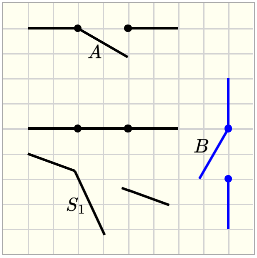

# Elements for drawing

## Elements to create drawing canvas

### `pl-drawing` element

A `pl-drawing` element displays a canvas, which can be used to display initial drawing objects or expect drawing objects for grading.

The system of coordinates of the canvas is located at the top/left corner, as illustrated in the image below.


#### Sample element

```html
<pl-drawing answers-name="fbd"> </pl-drawing>
```


#### Customizations

| Attribute                  | Type    | Default                                      | Description                                                                                                                                                                 |
| -------------------------- | ------- | -------------------------------------------- | --------------------------------------------------------------------------------------------------------------------------------------------------------------------------- |
| `gradable`                 | boolean | false                                        | `gradable = true` expects objects to be placed in the canvas for grading, when `gradable = false` the canvas will be used for display only, i.e. for plotting figures.      |
| `answers-name`             | string  | —                                            | Variable name to store student-input data in. This variable is required when `gradable = true`. The input data will be stored in `data[“submitted_answers”][answers-name]`. |
| `width`                    | integer | 580                                          | Horizontal width of the canvas (in pixels).                                                                                                                                 |
| `height`                   | integer | 320                                          | Vertical height of the canvas (in pixels).                                                                                                                                  |
| `grid-size`                | integer | 20                                           | Size of the square grid for the canvas background (in pixels). If `grid-size = 0`, then the background is white.                                                            |
| `snap-to-grid`             | boolean | false                                        | If true, objects placed in the canvas snap to closest grid point. Otherwise, they can be placed outside of the grid.                                                        |
| `correct-answer`           | string  | special                                      | Correct answer for grading. Defaults to `data["correct_answers"][answers-name]`.                                                                                            |
| `tol`                      | float   | `0.5*grid-size`                              | Tolerance to check the position of objects (in pixels). The error is calculated as the absolute difference between expected position and submitted one.                     |
| `angle-tol`                | float   | 10                                           | Tolerance to check angles (in degrees). The error is calculated as the absolute difference between expected angle and submitted one.                                        |
| `show-tolerance-hint`      | boolean | true                                         | Show tolerance hint under the canvas. The default is `true` when `gradable = true`.                                                                                         |
| `tolerance-hint`           | string  | "The expected tolerance is 1/2 square grid." | Hint explaining tolerance used when grading objects.                                                                                                                        |
| `disregard-extra-elements` | boolean | false                                        | If true, extra elements are ignored if they match the same reference object. Otherwise, multiple matching elements will reduce the awarded points.                          |
| `hide-answer-panel`        | boolean | true                                         | If true, the correct answer is not displayed in the answer panel.                                                                                                           |

### `pl-drawing-initial` element

A `pl-drawing-initial` will group objects that will be displayed in the canvas defined by `pl-drawing`.

For example, `pl-drawing-initial` can be used to create figures that are displayed as part of the question body:

```html
<pl-drawing grid-size="0">
  <pl-drawing-initial>
    <!-- create the image here -->
  </pl-drawing-initial>
</pl-drawing>
```


And `pl-drawing-initial` can also be used to display initial objects in a canvas that will be used for grading. Objects inside `pl-drawing-initial` are not graded. Objects inside `pl-drawing-answer` are graded.

```html
<pl-drawing gradable="true" answers-name="add-objects">
  <pl-drawing-initial>
    <!-- objects that define the correct answer are placed here -->
  </pl-drawing-initial>
  <pl-drawing-answer>
    <!-- objects that define the correct answer are placed here -->
  </pl-drawing-answer>
</pl-drawing>
```

The child element `pl-drawing-answer` is explained below in the [Grading](#elements-to-set-up-a-grading-canvas) section.

## Elements to create drawing objects

### `pl-coordinates` element

A `pl-coordinates` element adds a 2D system of coordinates.

#### Sample element

```html
<pl-drawing width="200" height="200">
  <pl-drawing-initial>
    <pl-coordinates x1="60" y1="80" label="0" angle="30"></pl-coordinates>
  </pl-drawing-initial>
</pl-drawing>
```


#### Customizations

| Attribute           | Type   | Default | Description                                                                                                                                                                    |
| ------------------- | ------ | ------- | ------------------------------------------------------------------------------------------------------------------------------------------------------------------------------ |
| `x1`                | float  | 40      | `x` position of the origin of the coordinate system w.r.t the origin of the canvas (top/left corner), i.e., the horizontal distance from the left border of the canvas.        |
| `y1`                | float  | 40      | `y` position of the origin of the coordinate system w.r.t the origin of the canvas (top/left corner), i.e., the vertical distance from the top border of the canvas.           |
| `width`             | float  | 40      | Length of the arrow vector.                                                                                                                                                    |
| `angle`             | float  | 0       | Angle of the coordinate system. Angle is positive when clockwise orientation.                                                                                                  |
| `label`             | string | -       | Text to label the center of the coordinate system                                                                                                                              |
| `offsetx`           | float  | -16     | Horizontal distance of `label` from the origin of the coordinate system.                                                                                                       |
| `offsety`           | float  | -10     | Vertical distance of `label` from the origin of the coordinate system.                                                                                                         |
| `label-x`           | string | x       | Text to label the horizontal arrow vector (x-axis)                                                                                                                             |
| `offsetx-label-x`   | float  | 0       | Horizontal distance of `label-x` from the origin of the coordinate system.                                                                                                     |
| `offsety-label-x`   | float  | 0       | Vertical distance of `label-x` from the origin of the coordinate system.                                                                                                       |
| `label-y`           | string | y       | Text to label the vertical arrow vector (y-axis)                                                                                                                               |
| `offsetx-label-y`   | float  | -20     | Horizontal distance of `label-y` from the origin of the coordinate system.                                                                                                     |
| `offsety-label-y`   | float  | -10     | Vertical distance of `label-y` from the origin of the coordinate system.                                                                                                       |
| `color`             | string | black   | Set the color of the coordinate system ( [PL colors](https://prairielearn.readthedocs.io/en/latest/course/#colors) or [HTML colors](https://htmlcolorcodes.com/color-chart/) ) |
| `stroke-width`      | float  | 2       | Set the width of the stroke.                                                                                                                                                   |
| `arrow-head-width`  | float  | 1       | Scale factor for the width of the arrow head.                                                                                                                                  |
| `arrow-head-length` | float  | 1       | Scale factor for the length of the arrow head.                                                                                                                                 |

#### Example implementations

- [demo/drawing/inclinedPlane]: Example that uses a system of coordinates

- [element/drawingGallery]: Image gallery with drawing objects

### `pl-line` element

#### Sample element

```html
<pl-drawing width="200" height="200">
  <pl-drawing-initial>
    <pl-line x1="60" y1="80" x2="140" y2="120"></pl-line>
  </pl-drawing-initial>
</pl-drawing>
```


#### Customizations

| Attribute      | Type   | Default | Description                                                                                                                                                                                                                                         |
| -------------- | ------ | ------- | --------------------------------------------------------------------------------------------------------------------------------------------------------------------------------------------------------------------------------------------------- |
| `x1`           | float  | 10      | `x` position for the start point for the line, i.e., the horizontal distance from the left border of the canvas.                                                                                                                                    |
| `y1`           | float  | 10      | `y` position for the start point for the line, i.e., the vertical distance from the top border of the canvas.                                                                                                                                       |
| `width`        | float  | 60      | Width of the line.                                                                                                                                                                                                                                  |
| `angle`        | float  | 0       | Angle of rotation around the start point of the line. Angles are measured from the horizontal axis and are positive clockwise.                                                                                                                      |
| `x2`           | float  | -       | `x` position for the end point for the line, i.e., the horizontal distance from the left border of the canvas. By default, `(x2,y2)` are determined from `angle` and `width`. If `x2` and `y2` are provided, then `angle` and `width` are replaced. |
| `y2`           | float  | -       | `y` position for the end point for the line, i.e., the vertical distance from the top border of the canvas. By default, `(x2,y2)` are determined from `angle` and `width`. If `x2` and `y2` are provided, then `angle` and `width` are replaced.    |
| `opacity`      | float  | 1       | Set the opacity of the line                                                                                                                                                                                                                         |
| `stroke-color` | string | black   | Set the color of the line ( [PL colors](https://prairielearn.readthedocs.io/en/latest/course/#colors) or [HTML colors](https://htmlcolorcodes.com/color-chart/) )                                                                                   |
| `stroke-width` | float  | 2       | Set the width of the stroke.                                                                                                                                                                                                                        |
| `dashed-size`  | float  | \_      | Creates a dashed line with equally spaced `dashed-size`px fills.                                                                                                                                                                                    |

#### Example implementations

- [demo/drawing/liftingMechanism]: Example that uses lines

- [element/drawingGallery]: Image gallery with drawing objects

### `pl-arc` element

#### Sample element

```html
<pl-drawing width="200" height="200">
  <pl-drawing-initial>
    <pl-line x1="0" y1="80" x2="60" y2="80" stroke-color="red"></pl-line>
    <pl-arc
      x1="60"
      y1="120"
      radius="40"
      start-angle="270"
      end-angle="0"
      stroke-color="green"
    ></pl-arc>
    <pl-line x1="100" y1="120" x2="100" y2="200" stroke-color="blue"></pl-line>
  </pl-drawing-initial>
</pl-drawing>
```


#### Customizations

| Attribute      | Type   | Default | Description                                                                                                                                                                      |
| -------------- | ------ | ------- | -------------------------------------------------------------------------------------------------------------------------------------------------------------------------------- |
| `x1`           | float  | 40      | `x` position for the center of the arc, i.e., the horizontal distance from the left border of the arc.                                                                           |
| `y1`           | float  | 40      | `y` position for the center of the circle, i.e., the vertical distance from the top border of the canvas.                                                                        |
| `radius`       | float  | 20      | Radius of the circle.                                                                                                                                                            |
| `start-angle`  | float  | 0       | Start angle of the arc. Angles are measured from the horizontal axis and are positive clockwise.                                                                                 |
| `end-angle`    | float  | 90      | End angle of the arc. Angles are measured from the horizontal axis and are positive clockwise. Arcs are formed from `start-angle` to `end-angle` going on clockwise orientation. |
| `opacity`      | float  | 1       | Set the opacity of the arc.                                                                                                                                                      |
| `stroke-color` | string | black   | Set the stroke color of the line ( [PL colors](https://prairielearn.readthedocs.io/en/latest/course/#colors) or [HTML colors](https://htmlcolorcodes.com/color-chart/) ).        |
| `stroke-width` | float  | 2       | Set the width of the stroke.                                                                                                                                                     |
| `dashed-size`  | float  | \_      | Creates a dashed line with equally spaced `dashed-size`px fills.                                                                                                                 |

#### Example implementations

- [element/drawingGallery]: Image gallery with drawing objects

### `pl-point` element

#### Sample element

```html
<pl-drawing width="200" height="200">
  <pl-drawing-initial>
    <pl-point x1="60" y1="120" label="A"></pl-point>
    <pl-point x1="160" y1="60" label="B"></pl-point>
  </pl-drawing-initial>
</pl-drawing>
```


#### Customizations

| Attribute | Type   | Default | Description                                                                                                                                                              |
| --------- | ------ | ------- | ------------------------------------------------------------------------------------------------------------------------------------------------------------------------ |
| `x1`      | float  | 20      | `x` position of the point, i.e., the horizontal distance from the left border of the canvas.                                                                             |
| `y1`      | float  | 20      | `y` position of the point, i.e., the vertical distance from the top border of the canvas.                                                                                |
| `radius`  | float  | 4       | Radius of the circle that defines the point.                                                                                                                             |
| `label`   | string | -       | Text to label the point.                                                                                                                                                 |
| `offsetx` | float  | 5       | Horizontal distance of `label` from the point.                                                                                                                           |
| `offsety` | float  | 5       | Vertical distance of `label` from the point.                                                                                                                             |
| `opacity` | float  | 1       | Set the opacity of the point.                                                                                                                                            |
| `color`   | string | black   | Set the fill color of the point ( [PL colors](https://prairielearn.readthedocs.io/en/latest/course/#colors) or [HTML colors](https://htmlcolorcodes.com/color-chart/) ). |

#### Example implementations

- [demo/drawing/pulley]: Example that includes a point in the canvas

- [element/drawingGallery]: Image gallery with drawing objects

### `pl-triangle` element

#### Sample element

```html
<pl-drawing width="200" height="200">
  <pl-drawing-initial>
    <pl-triangle x1="40" y1="180" x2="160" y2="180" x3="160" y3="40"></pl-triangle>
  </pl-drawing-initial>
</pl-drawing>
```


#### Customizations

| Attribute      | Type   | Default | Description                                                                                                                                                                 |
| -------------- | ------ | ------- | --------------------------------------------------------------------------------------------------------------------------------------------------------------------------- |
| `x1`           | float  | 20      | `x` position for vertex 1, i.e., the horizontal distance from the left border of the canvas.                                                                                |
| `y1`           | float  | 20      | `y` position for vertex 1, i.e., the vertical distance from the top border of the canvas.                                                                                   |
| `x2`           | float  | 20      | `x` position for vertex 2, i.e., the horizontal distance from the left border of the canvas.                                                                                |
| `y2`           | float  | 20      | `y` position for vertex 2, i.e., the vertical distance from the top border of the canvas.                                                                                   |
| `x3`           | float  | 20      | `x` position for vertex 3, i.e., the horizontal distance from the left border of the canvas.                                                                                |
| `y3`           | float  | 20      | `y` position for vertex 3, i.e., the vertical distance from the top border of the canvas.                                                                                   |
| `opacity`      | float  | 1       | Set the opacity of the entire element (both line and fill).                                                                                                                 |
| `color`        | string | red1    | Set the fill color of the triangle ( [PL colors](https://prairielearn.readthedocs.io/en/latest/course/#colors) or [HTML colors](https://htmlcolorcodes.com/color-chart/) ). |
| `stroke-color` | string | black   | Set the stroke color of the triangle.                                                                                                                                       |
| `stroke-width` | float  | 1       | Set the width of the stroke.                                                                                                                                                |

#### Example implementations

- [demo/drawing/pulley]: Example that includes a triangle

- [element/drawingGallery]: Image gallery with drawing objects

### `pl-rectangle` element

#### Sample element

```html
<pl-drawing width="200" height="200">
  <pl-drawing-initial>
    <pl-rectangle x1="80" y1="50" width="100" height="40"></pl-rectangle>
    <pl-rectangle x1="120" y1="140" width="120" height="20" angle="30" color="pink1"></pl-rectangle>
  </pl-drawing-initial>
</pl-drawing>
```


#### Customizations

| Attribute      | Type   | Default | Description                                                                                                                                                                  |
| -------------- | ------ | ------- | ---------------------------------------------------------------------------------------------------------------------------------------------------------------------------- |
| `x1`           | float  | 20      | `x` position for the center of the rectangle, i.e., the horizontal distance from the left border of the canvas.                                                              |
| `y1`           | float  | 20      | `y` position for the center of the rectangle, i.e., the vertical distance from the top border of the canvas.                                                                 |
| `height`       | float  | 20      | Height of the rectangle.                                                                                                                                                     |
| `width`        | float  | 20      | Width of the rectangle.                                                                                                                                                      |
| `angle`        | float  | 0       | Angle of rotation around the center of the rectangle. Angles are measured from the horizontal axis and are positive clockwise.                                               |
| `opacity`      | float  | 1       | Set the opacity of the entire element (both line and fill).                                                                                                                  |
| `color`        | string | green1  | Set the fill color of the rectangle ( [PL colors](https://prairielearn.readthedocs.io/en/latest/course/#colors) or [HTML colors](https://htmlcolorcodes.com/color-chart/) ). |
| `stroke-color` | string | black   | Set the stroke color of the rectangle.                                                                                                                                       |
| `stroke-width` | float  | 1       | Set the width of the stroke.                                                                                                                                                 |

#### Example implementations

- [demo/drawing/pulley]: Example that includes a rectangle

- [element/drawingGallery]: Image gallery with drawing objects

### `pl-circle` element

#### Sample element

```html
<pl-drawing width="200" height="200">
  <pl-drawing-initial>
    <pl-circle x1="40" y1="100" radius="30" color="#95A5A6" stroke-width="3"></pl-circle>
    <pl-circle x1="120" y1="100" radius="50" color="#D0D3D4"></pl-circle>
  </pl-drawing-initial>
</pl-drawing>
```


#### Customizations

| Attribute      | Type   | Default | Description                                                                                                                                                               |
| -------------- | ------ | ------- | ------------------------------------------------------------------------------------------------------------------------------------------------------------------------- |
| `x1`           | float  | 20      | `x` position for the center of the circle, i.e., the horizontal distance from the left border of the canvas.                                                              |
| `y1`           | float  | 20      | `y` position for the center of the circle, i.e., the vertical distance from the top border of the canvas.                                                                 |
| `radius`       | float  | 20      | Radius of the circle.                                                                                                                                                     |
| `opacity`      | float  | 1       | Set the opacity of the entire element (both line and fill).                                                                                                               |
| `color`        | string | gray1   | Set the fill color of the circle ( [PL colors](https://prairielearn.readthedocs.io/en/latest/course/#colors) or [HTML colors](https://htmlcolorcodes.com/color-chart/) ). |
| `stroke-color` | string | black   | Set the stroke color of the circle.                                                                                                                                       |
| `stroke-width` | float  | 1       | Set the width of the stroke.                                                                                                                                              |
| `label`        | string | -       | Text to label the center of the circle.                                                                                                                                   |
| `offsetx`      | float  | 5       | Horizontal distance of `label` from the center of the circle.                                                                                                             |
| `offsety`      | float  | 5       | Vertical distance of `label1` from the center of the circle                                                                                                               |

#### Example implementations

- [demo/drawing/liftingMechanism]: Example that uses circles

- [element/drawingGallery]: Image gallery with drawing objects

### `pl-polygon` element

#### Sample element

```html
<pl-drawing width="200" height="200">
  <pl-drawing-initial>
    <pl-polygon plist='[{"x": 40, "y": 40}, {"x": 140,"y": 80}, {"x": 60,"y": 180}]'></pl-polygon>
  </pl-drawing-initial>
</pl-drawing>
```


#### Customizations

| Attribute      | Type   | Default | Description                                                                                                                                                               |
| -------------- | ------ | ------- | ------------------------------------------------------------------------------------------------------------------------------------------------------------------------- |
| `plist`        | string | ''      | List of the vertices that form the polygon.                                                                                                                               |
| `opacity`      | float  | 1       | Set the opacity of the entire element (both line and fill).                                                                                                               |
| `color`        | string | gray1   | Set the fill color of the circle ( [PL colors](https://prairielearn.readthedocs.io/en/latest/course/#colors) or [HTML colors](https://htmlcolorcodes.com/color-chart/) ). |
| `stroke-color` | string | black   | Set the stroke color of the circle.                                                                                                                                       |
| `stroke-width` | float  | 1       | Set the width of the stroke.                                                                                                                                              |

To draw a polygon with `n` vertices, each one with coordinates `(xi,yi)`, the string `plist` is given as a dictionar with the following format:

`plist = '[{"x": x1, "y": y1}, {"x": x2,"y": x2}, ... , {"x": xn,"y": yn}]' `

For an example that uses `server.py` to generate `plist` refer to QID: `Example-pl-drawing-beam-cross-section`

#### Example implementations

- [element/drawingGallery]: Image gallery with drawing objects

### `pl-rod` element

#### Sample element

```html
<pl-drawing width="200" height="200">
  <pl-drawing-initial>
    <pl-rod x1="60" y1="80" x2="120" y2="100"></pl-rod>
  </pl-drawing-initial>
</pl-drawing>
```


#### Customizations

| Attribute      | Type    | Default | Description                                                                                                                                                            |
| -------------- | ------- | ------- | ---------------------------------------------------------------------------------------------------------------------------------------------------------------------- |
| `x1`           | float   | 40      | `x` position for the first end of the rod, i.e., the horizontal distance from the left border of the canvas.                                                           |
| `y1`           | float   | 20      | `y` position for the first end of the rod, i.e., the vertical distance from the top border of the canvas.                                                              |
| `x2`           | float   | 80      | `x` position for the second end of the rod, i.e., the horizontal distance from the left border of the canvas.                                                          |
| `y2`           | float   | 20      | `y` position for the second end of the rod, i.e., the vertical distance from the top border of the canvas.                                                             |
| `width`        | float   | 20      | Thickness of the rod.                                                                                                                                                  |
| `draw-pin`     | boolean | true    | Draw the pin location in both ends of the rod.                                                                                                                         |
| `label1`       | string  | -       | Text to label the first end of the rod.                                                                                                                                |
| `offsetx1`     | float   | 2       | Horizontal distance of `label1` from the first end of the rod.                                                                                                         |
| `offsety1`     | float   | 2       | Vertical distance of `label1` from the first end of the rod.                                                                                                           |
| `label2`       | string  | -       | Text to label the first end of the rod.                                                                                                                                |
| `offsetx2`     | float   | 2       | Horizontal distance of `label2` from the first end of the rod.                                                                                                         |
| `offsety2`     | float   | 2       | Vertical distance of `label2` from the first end of the rod.                                                                                                           |
| `color`        | string  | white   | Set the fill color of the rod ( [PL colors](https://prairielearn.readthedocs.io/en/latest/course/#colors) or [HTML colors](https://htmlcolorcodes.com/color-chart/) ). |
| `stroke-color` | string  | black   | Set the stroke color of the rod.                                                                                                                                       |
| `stroke-width` | float   | 2       | Set the width of the stroke.                                                                                                                                           |

#### Example implementations

- [demo/drawing/vMDiagrams]: Example that includes a rod

- [element/drawingGallery]: Image gallery with drawing objects

### `pl-3pointrod` element

#### Sample element

```html
<pl-drawing width="200" height="200">
  <pl-drawing-initial>
    <pl-3pointrod x1="40" y1="100" x2="100" y2="100" x3="100" y3="180"></pl-3pointrod>
  </pl-drawing-initial>
</pl-drawing>
```


#### Customizations

| Attribute      | Type    | Default | Description                                                                                                                                                            |
| -------------- | ------- | ------- | ---------------------------------------------------------------------------------------------------------------------------------------------------------------------- |
| `x1`           | float   | 40      | `x` position for the first end of the rod, i.e., the horizontal distance from the left border of the canvas.                                                           |
| `y1`           | float   | 100     | `y` position for the first end of the rod, i.e., the vertical distance from the top border of the canvas.                                                              |
| `x2`           | float   | 100     | `x` position of the center point of the rod, i.e., the horizontal distance from the left border of the canvas.                                                         |
| `y2`           | float   | 100     | `y` position of the center point of the rod, i.e., the vertical distance from the top border of the canvas.                                                            |
| `x3`           | float   | 100     | `x` position for the second end of the rod, i.e., the horizontal distance from the left border of the canvas.                                                          |
| `y3`           | float   | 140     | `y` position for the second end of the rod, i.e., the vertical distance from the top border of the canvas.                                                             |
| `width`        | float   | 20      | Thickness of the rod.                                                                                                                                                  |
| `draw-pin`     | boolean | true    | Draw the pin location in both ends of the rod.                                                                                                                         |
| `label1`       | string  | -       | Text to label the first end of the rod.                                                                                                                                |
| `offsetx1`     | float   | 0       | Horizontal distance of `label1` from the first end of the rod.                                                                                                         |
| `offsety1`     | float   | -20     | Vertical distance of `label1` from the first end of the rod.                                                                                                           |
| `label2`       | string  | -       | Text to label the middle point of the rod.                                                                                                                             |
| `offsetx2`     | float   | 0       | Horizontal distance of `label2` from the first end of the rod.                                                                                                         |
| `offsety2`     | float   | -20     | Vertical distance of `label2` from the first end of the rod.                                                                                                           |
| `label3`       | string  | -       | Text to label the second end of the rod.                                                                                                                               |
| `offsetx3`     | float   | 0       | Horizontal distance of `label3` from the first end of the rod.                                                                                                         |
| `offsety3`     | float   | -20     | Vertical distance of `label3` from the first end of the rod.                                                                                                           |
| `color`        | string  | white   | Set the fill color of the rod ( [PL colors](https://prairielearn.readthedocs.io/en/latest/course/#colors) or [HTML colors](https://htmlcolorcodes.com/color-chart/) ). |
| `stroke-color` | string  | black   | Set the stroke color of the rod.                                                                                                                                       |
| `stroke-width` | float   | 2       | Set the width of the stroke.                                                                                                                                           |

#### Example implementations

- [demo/drawing/inclinedPlane]: Example that includes a 3-point rod

- [element/drawingGallery]: Image gallery with drawing objects

### `pl-4pointrod` element

#### Sample element

```html
<pl-drawing width="200" height="200">
  <pl-drawing-initial>
    <pl-4pointrod></pl-4pointrod>
  </pl-drawing-initial>
</pl-drawing>
```


#### Customizations

| Attribute      | Type    | Default | Description                                                                                                                                                            |
| -------------- | ------- | ------- | ---------------------------------------------------------------------------------------------------------------------------------------------------------------------- |
| `x1`           | float   | 40      | `x` position for the first end of the rod, i.e., the horizontal distance from the left border of the canvas.                                                           |
| `y1`           | float   | 100     | `y` position for the first end of the rod, i.e., the vertical distance from the top border of the canvas.                                                              |
| `x2`           | float   | 100     | `x` position of the center point of the rod, i.e., the horizontal distance from the left border of the canvas.                                                         |
| `y2`           | float   | 100     | `y` position of the center point of the rod, i.e., the vertical distance from the top border of the canvas.                                                            |
| `x3`           | float   | 100     | `x` position for the second end of the rod, i.e., the horizontal distance from the left border of the canvas.                                                          |
| `y3`           | float   | 160     | `y` position for the second end of the rod, i.e., the vertical distance from the top border of the canvas.                                                             |
| `x4`           | float   | 140     | `x` position for the third end of the rod, i.e., the horizontal distance from the left border of the canvas.                                                           |
| `y4`           | float   | 60      | `y` position for the third end of the rod, i.e., the vertical distance from the top border of the canvas.                                                              |
| `width`        | float   | 20      | Thickness of the rod.                                                                                                                                                  |
| `draw-pin`     | boolean | true    | Draw the pin location in both ends of the rod.                                                                                                                         |
| `label1`       | string  | -       | Text to label the first end of the rod.                                                                                                                                |
| `offsetx1`     | float   | 0       | Horizontal distance of `label1` from the first end of the rod.                                                                                                         |
| `offsety1`     | float   | -20     | Vertical distance of `label1` from the first end of the rod.                                                                                                           |
| `label2`       | string  | -       | Text to label the middle point of the rod.                                                                                                                             |
| `offsetx2`     | float   | 0       | Horizontal distance of `label2` from the first end of the rod.                                                                                                         |
| `offsety2`     | float   | -20     | Vertical distance of `label2` from the first end of the rod.                                                                                                           |
| `label3`       | string  | -       | Text to label the second end of the rod.                                                                                                                               |
| `offsetx3`     | float   | 0       | Horizontal distance of `label3` from the first end of the rod.                                                                                                         |
| `offsety3`     | float   | -20     | Vertical distance of `label3` from the first end of the rod.                                                                                                           |
| `label4`       | string  | -       | Text to label the third end of the rod.                                                                                                                                |
| `offsetx4`     | float   | 0       | Horizontal distance of `label4` from the first end of the rod.                                                                                                         |
| `offsety4`     | float   | -20     | Vertical distance of `label4` from the first end of the rod.                                                                                                           |
| `color`        | string  | white   | Set the fill color of the rod ( [PL colors](https://prairielearn.readthedocs.io/en/latest/course/#colors) or [HTML colors](https://htmlcolorcodes.com/color-chart/) ). |
| `stroke-color` | string  | black   | Set the stroke color of the rod.                                                                                                                                       |
| `stroke-width` | float   | 2       | Set the width of the stroke.                                                                                                                                           |

#### Example implementations

- [demo/drawing/liftingMechanism]: Example that uses 4-point rods

- [element/drawingGallery]: Image gallery with drawing objects

### `pl-collar-rod` element

#### Sample element

```html
<pl-drawing width="200" height="200">
  <pl-drawing-initial>
    <pl-collar-rod x1="60" y1="100" x2="160" y2="100"></pl-collar-rod>
  </pl-drawing-initial>
</pl-drawing>
```


#### Customizations

| Attribute          | Type    | Default    | Description                                                                                                                                                            |
| ------------------ | ------- | ---------- | ---------------------------------------------------------------------------------------------------------------------------------------------------------------------- |
| `x1`               | float   | 40         | `x` position for the first end of the rod, i.e., the horizontal distance from the left border of the canvas.                                                           |
| `y1`               | float   | 40         | `y` position for the first end of the rod, i.e., the vertical distance from the top border of the canvas.                                                              |
| `x2`               | float   | 100        | `x` position for the second end of the rod, i.e., the horizontal distance from the left border of the canvas.                                                          |
| `y2`               | float   | 40         | `y` position for the second end of the rod, i.e., the vertical distance from the top border of the canvas.                                                             |
| `width`            | float   | 20         | Thickness of the rod.                                                                                                                                                  |
| `draw-pin`         | boolean | true       | Draw the pin location in both ends of the rod.                                                                                                                         |
| `label1`           | string  | -          | Text to label the first end of the rod.                                                                                                                                |
| `offsetx1`         | float   | 2          | Horizontal distance of `label1` from the first end of the rod.                                                                                                         |
| `offsety1`         | float   | 2          | Vertical distance of `label1` from the first end of the rod.                                                                                                           |
| `label2`           | string  | -          | Text to label the first end of the rod.                                                                                                                                |
| `offsetx2`         | float   | 2          | Horizontal distance of `label2` from the first end of the rod.                                                                                                         |
| `offsety2`         | float   | 2          | Vertical distance of `label2` from the first end of the rod.                                                                                                           |
| `draw-collar-end1` | boolean | true       | Draw a collar end at `(x1,y1)`.                                                                                                                                        |
| `w1`               | float   | 1.5\*width | The width of the collar at end 1.                                                                                                                                      |
| `h1`               | float   | 2\*width   | The height of the collar at end 1.                                                                                                                                     |
| `draw-collar-end2` | boolean | false      | Draw a collar end at `(x2,y2)`.                                                                                                                                        |
| `w2`               | float   | 1.5\*width | The width of the collar at end 2.                                                                                                                                      |
| `h2`               | float   | 2\*width   | The height of the collar at end 2.                                                                                                                                     |
| `color`            | string  | white      | Set the fill color of the rod ( [PL colors](https://prairielearn.readthedocs.io/en/latest/course/#colors) or [HTML colors](https://htmlcolorcodes.com/color-chart/) ). |
| `stroke-color`     | string  | black      | Set the stroke color of the rod.                                                                                                                                       |
| `stroke-width`     | float   | 2          | Set the width of the stroke.                                                                                                                                           |

#### Example implementations

- [demo/drawing/collarRod]: Example that uses a collar rod

- [element/drawingGallery]: Image gallery with drawing objects

### `pl-fixed-pin` element

#### Sample element

```html
<pl-drawing width="200" height="200">
  <pl-drawing-initial>
    <pl-fixed-pin x1="100" y1="100"></pl-fixed-pin>
  </pl-drawing-initial>
</pl-drawing>
```


#### Customizations

| Attribute      | Type    | Default | Description                                                                                                                                                                    |
| -------------- | ------- | ------- | ------------------------------------------------------------------------------------------------------------------------------------------------------------------------------ |
| `x1`           | float   | 20      | `x` position for the center of the pin, i.e., the horizontal distance from the left border of the canvas.                                                                      |
| `y1`           | float   | 20      | `y` position for the first end of the rod, i.e., the vertical distance from the top border of the canvas.                                                                      |
| `height`       | float   | 40      | Height of the pin support, measured from the top of the base (ground) to the center of the pin.                                                                                |
| `width`        | float   | 30      | Width of the pin support.                                                                                                                                                      |
| `angle`        | float   | 0       | Angle of rotation around the center of the pin. Angles are measured from the horizontal axis and are positive clockwise.                                                       |
| `draw-pin`     | boolean | true    | Draw the location of the pin.                                                                                                                                                  |
| `draw-ground`  | boolean | true    | Draw the rectangular base/ground.                                                                                                                                              |
| `label`        | string  | -       | Text to label the pin support.                                                                                                                                                 |
| `offsetx`      | float   | 2       | Horizontal distance of `label` from the center of the pin.                                                                                                                     |
| `offsety`      | float   | 2       | Vertical distance of `label` from the center of the pin.                                                                                                                       |
| `color`        | string  | brown1  | Set the fill color of the pin support ( [PL colors](https://prairielearn.readthedocs.io/en/latest/course/#colors) or [HTML colors](https://htmlcolorcodes.com/color-chart/) ). |
| `stroke-color` | string  | black   | Set the stroke color of the pin support.                                                                                                                                       |
| `stroke-width` | float   | 2       | Set the width of the stroke.                                                                                                                                                   |

#### Example implementations

- [demo/drawing/vMDiagrams]: Example that uses a fixed pin as boundary condition

- [element/drawingGallery]: Image gallery with drawing objects

### `pl-roller` element

#### Sample element

```html
<pl-drawing width="200" height="200">
  <pl-drawing-initial>
    <pl-roller x1="60" y1="100"></pl-roller>
    <pl-fixed-pin x1="140" y1="100" color="green1"></pl-fixed-pin>
  </pl-drawing-initial>
</pl-drawing>
```


#### Customizations

| Attribute      | Type    | Default | Description                                                                                                                                                                       |
| -------------- | ------- | ------- | --------------------------------------------------------------------------------------------------------------------------------------------------------------------------------- |
| `x1`           | float   | 20      | `x` position for the center of the pin, i.e., the horizontal distance from the left border of the canvas.                                                                         |
| `y1`           | float   | 20      | `y` position for the first end of the pin, i.e., the vertical distance from the top border of the canvas.                                                                         |
| `height`       | float   | 40      | Height of the roller support, measured from the top of the base (ground) to the center of the pin.                                                                                |
| `width`        | float   | 30      | Width of the roller support.                                                                                                                                                      |
| `angle`        | float   | 0       | Angle of rotation around the center of the pin. Angles are measured from the horizontal axis and are positive clockwise.                                                          |
| `draw-pin`     | boolean | true    | Draw the location of the pin.                                                                                                                                                     |
| `draw-ground`  | boolean | true    | Draw the rectangular base/ground.                                                                                                                                                 |
| `label`        | string  | -       | Text to label the roller support.                                                                                                                                                 |
| `offsetx`      | float   | 2       | Horizontal distance of `label` from the center of the pin.                                                                                                                        |
| `offsety`      | float   | 2       | Vertical distance of `label` from the center of the pin.                                                                                                                          |
| `color`        | string  | brown1  | Set the fill color of the roller support ( [PL colors](https://prairielearn.readthedocs.io/en/latest/course/#colors) or [HTML colors](https://htmlcolorcodes.com/color-chart/) ). |
| `stroke-color` | string  | black   | Set the stroke color of the roller.                                                                                                                                               |
| `stroke-width` | float   | 2       | Set the width of the stroke.                                                                                                                                                      |

#### Example implementations

- [demo/drawing/vMDiagrams]: Example that uses a roller as boundary condition

- [element/drawingGallery]: Image gallery with drawing objects

### `pl-clamped` element

#### Sample element

```html
<pl-drawing width="200" height="200">
  <pl-drawing-initial>
    <pl-roller x1="140" y1="100" width="40" color="gray1"></pl-roller>
    <pl-rod x1="40" y1="100" x2="140" y2="100" draw-pin="false"></pl-rod>
    <pl-clamped x1="40" y1="100" height="60" width="20"></pl-clamped>
  </pl-drawing-initial>
</pl-drawing>
```


#### Customizations

| Attribute      | Type   | Default | Description                                                                                                                                                                                                        |
| -------------- | ------ | ------- | ------------------------------------------------------------------------------------------------------------------------------------------------------------------------------------------------------------------ |
| `x1`           | float  | 20      | `x` position for the clamped point, i.e., the horizontal distance from the left border of the canvas.                                                                                                              |
| `y1`           | float  | 20      | `y` position for the clamped, i.e., the vertical distance from the top border of the canvas.                                                                                                                       |
| `height`       | float  | 40      | Height of the clamped support (rectangle).                                                                                                                                                                         |
| `width`        | float  | 20      | Width of the clamped support (rectangle).                                                                                                                                                                          |
| `angle`        | float  | 0       | Angle of rotation around the clamped point. Angles are measured from the horizontal axis and are positive clockwise.                                                                                               |
| `label`        | string | -       | Text to label the pin support.                                                                                                                                                                                     |
| `offsetx`      | float  | 2       | Horizontal distance of `label` from the center of the pin.                                                                                                                                                         |
| `offsety`      | float  | 2       | Vertical distance of `label` from the center of the pin.                                                                                                                                                           |
| `color`        | string | black   | Fill color for the clamped support using a gradient from white to `color` ( [PL colors](https://prairielearn.readthedocs.io/en/latest/course/#colors) or [HTML colors](https://htmlcolorcodes.com/color-chart/) ). |
| `stroke-width` | float  | 2       | Set the width of the stroke.                                                                                                                                                                                       |

#### Example implementations

- [demo/drawing/collarRod]: Example that uses a clamped end as boundary condition

- [element/drawingGallery]: Image gallery with drawing objects

### `pl-spring` element

#### Sample element

```html
<pl-drawing width="200" height="200" grid-size="20">
  <pl-drawing-initial>
    <pl-spring x1="50" y1="40" width="140" draw-pin="true"></pl-spring>
    <pl-spring x1="20" y1="80" angle="20" width="120" height="20" interval="5"></pl-spring>
    <pl-spring x1="20" y1="160" width="30" height="20" stroke-color="purple3"></pl-spring>
  </pl-drawing-initial>
</pl-drawing>
```


#### Customizations

| Attribute      | Type    | Default | Description                                                                                                                                                                                                                                           |
| -------------- | ------- | ------- | ----------------------------------------------------------------------------------------------------------------------------------------------------------------------------------------------------------------------------------------------------- |
| `x1`           | float   | 20      | `x` position for the start point for the spring, i.e., the horizontal distance from the left border of the canvas.                                                                                                                                    |
| `y1`           | float   | 20      | `y` position for the start point for the spring, i.e., the vertical distance from the top border of the canvas.                                                                                                                                       |
| `width`        | float   | 60      | Length of the spring.                                                                                                                                                                                                                                 |
| `angle`        | float   | 0       | Angle of rotation around the start point of the spring. Angles are measured from the horizontal axis and are positive clockwise.                                                                                                                      |
| `height`       | float   | 40      | Height of the spring.                                                                                                                                                                                                                                 |
| `interval`     | float   | 10      | Interval between each angled line. This interval is recalculated if the spring width is too short.                                                                                                                                                    |
| `x2`           | float   | -       | `x` position for the end point for the spring, i.e., the horizontal distance from the left border of the canvas. By default, `(x2,y2)` are determined from `angle` and `width`. If `x2` and `y2` are provided, then `angle` and `width` are replaced. |
| `y2`           | float   | -       | `y` position for the end point for the spring, i.e., the vertical distance from the top border of the canvas. By default, `(x2,y2)` are determined from `angle` and `width`. If `x2` and `y2` are provided, then `angle` and `width` are replaced.    |
| `stroke-color` | string  | black   | Set the color of the spring ( [PL colors](https://prairielearn.readthedocs.io/en/latest/course/#colors) or [HTML colors](https://htmlcolorcodes.com/color-chart/) ).                                                                                  |
| `stroke-width` | float   | 2       | Set the width of the stroke.                                                                                                                                                                                                                          |
| `draw-pin`     | boolean | false   | Draw points at the spring ends.                                                                                                                                                                                                                       |

#### Example implementations

- [element/drawingGallery]: Image gallery with drawing objects

### `pl-coil` element

#### Sample element

```html
<pl-drawing width="200" height="200" grid-size="20">
  <pl-drawing-initial>
    <pl-coil x1="50" y1="40" draw-pin="true"></pl-coil>
    <pl-coil x1="20" y1="100" angle="20" width="120" height="80"></pl-coil>
    <pl-coil x1="20" y1="180" width="40" height="20" stroke-color="purple3"></pl-coil>
  </pl-drawing-initial>
</pl-drawing>
```


#### Customizations

| Attribute      | Type    | Default | Description                                                                                                                                                                                                                                         |
| -------------- | ------- | ------- | --------------------------------------------------------------------------------------------------------------------------------------------------------------------------------------------------------------------------------------------------- |
| `x1`           | float   | 20      | `x` position for the start point for the coil, i.e., the horizontal distance from the left border of the canvas.                                                                                                                                    |
| `y1`           | float   | 20      | `y` position for the start point for the coil, i.e., the vertical distance from the top border of the canvas.                                                                                                                                       |
| `width`        | float   | 80      | Length of the coil.                                                                                                                                                                                                                                 |
| `angle`        | float   | 0       | Angle of rotation around the start point of the coil. Angles are measured from the horizontal axis and are positive clockwise.                                                                                                                      |
| `height`       | float   | 30      | Height of the coil.                                                                                                                                                                                                                                 |
| `x2`           | float   | -       | `x` position for the end point for the coil, i.e., the horizontal distance from the left border of the canvas. By default, `(x2,y2)` are determined from `angle` and `width`. If `x2` and `y2` are provided, then `angle` and `width` are replaced. |
| `y2`           | float   | -       | `y` position for the end point for the coil, i.e., the vertical distance from the top border of the canvas. By default, `(x2,y2)` are determined from `angle` and `width`. If `x2` and `y2` are provided, then `angle` and `width` are replaced.    |
| `stroke-color` | string  | black   | Set the color of the coil ( [PL colors](https://prairielearn.readthedocs.io/en/latest/course/#colors) or [HTML colors](https://htmlcolorcodes.com/color-chart/) ).                                                                                  |
| `stroke-width` | float   | 2       | Set the width of the stroke.                                                                                                                                                                                                                        |
| `draw-pin`     | boolean | false   | Draw points at the coil ends.                                                                                                                                                                                                                       |

#### Example implementations

- [element/drawingGallery]: Image gallery with drawing objects

### `pl-pulley` element

#### Sample element

```html
<pl-drawing width="200" height="200">
  <pl-drawing-initial>
    <pl-pulley x1="100" y1="150" x2="20" y2="120" x3="140" y3="60" radius="40"></pl-pulley>
    <pl-pulley x1="50" y1="40" x2="50" y2="100" x3="160" y3="40" color="blue1"></pl-pulley>
  </pl-drawing-initial>
</pl-drawing>
```


#### Customizations

| Attribute          | Type    | Default | Description                                                                                                                                                               |
| ------------------ | ------- | ------- | ------------------------------------------------------------------------------------------------------------------------------------------------------------------------- |
| `x1`               | float   | 40      | `x` position for the center of the pulley, i.e., the horizontal distance from the left border of the canvas.                                                              |
| `y1`               | float   | 40      | `y` position for the center of the pulley, i.e., the vertical distance from the top border of the canvas.                                                                 |
| `x2`               | float   | 10      | `x` position for the first point defining the end of the pulley line, i.e., the horizontal distance from the left border of the canvas.                                   |
| `y2`               | float   | 10      | `y` position for the first point defining the end of the pulley line, i.e., the vertical distance from the top border of the canvas.                                      |
| `x3`               | float   | 120     | `x` position for the second point defining the end of the pulley line, i.e., the horizontal distance from the left border of the canvas.                                  |
| `y3`               | float   | 60      | `y` position for the second point defining the end of the pulley line, i.e., the vertical distance from the top border of the canvas.                                     |
| `alternative-path` | boolean | false   | Selects the other tangent points at the pulley that connects to points `(x2,y2)` and `(x3,y3)`. By default, it draws the shortest path.                                   |
| `radius`           | float   | 20      | Radius of the pulley.                                                                                                                                                     |
| `label`            | string  | -       | Text to label the pulley.                                                                                                                                                 |
| `offsetx`          | float   | 2       | Horizontal distance of `label` from the center of the pulley.                                                                                                             |
| `offsety`          | float   | 2       | Vertical distance of `label` from the center of the pulley.                                                                                                               |
| `color`            | string  | gray    | Set the fill color of the pulley ( [PL colors](https://prairielearn.readthedocs.io/en/latest/course/#colors) or [HTML colors](https://htmlcolorcodes.com/color-chart/) ). |
| `stroke-color`     | string  | black   | Set the stroke color of the pulley.                                                                                                                                       |
| `stroke-width`     | float   | 2       | Set the width of the stroke.                                                                                                                                              |

#### Example implementations

- [demo/drawing/pulley]: Example that includes a pulley system

- [element/drawingGallery]: Image gallery with drawing objects

### `pl-dimensions` element

#### Sample element

```html
<pl-drawing width="200" height="200">
  <pl-drawing-initial>
    <pl-rod x1="60" y1="100" x2="120" y2="40" height="60"></pl-rod>
    <pl-dimensions x1="60" y1="100" x2="120" y2="40"></pl-dimensions>
    <pl-dimensions
      x1="60"
      y1="100"
      x2="120"
      y2="40"
      dim-offset="-40"
      stroke-color="brown"
      start-support-line="true"
      end-support-line="true"
    ></pl-dimensions>
    <pl-dimensions
      x1="60"
      y1="100"
      x2="120"
      y2="40"
      dim-offset="60"
      dim-offset-angle="0"
      stroke-color="blue3"
      start-support-line="true"
      end-support-line="true"
    ></pl-dimensions>
    <pl-dimensions
      x1="60"
      y1="100"
      x2="120"
      y2="40"
      dim-offset="100"
      dim-offset-angle="-90"
      stroke-color="green3"
    ></pl-dimensions>
    <pl-dimensions x1="60" y1="100" width="60" stroke-color="pink3" label="a"></pl-dimensions>
  </pl-drawing-initial>
</pl-drawing>
```


#### Customizations

| Attribute            | Type    | Default | Description                                                                                                                                                                                                                                           |
| -------------------- | ------- | ------- | ----------------------------------------------------------------------------------------------------------------------------------------------------------------------------------------------------------------------------------------------------- |
| `x1`                 | float   | 10      | `x` position for the start point for the line, i.e., the horizontal distance from the left border of the canvas.                                                                                                                                      |
| `y1`                 | float   | 10      | `y` position for the start point for the line, i.e., the vertical distance from the top border of the canvas.                                                                                                                                         |
| `width`              | float   | 40      | Width of the line.                                                                                                                                                                                                                                    |
| `angle`              | float   | 0       | Angle of rotation around the start point of the line. Angles are measured from the horizontal axis and are positive clockwise.                                                                                                                        |
| `x2`                 | float   | -       | `x` position for the end point for the line, i.e., the horizontal distance from the left border of the canvas. By default, `(x2,y2)` are determined from `angle` and `width`. If `x2` and `y2` are provided, then `angle` and `width` are replaced.   |
| `y2`                 | float   | -       | `y` position for the end point for the line, i.e., the vertical distance from the top border of the canvas. By default, `(x2,y2)` are determined from `angle` and `width`. If `x2` and `y2` are provided, then `angle` and `width` are replaced.      |
| `dim-offset`         | float   | 0       | By default, the dimension is placed between points `(x1,y1)` and `(x2,y2)`. When `dim-offset` is different than zero, the dimension is translated parallel to the direction defined by `(x1,y1)` and `(x2,y2)`, with an offset distance `dim-offset`. |
| `dim-offset-angle`   | float   | -       | When `dim-offset-angle` is defined, the dimension has the orientation defined by `dim-offset-angle` about the point `(x1,y1)`, and the `dim-offset` is the distance from `(x1,y1)`.                                                                   |
| `start-support-line` | boolean | false   | When `true` it draws a dashed line connecting the reference point `(x1,y1)` and the point where the dimension line starts (which are different when `dim-offset` is not zero).                                                                        |
| `end-support-line`   | boolean | false   | When `true` it draws a dashed line connecting the reference point `(x2,y2)` and the point where the dimension line finishes (which are different when `dim-offset` is not zero).                                                                      |
| `label`              | string  | -       | Text to label the dimension.                                                                                                                                                                                                                          |
| `offsetx`            | float   | 0       | Horizontal distance of `label` from the center of the dimension line.                                                                                                                                                                                 |
| `offsety`            | float   | 0       | Vertical distance of `label` from the center of the dimension line.                                                                                                                                                                                   |
| `stroke-color`       | string  | black   | Set the color of the line ( [PL colors](https://prairielearn.readthedocs.io/en/latest/course/#colors) or [HTML colors](https://htmlcolorcodes.com/color-chart/) ).                                                                                    |
| `stroke-width`       | float   | 1       | Set the width of the stroke.                                                                                                                                                                                                                          |
| `draw-start-arrow`   | boolean | true    | Draw an arrow head at the start point of the line.                                                                                                                                                                                                    |
| `draw-end-arrow`     | boolean | true    | Draw an arrow head at the end point of the line.                                                                                                                                                                                                      |
| `arrow-head-width`   | float   | 1.5     | Scale factor for the width of the arrow head.                                                                                                                                                                                                         |
| `arrow-head-length`  | float   | 1.5     | Scale factor for the length of the arrow head.                                                                                                                                                                                                        |

#### Example implementations

- [demo/drawing/liftingMechanism]: Example that includes dimensions

- [element/drawingGallery]: Image gallery with drawing objects

### `pl-arc-dimensions` element

```html
<pl-drawing width="200" height="200">
  <pl-drawing-initial>
    <pl-fixed-pin x1="80" y1="100" angle="50" color="turquoise1"></pl-fixed-pin>
    <pl-coordinates x1="80" y1="100" width="80"></pl-coordinates>
    <pl-arc-dimensions
      x1="80"
      y1="100"
      end-angle="50"
      label="\\theta"
      offsetx="5"
      offsety="-5"
      end-support-line="true"
    ></pl-arc-dimensions>
  </pl-drawing-initial>
</pl-drawing>
```


#### Customizations

| Attribute            | Type    | Default | Description                                                                                                                                                                      |
| -------------------- | ------- | ------- | -------------------------------------------------------------------------------------------------------------------------------------------------------------------------------- |
| `x1`                 | float   | 20      | `x` position for the center of the arc, i.e., the horizontal distance from the left border of the canvas.                                                                        |
| `y1`                 | float   | 20      | `y` position for the center of the arc, i.e., the vertical distance from the top border of the canvas.                                                                           |
| `radius`             | float   | 20      | Radius of the arc.                                                                                                                                                               |
| `start-angle`        | float   | 0       | Start angle of the arc. Angles are measured from the horizontal axis and are positive clockwise.                                                                                 |
| `end-angle`          | float   | 60      | End angle of the arc. Angles are measured from the horizontal axis and are positive clockwise. Arcs are formed from `start-angle` to `end-angle` going on clockwise orientation. |
| `start-support-line` | boolean | false   | When `true` it draws a dashed line from the reference point `(x1,y1)` with width `1.5*radius` and orientation given by `start-angle`,                                            |
| `end-support-line`   | boolean | false   | When `true` it draws a dashed line from the reference point `(x2,y2)` with width `1.5*radius` and orientation given by `end-angle`,                                              |
| `draw-center`        | boolean | false   | Draw the center of the arc.                                                                                                                                                      |
| `draw-start-arrow`   | boolean | false   | Draw an arrow head at the `start-angle`.                                                                                                                                         |
| `draw-end-arrow`     | boolean | true    | Draw an arrow head at the `end-angle`.                                                                                                                                           |
| `label`              | string  | -       | Text to label the arc angle.                                                                                                                                                     |
| `offsetx`            | float   | 0       | Horizontal distance of `label` from the center of the arc.                                                                                                                       |
| `offsety`            | float   | 0       | Vertical distance of `label` from the center of the arc.                                                                                                                         |
| `stroke-color`       | string  | black   | Set the stroke color of the arc ( [PL colors](https://prairielearn.readthedocs.io/en/latest/course/#colors) or [HTML colors](https://htmlcolorcodes.com/color-chart/) ).         |
| `stroke-width`       | float   | 1       | Set the width of the stroke.                                                                                                                                                     |
| `arrow-head-width`   | float   | 1       | Scale factor for the width of the arrow head.                                                                                                                                    |
| `arrow-head-length`  | float   | 1       | Scale factor for the length of the arrow head.                                                                                                                                   |

#### Example implementations

- [demo/drawing/liftingMechanism]: Example that includes arc dimensions

- [demo/drawing/inclinedPlane]: Example that includes arc dimensions

- [element/drawingGallery]: Image gallery with drawing objects

### `pl-vector` element

#### Sample element

```html
<pl-drawing width="200" height="200">
  <pl-drawing-initial>
    <pl-point x1="100" y1="100"></pl-point>
    <pl-line x1="20" y1="20" angle="45" width="240" dashed-size="4" stroke-width="1"></pl-line>
    <pl-vector x1="100" y1="100" width="80" angle="45" label="F"></pl-vector>
    <pl-vector
      x1="100"
      y1="100"
      width="80"
      angle="45"
      color="green3"
      anchor-is-tail="false"
    ></pl-vector>
  </pl-drawing-initial>
</pl-drawing>
```


#### Customizations

| Attribute           | Type    | Default | Description                                                                                                                                                                                                                                                                                                       |
| ------------------- | ------- | ------- | ----------------------------------------------------------------------------------------------------------------------------------------------------------------------------------------------------------------------------------------------------------------------------------------------------------------- |
| `x1`                | float   | 30      | `x` position for the anchor point of the vector, i.e., the horizontal distance from the left border of the canvas.                                                                                                                                                                                                |
| `y1`                | float   | 10      | `y` position for the anchor point of the vector , i.e., the vertical distance from the top border of the canvas.                                                                                                                                                                                                  |
| `anchor-is-tail`    | boolean | true    | the anchor point `(x1,y1)` is the tail of the vector.                                                                                                                                                                                                                                                             |
| `width`             | float   | 80      | Length of the vector.                                                                                                                                                                                                                                                                                             |
| `angle`             | float   | 0       | Angle of rotation around the starting point of the vector. Angles are measured from the horizontal axis and are positive clockwise.                                                                                                                                                                               |
| `label`             | string  | -       | Text to label the vector.                                                                                                                                                                                                                                                                                         |
| `offsetx`           | float   | 2       | Horizontal distance of `label` from the head of the vector.                                                                                                                                                                                                                                                       |
| `offsety`           | float   | 2       | Vertical distance of `label` from the head of the vector.                                                                                                                                                                                                                                                         |
| `color`             | string  | red3    | Set the color of the vector ( [PL colors](https://prairielearn.readthedocs.io/en/latest/course/#colors) or [HTML colors](https://htmlcolorcodes.com/color-chart/) ).                                                                                                                                              |
| `stroke-width`      | float   | 3       | Set the width of the stroke.                                                                                                                                                                                                                                                                                      |
| `arrow-head-width`  | float   | 1       | Scale factor for the width of the arrow head.                                                                                                                                                                                                                                                                     |
| `arrow-head-length` | float   | 1       | Scale factor for the length of the arrow head.                                                                                                                                                                                                                                                                    |
| `disregard-sense`   | boolean | false   | When `disregard-sense=false` both the location of the anchor and the angle should match within the tolerance. When `disregard-sense=true`, the correctness of the vector only considers the position of the anchor point and direction (i.e. the vector in the opposite direction is also considered as correct). |
| `draw-error-box`    | boolean | -       | Draw the error bounding box, where the location of the anchor point is accepted as correct.                                                                                                                                                                                                                       |
| `offset-forward`    | float   | 0       | Length of the bounding box measured from the anchor point in the same orientation of the vector.                                                                                                                                                                                                                  |
| `offset-backward`   | float   | width   | Length of the bounding box measured from the anchor point in the opposite orientation of the vector.                                                                                                                                                                                                              |
| `optional-grading`  | boolean | false   | When `true`, the grading algorithm will not assign point values for the object, but it won't penalize either.                                                                                                                                                                                                     |

More information about the grading attributes in the Grading section below.

#### Example implementations

- [demo/drawing/simpleTutorial]: Tutorial example that includes arrows (vectors)

- [demo/drawing/liftingMechanism]: Example that includes arrows (vectors)

- [demo/drawing/inclinedPlane]: Example that includes arrows (vectors)

- [element/drawingGallery]: Image gallery with drawing objects

### `pl-double-headed-vector` element

#### Sample element

```html
<pl-drawing width="200" height="200">
  <pl-drawing-initial>
    <pl-double-headed-vector
      x1="40"
      y1="120"
      width="120"
      color="blue"
      angle="-30"
    ></pl-double-headed-vector>
  </pl-drawing-initial>
</pl-drawing>
```


#### Customizations

| Attribute           | Type    | Default | Description                                                                                                                                                                                                                                                                                                       |
| ------------------- | ------- | ------- | ----------------------------------------------------------------------------------------------------------------------------------------------------------------------------------------------------------------------------------------------------------------------------------------------------------------- |
| `x1`                | float   | 30      | `x` position for the anchor point of the vector, i.e., the horizontal distance from the left border of the canvas.                                                                                                                                                                                                |
| `y1`                | float   | 10      | `y` position for the anchor point of the vector , i.e., the vertical distance from the top border of the canvas.                                                                                                                                                                                                  |
| `anchor-is-tail`    | boolean | true    | the anchor point `(x1,y1)` is the tail of the vector.                                                                                                                                                                                                                                                             |
| `width`             | float   | 80      | Length of the vector.                                                                                                                                                                                                                                                                                             |
| `angle`             | float   | 0       | Angle of rotation around the starting point of the vector. Angles are measured from the horizontal axis and are positive clockwise.                                                                                                                                                                               |
| `label`             | string  | -       | Text to label the vector.                                                                                                                                                                                                                                                                                         |
| `offsetx`           | float   | 2       | Horizontal distance of `label` from the head of the vector.                                                                                                                                                                                                                                                       |
| `offsety`           | float   | 2       | Vertical distance of `label` from the head of the vector.                                                                                                                                                                                                                                                         |
| `color`             | string  | red3    | Set the color of the vector ( [PL colors](https://prairielearn.readthedocs.io/en/latest/course/#colors) or [HTML colors](https://htmlcolorcodes.com/color-chart/) ).                                                                                                                                              |
| `stroke-width`      | float   | 3       | Set the width of the stroke.                                                                                                                                                                                                                                                                                      |
| `arrow-head-width`  | float   | 1       | Scale factor for the width of the arrow head.                                                                                                                                                                                                                                                                     |
| `arrow-head-length` | float   | 1       | Scale factor for the length of the arrow head.                                                                                                                                                                                                                                                                    |
| `disregard-sense`   | boolean | false   | When `disregard-sense=false` both the location of the anchor and the angle should match within the tolerance. When `disregard-sense=true`, the correctness of the vector only considers the position of the anchor point and direction (i.e. the vector in the opposite direction is also considered as correct). |
| `draw-error-box`    | boolean | -       | Draw the error bounding box, where the location of the anchor point is accepted as correct.                                                                                                                                                                                                                       |
| `offset-forward`    | float   | 0       | Length of the bounding box measured from the anchor point in the same orientation of the vector.                                                                                                                                                                                                                  |
| `offset-backward`   | float   | width   | Length of the bounding box measured from the anchor point in the opposite orientation of the vector.                                                                                                                                                                                                              |
| `optional-grading`  | boolean | false   | When `true`, the grading algorithm will not assign point values for the object, but it won't penalize either.                                                                                                                                                                                                     |

#### Example implementations

- [demo/drawing/simpleTutorial]: Tutorial example that includes double arrows (vectors)

- [demo/drawing/liftingMechanism]: Example that includes double arrows (vectors)

- [demo/drawing/inclinedPlane]: Example that includes double arrows (vectors)

- [element/drawingGallery]: Image gallery with drawing objects

### `pl-paired-vector` element

#### Sample element

```html
<pl-drawing width="200" height="200">
  <pl-drawing-initial>
    <pl-point x1="40" y1="40"></pl-point>
    <pl-point x1="140" y1="140"></pl-point>
    <pl-line x1="20" y1="20" angle="45" width="240" dashed-size="4" stroke-width="1"></pl-line>
    <pl-paired-vector
      x1="40"
      y1="40"
      x2="140"
      y2="140"
      width="60"
      angle1="45"
      angle2="225"
    ></pl-paired-vector>
  </pl-drawing-initial>
</pl-drawing>
```


#### Customizations

| Attribute           | Type    | Default        | Description                                                                                                                                                                                                                                                                                                       |
| ------------------- | ------- | -------------- | ----------------------------------------------------------------------------------------------------------------------------------------------------------------------------------------------------------------------------------------------------------------------------------------------------------------- |
| `x1`                | float   | 2 \* grid_size | `x` position for the anchor point of the first vector, i.e., the horizontal distance from the left border of the canvas.                                                                                                                                                                                          |
| `y1`                | float   | 1 \* grid_size | `y` position for the anchor point of the first vector , i.e., the vertical distance from the top border of the canvas.                                                                                                                                                                                            |
| `x1`                | float   | 3 \* grid_size | `x` position for the anchor point of the second vector, i.e., the horizontal distance from the left border of the canvas.                                                                                                                                                                                         |
| `y1`                | float   | 2 \* grid_size | `y` position for the anchor point of the second vector , i.e., the vertical distance from the top border of the canvas.                                                                                                                                                                                           |
| `width`             | float   | 80             | Length of the vectors.                                                                                                                                                                                                                                                                                            |
| `angle1`            | float   | 0              | Angle of rotation around the starting point of the first vector. Angles are measured from the horizontal axis and are positive clockwise.                                                                                                                                                                         |
| `angle2`            | float   | 0              | Angle of rotation around the starting point of the second vector. Angles are measured from the horizontal axis and are positive clockwise.                                                                                                                                                                        |
| `label`             | string  | -              | Text to label the vectors.                                                                                                                                                                                                                                                                                        |
| `offsetx`           | float   | 2              | Horizontal distance of `label` from the head of the vectors.                                                                                                                                                                                                                                                      |
| `offsety`           | float   | 2              | Vertical distance of `label` from the head of the vectors.                                                                                                                                                                                                                                                        |
| `stroke-width`      | float   | 3              | Set the width of the stroke.                                                                                                                                                                                                                                                                                      |
| `arrow-head-width`  | float   | 1              | Scale factor for the width of the arrow head.                                                                                                                                                                                                                                                                     |
| `arrow-head-length` | float   | 1              | Scale factor for the length of the arrow head.                                                                                                                                                                                                                                                                    |
| `disregard-sense`   | boolean | true           | When `disregard-sense=true`, the correctness of the vector only considers the position of the anchor point and direction (i.e. the vector in the opposite direction is also considered as correct). When `disregard-sense=false` both the location of the anchor and the angle should match within the tolerance. |
| `draw-error-box`    | boolean | -              | Draw the error bounding box, where the location of the anchor point is accepted as correct.                                                                                                                                                                                                                       |
| `offset-forward`    | float   | 0              | Length of the bounding box measured from the anchor point in the same orientation of the vector.                                                                                                                                                                                                                  |
| `offset-backward`   | float   | width          | Length of the bounding box measured from the anchor point in the opposite orientation of the vector.                                                                                                                                                                                                              |
| `optional-grading`  | boolean | false          | When `true`, the grading algorithm will not assign point values for the object, but it won't penalize either.                                                                                                                                                                                                     |

#### Example implementations

- [demo/drawing/inclinedPlane-reaction]: FBD that includes a single paired vector

- [demo/drawing/frame-exploded]: Example that entire FBD of a structure and individual FBDs of the components

### `pl-arc-vector` element

#### Sample element

```html
<pl-drawing width="200" height="200">
  <pl-drawing-initial>
    <pl-arc-vector x1="80" y1="80" label="M" radius="60" stroke-width="2"></pl-arc-vector>
  </pl-drawing-initial>
</pl-drawing>
```


#### Customizations

| Attribute             | Type    | Default | Description                                                                                                                                                                             |
| --------------------- | ------- | ------- | --------------------------------------------------------------------------------------------------------------------------------------------------------------------------------------- |
| `x1`                  | float   | 40      | `x` position for the center of the arc vector, i.e., the horizontal distance from the left border of the canvas.                                                                        |
| `y1`                  | float   | 40      | `y` position for the center of the arc vector, i.e., the vertical distance from the top border of the canvas.                                                                           |
| `radius`              | float   | 30      | Radius of the arc vector.                                                                                                                                                               |
| `start-angle`         | float   | 0       | Start angle of the arc. Angles are measured from the horizontal axis and are positive clockwise.                                                                                        |
| `end-angle`           | float   | 210     | End angle of the arc vector. Angles are measured from the horizontal axis and are positive clockwise. Arcs are formed from `start-angle` to `end-angle` going on clockwise orientation. |
| `draw-center`         | boolean | true    | Draw the center of the arc vector.                                                                                                                                                      |
| `clockwise-direction` | boolean | true    | Defines the orientation of the arc vector. Draw an arc vector in the clockwise direction by default.                                                                                    |
| `label`               | string  | -       | Text to label the arc vector angle.                                                                                                                                                     |
| `offsetx`             | float   | 0       | Horizontal distance of `label` from the center of the arc vector.                                                                                                                       |
| `offsety`             | float   | 0       | Vertical distance of `label` from the center of the arc vector.                                                                                                                         |
| `color`               | string  | purple  | Set the stroke color of the arc ( [PL colors](https://prairielearn.readthedocs.io/en/latest/course/#colors) or [HTML colors](https://htmlcolorcodes.com/color-chart/) ).                |
| `stroke-width`        | float   | 3       | Set the width of the stroke.                                                                                                                                                            |
| `arrow-head-width`    | float   | 1       | Scale factor for the width of the arrow head.                                                                                                                                           |
| `arrow-head-length`   | float   | 1       | Scale factor for the length of the arrow head.                                                                                                                                          |
| `disregard-sense`     | boolean | false   | When `disregard-sense=true`, the correctness of the arc vector only considers the position of the anchor point.                                                                         |
| `draw-error-box`      | boolean | -       | Draw the error bounding box, where the location of the anchor point is accepted as correct.                                                                                             |

#### Example implementations

- [demo/drawing/simpleTutorial]: Tutorial example that includes arc vectors

- [demo/drawing/collarRod]: Example that includes arc vectors

- [element/drawingGallery]: Image gallery with drawing objects

### `pl-distributed-load` element

#### Sample element

```html
<pl-drawing width="200" height="200">
  <pl-drawing-initial>
    <pl-distributed-load x1="50" y1="40" width="60"></pl-distributed-load>
    <pl-distributed-load
      x1="100"
      y1="160"
      width="80"
      w1="0"
      w2="40"
      color="green3"
      anchor-is-tail="false"
      stroke-width="2"
    ></pl-distributed-load>
    <pl-distributed-load
      x1="160"
      y1="60"
      width="80"
      w1="30"
      w2="60"
      angle="90"
      color="brown"
    ></pl-distributed-load>
  </pl-drawing-initial>
</pl-drawing>
```


#### Customizations

| Attribute           | Type    | Default    | Description                                                                                                                                                                                                                                                                                                       |
| ------------------- | ------- | ---------- | ----------------------------------------------------------------------------------------------------------------------------------------------------------------------------------------------------------------------------------------------------------------------------------------------------------------- |
| `x1`                | float   | 20         | `x` position for the center of the baseline, i.e., the horizontal distance from the left border of the canvas.                                                                                                                                                                                                    |
| `y1`                | float   | 20         | `y` position for the center of the baseline, i.e., the vertical distance from the top border of the canvas.                                                                                                                                                                                                       |
| `anchor-is-tail`    | boolean | true       | the anchor point `(x1,y1)` is the tail of the vector.                                                                                                                                                                                                                                                             |
| `width`             | float   | 40         | Range of the distributed load.                                                                                                                                                                                                                                                                                    |
| `spacing`           | float   | 20         | Spacing between the vectors.                                                                                                                                                                                                                                                                                      |
| `w1`                | float   | 40         | Height of the distributed load at the start of the range.                                                                                                                                                                                                                                                         |
| `w2`                | float   | 40         | Height of the distributed load at the end of the range.                                                                                                                                                                                                                                                           |
| `angle`             | float   | 0          | Angle of rotation around the center of the baseline, i.e., point `(x1,y1)`. Angles are measured from the horizontal axis and are positive clockwise.                                                                                                                                                              |
| `label1`            | string  | -          | Text to label the height of the vectors at the start of the range.                                                                                                                                                                                                                                                |
| `offsetx1`          | float   | 2          | Horizontal distance of `label1` from the vector at the start of the range.                                                                                                                                                                                                                                        |
| `offsety1`          | float   | 2          | Vertical distance of `label1` from the vector at the start of the range.                                                                                                                                                                                                                                          |
| `label2`            | string  | -          | Text to label the height of the vectors at the start of the range.                                                                                                                                                                                                                                                |
| `offsetx2`          | float   | 2          | Horizontal distance of `label2` from the vector at the start of the range.                                                                                                                                                                                                                                        |
| `offsety2`          | float   | 2          | Vertical distance of `label2` from the vector at the start of the range.                                                                                                                                                                                                                                          |
| `color`             | string  | blue       | Set the stroke color of the arc ( [PL colors](https://prairielearn.readthedocs.io/en/latest/course/#colors) or [HTML colors](https://htmlcolorcodes.com/color-chart/) ).                                                                                                                                          |
| `stroke-width`      | float   | 3          | Set the width of the stroke.                                                                                                                                                                                                                                                                                      |
| `arrow-head-width`  | float   | 1          | Scale factor for the width of the arrow head.                                                                                                                                                                                                                                                                     |
| `arrow-head-length` | float   | 1          | Scale factor for the length of the arrow head.                                                                                                                                                                                                                                                                    |
| `disregard-sense`   | boolean | false      | When `disregard-sense=false` both the location of the anchor and the angle should match within the tolerance. When `disregard-sense=true`, the correctness of the vector only considers the position of the anchor point and direction (i.e. the vector in the opposite direction is also considered as correct). |
| `draw-error-box`    | boolean | -          | Draw the error bounding box, where the location of the anchor point is accepted as correct.                                                                                                                                                                                                                       |
| `offset-forward`    | float   | 0          | Length of the bounding box measured from the anchor point in the same orientation of the distributed load.                                                                                                                                                                                                        |
| `offset-backward`   | float   | max(w1,w2) | Length of the bounding box measured from the anchor point in the opposite orientation of the distributed load.                                                                                                                                                                                                    |

#### Example implementations

- [demo/drawing/simpleTutorial]: Tutorial example that includes distributed loads

- [element/drawingGallery]: Image gallery with drawing objects

### `pl-controlled-line` element

#### Sample element

```html
<pl-drawing width="200" height="200">
  <pl-drawing-initial>
    <pl-controlled-line
      x1="40"
      y1="40"
      x2="120"
      y2="80"
      draw-error-box="true"
      offset-tol-x="20"
    ></pl-controlled-line>
    <pl-controlled-line
      x1="60"
      y1="140"
      x2="160"
      y2="140"
      color="blue"
      stroke-width="6"
      handle-radius="8"
    ></pl-controlled-line>
  </pl-drawing-initial>
</pl-drawing>
```


#### Customizations

| Attribute        | Type    | Default | Description                                                                                                                                                                                                                                                               |
| ---------------- | ------- | ------- | ------------------------------------------------------------------------------------------------------------------------------------------------------------------------------------------------------------------------------------------------------------------------- |
| `x1`             | float   | 20      | `x` position of one of the end points w.r.t the origin of the canvas (top/left corner), i.e., the horizontal distance from the left border of the canvas.                                                                                                                 |
| `y1`             | float   | 40      | `y` position of one of the end points w.r.t the origin of the canvas (top/left corner), i.e., the vertical distance from the top border of the canvas.                                                                                                                    |
| `x2`             | float   | 40      | `x` position of one of the end points w.r.t the origin of the canvas (top/left corner), i.e., the horizontal distance from the left border of the canvas.                                                                                                                 |
| `y2`             | float   | 40      | `y` position of one of the end points w.r.t the origin of the canvas (top/left corner), i.e., the vertical distance from the top border of the canvas.                                                                                                                    |
| `draw-error-box` | boolean | -       | Draw the error bounding box, where the location of the end points and control point are accepted as correct.                                                                                                                                                              |
| `offset-tol-x`   | float   | 0       | Tolerance offset in the horizontal direction. The error bounding box has horizontal dimension equals to `2*(tol + offset-tol-x)` where `tol` is defined as an attribute of `pl-drawing` (or the default is 1/2 grid). The end point is at the center of the bounding box. |
| `offset-tol-y`   | float   | 0       | Tolerance offset in the vertical direction. The error bounding box has vertical dimension equals to `2*(tol + offset-tol-y)` where `tol` is defined as an attribute of `pl-drawing` (or the default is 1/2 grid). The end point is at the center of the bounding box.     |
| `color`          | string  | red     | Set the color of the coordinate system ( [PL colors](https://prairielearn.readthedocs.io/en/latest/course/#colors) or [HTML colors](https://htmlcolorcodes.com/color-chart/) )                                                                                            |
| `stroke-width`   | float   | 4       | Set the width of the stroke.                                                                                                                                                                                                                                              |
| `handle-radius`  | float   | 6       | Set the radius of the circle handles that define the end and control points.                                                                                                                                                                                              |

#### Example implementations

- [demo/drawing/graphs]: Example that includes controlled lines for graph sketching

- [demo/drawing/vMDiagrams]: Example that includes controlled lines for graph sketching

- [element/drawingGallery]: Image gallery with drawing objects

### `pl-controlled-curved-line` element

#### Sample element

```html
<pl-drawing width="200" height="200">
  <pl-drawing-initial>
    <pl-controlled-curved-line
      x1="20"
      y1="20"
      x2="160"
      y2="20"
      x3="40"
      y3="140"
      draw-error-box="true"
      offset-control-tol-x="20"
      offset-control-tol-y="30"
    ></pl-controlled-curved-line>
  </pl-drawing-initial>
</pl-drawing>
```


#### Customizations

| Attribute              | Type    | Default | Description                                                                                                                                                                                                                                                                                         |
| ---------------------- | ------- | ------- | --------------------------------------------------------------------------------------------------------------------------------------------------------------------------------------------------------------------------------------------------------------------------------------------------- |
| `x1`                   | float   | 20      | `x` position of one of the end points w.r.t the origin of the canvas (top/left corner), i.e., the horizontal distance from the left border of the canvas.                                                                                                                                           |
| `y1`                   | float   | 40      | `y` position of one of the end points w.r.t the origin of the canvas (top/left corner), i.e., the vertical distance from the top border of the canvas.                                                                                                                                              |
| `x2`                   | float   | 60      | `x` position of one of the end points w.r.t the origin of the canvas (top/left corner), i.e., the horizontal distance from the left border of the canvas.                                                                                                                                           |
| `y2`                   | float   | 40      | `y` position of one of the end points w.r.t the origin of the canvas (top/left corner), i.e., the vertical distance from the top border of the canvas.                                                                                                                                              |
| `x3`                   | float   | 40      | `x` position of the control point for the quadratic curve (middle point) w.r.t the origin of the canvas (top/left corner), i.e., the horizontal distance from the left border of the canvas.                                                                                                        |
| `y3`                   | float   | 60      | `y` position of the control point for the quadratic curve (middle point) w.r.t the origin of the canvas (top/left corner), i.e., the vertical distance from the top border of the canvas.                                                                                                           |
| `draw-error-box`       | boolean | -       | Draw the error bounding box, where the location of the end points and control point are accepted as correct.                                                                                                                                                                                        |
| `offset-tol-x`         | float   | 0       | Tolerance offset in the horizontal direction for the end points. The error bounding box has horizontal dimension equals to `2*(tol + offset-tol-x)` where `tol` is defined as an attribute of `pl-drawing` (or the default is 1/2 grid). The end point is at the center of the bounding box.        |
| `offset-tol-y`         | float   | 0       | Tolerance offset in the vertical direction for the end points. The error bounding box has vertical dimension equals to `2*(tol + offset-tol-y)` where `tol` is defined as an attribute of `pl-drawing` (or the default is 1/2 grid). The end point is at the center of the bounding box.            |
| `offset-control-tol-x` | float   | 0       | Tolerance offset in the horizontal direction for the control point. The error bounding box has horizontal dimension equals to `2*(tol + offset-tol-x)` where `tol` is defined as an attribute of `pl-drawing` (or the default is 1/2 grid). The control point is at the center of the bounding box. |
| `offset-control-tol-y` | float   | 0       | Tolerance offset in the vertical direction for the control point. The error bounding box has vertical dimension equals to `2*(tol + offset-tol-y)` where `tol` is defined as an attribute of `pl-drawing` (or the default is 1/2 grid). The control point is at the center of the bounding box.     |
| `color`                | string  | red     | Set the color of the coordinate system ( [PL colors](https://prairielearn.readthedocs.io/en/latest/course/#colors) or [HTML colors](https://htmlcolorcodes.com/color-chart/) ).                                                                                                                     |
| `stroke-width`         | float   | 4       | Set the width of the stroke.                                                                                                                                                                                                                                                                        |
| `handle-radius`        | float   | 6       | Set the radius of the circle handles that define the end and control points.                                                                                                                                                                                                                        |

#### Example implementations

- [demo/drawing/graphs]: Example that includes controlled curved lines for graph sketching

- [demo/drawing/vMDiagrams]: Example that includes controlled curved lines for graph sketching

- [element/drawingGallery]: Image gallery with drawing objects

### `pl-text` element

#### Sample element

```html
<pl-drawing width="200" height="200" grid-size="0">
  <pl-drawing-initial>
    <pl-text x1="20" y1="40" label="Moment of inertia:" latex="false"></pl-text>
    <pl-text x1="20" y1="80" label="\\int_A y^2 dA"></pl-text>
  </pl-drawing-initial>
</pl-drawing>
```


#### Customizations

| Attribute   | Type    | Default | Description                                                                                                         |
| ----------- | ------- | ------- | ------------------------------------------------------------------------------------------------------------------- |
| `label`     | string  | -       | Text to be added.                                                                                                   |
| `latex`     | boolean | true    | Adds the text in `label` using latex. Otherwise, uses Times New Romans.                                             |
| `font-size` | float   | 16      | Font size.                                                                                                          |
| `x1`        | float   | 20      | `x` position for the top-left corner of the text, i.e., the horizontal distance from the left border of the canvas. |
| `y1`        | float   | 20      | `y` position for the top-left corner of the text, i.e., the vertical distance from the top border of the canvas     |
| `offsetx`   | float   | 0       | Offset in x direction from `x1`                                                                                     |
| `offsety`   | float   | 0       | Offset in y direction from `y1`                                                                                     |

#### Example implementations

- [element/drawingGallery]: Image gallery with drawing objects

### `pl-capacitor` element

#### Sample element

```html
<pl-drawing width="200" height="200" grid-size="20">
  <pl-drawing-initial>
    <pl-capacitor x1="20" y1="40" x2="140" y2="40" label="20\\mu C"></pl-capacitor>
    <pl-capacitor
      x1="40"
      y1="180"
      x2="180"
      y2="100"
      stroke-color="blue"
      label="4\\mu C"
    ></pl-capacitor>
  </pl-drawing-initial>
</pl-drawing>
```


#### Customizations

| Attribute      | Type    | Default | Description                                                                                                                                                                                                                                              |
| -------------- | ------- | ------- | -------------------------------------------------------------------------------------------------------------------------------------------------------------------------------------------------------------------------------------------------------- |
| `x1`           | float   | 40      | `x` position for the first end of the capacitor, i.e., the horizontal distance from the left border of the canvas.                                                                                                                                       |
| `y1`           | float   | 40      | `y` position for the first end of the capacitor, i.e., the vertical distance from the top border of the canvas.                                                                                                                                          |
| `angle`        | float   | 0       | Angle of rotation around the start point of the capacitor. Angles are measured from the horizontal axis and are positive clockwise.                                                                                                                      |
| `width`        | float   | 60      | Length of the capacitor                                                                                                                                                                                                                                  |
| `x2`           | float   | -       | `x` position for the end point for the capacitor, i.e., the horizontal distance from the left border of the canvas. By default, `(x2,y2)` are determined from `angle` and `width`. If `x2` and `y2` are provided, then `angle` and `width` are replaced. |
| `y2`           | float   | -       | `y` position for the end point for the capacitor, i.e., the vertical distance from the top border of the canvas. By default, `(x2,y2)` are determined from `angle` and `width`. If `x2` and `y2` are provided, then `angle` and `width` are replaced.    |
| `height`       | float   | 15      | Length of the capacitor plates.                                                                                                                                                                                                                          |
| `interval`     | float   | 10      | Distance between capacitor plates.                                                                                                                                                                                                                       |
| `polarized`    | boolean | false   | Set if the capacitor is polarized or not, by adding the "+" symbol.                                                                                                                                                                                      |
| `label`        | string  | -       | Text to label the capacitor.                                                                                                                                                                                                                             |
| `font-size`    | float   | 16      | Label font size.                                                                                                                                                                                                                                         |
| `offsetx`      | float   | 2       | Horizontal offset for the `label`.                                                                                                                                                                                                                       |
| `offsety`      | float   | 2       | Vertical offset for the `label`.                                                                                                                                                                                                                         |
| `stroke-color` | string  | black   | Set the stroke color of the rod.                                                                                                                                                                                                                         |
| `stroke-width` | float   | 2       | Set the width of the stroke.                                                                                                                                                                                                                             |

#### Example implementations

- [demo/drawing/resistorCapacitorCircuit]: Example that includes a capacitor

- [element/drawingGallery]: Image gallery with drawing objects

### `pl-resistor` element

#### Sample element

```html
<pl-drawing width="200" height="200" grid-size="20">
  <pl-drawing-initial>
    <pl-resistor x1="20" y1="40" x2="140" y2="40" label="2\\Omega"></pl-resistor>
    <pl-resistor
      x1="40"
      y1="80"
      x2="180"
      y2="120"
      stroke-color="red"
      label="14\\Omega"
    ></pl-resistor>
    <pl-resistor
      x1="80"
      y1="160"
      height="30"
      stroke-color="purple"
      label="30\\Omega"
      offsety="25"
    ></pl-resistor>
  </pl-drawing-initial>
</pl-drawing>
```


#### Customizations

| Attribute      | Type   | Default | Description                                                                                                                                                                                                                                             |
| -------------- | ------ | ------- | ------------------------------------------------------------------------------------------------------------------------------------------------------------------------------------------------------------------------------------------------------- |
| `x1`           | float  | 40      | `x` position for the first end of the resistor, i.e., the horizontal distance from the left border of the canvas.                                                                                                                                       |
| `y1`           | float  | 40      | `y` position for the first end of the resistor, i.e., the vertical distance from the top border of the canvas.                                                                                                                                          |
| `angle`        | float  | 0       | Angle of rotation around the start point of the resistor. Angles are measured from the horizontal axis and are positive clockwise.                                                                                                                      |
| `width`        | float  | 60      | Length of the resistor                                                                                                                                                                                                                                  |
| `x2`           | float  | -       | `x` position for the end point for the resistor, i.e., the horizontal distance from the left border of the canvas. By default, `(x2,y2)` are determined from `angle` and `width`. If `x2` and `y2` are provided, then `angle` and `width` are replaced. |
| `y2`           | float  | -       | `y` position for the end point for the resistor, i.e., the vertical distance from the top border of the canvas. By default, `(x2,y2)` are determined from `angle` and `width`. If `x2` and `y2` are provided, then `angle` and `width` are replaced.    |
| `height`       | float  | 10      | Height of the spring-like region of the resistor.                                                                                                                                                                                                       |
| `interval`     | float  | 30      | Length of the spring-like region of the resistor.                                                                                                                                                                                                       |
| `label`        | string | -       | Text to label the resistor.                                                                                                                                                                                                                             |
| `font-size`    | float  | 16      | Label font size.                                                                                                                                                                                                                                        |
| `offsetx`      | float  | 2       | Horizontal offset for the `label`.                                                                                                                                                                                                                      |
| `offsety`      | float  | 2       | Vertical offset for the `label`.                                                                                                                                                                                                                        |
| `stroke-color` | string | black   | Set the stroke color of the rod.                                                                                                                                                                                                                        |
| `stroke-width` | float  | 2       | Set the width of the stroke.                                                                                                                                                                                                                            |

#### Example implementations

- [demo/drawing/resistorCapacitorCircuit]: Example that includes a resistor

- [element/drawingGallery]: Image gallery with drawing objects

### `pl-battery` element

#### Sample element

```html
<pl-drawing width="200" height="200" grid-size="20">
  <pl-drawing-initial>
    <pl-battery x1="20" y1="40" x2="140" y2="40" label="10 V"></pl-battery>
    <pl-battery x1="40" y1="120" angle="30" width="80" stroke-color="red" label="20 V"></pl-battery>
  </pl-drawing-initial>
</pl-drawing>
```


#### Customizations

| Attribute      | Type   | Default | Description                                                                                                                                                                                                                                            |
| -------------- | ------ | ------- | ------------------------------------------------------------------------------------------------------------------------------------------------------------------------------------------------------------------------------------------------------ |
| `x1`           | float  | 40      | `x` position for the first end of the battery, i.e., the horizontal distance from the left border of the canvas.                                                                                                                                       |
| `y1`           | float  | 40      | `y` position for the first end of the battery, i.e., the vertical distance from the top border of the canvas.                                                                                                                                          |
| `angle`        | float  | 0       | Angle of rotation around the start point of the battery. Angles are measured from the horizontal axis and are positive clockwise.                                                                                                                      |
| `width`        | float  | 60      | Length of the battery                                                                                                                                                                                                                                  |
| `x2`           | float  | -       | `x` position for the end point for the battery, i.e., the horizontal distance from the left border of the canvas. By default, `(x2,y2)` are determined from `angle` and `width`. If `x2` and `y2` are provided, then `angle` and `width` are replaced. |
| `y2`           | float  | -       | `y` position for the end point for the battery, i.e., the vertical distance from the top border of the canvas. By default, `(x2,y2)` are determined from `angle` and `width`. If `x2` and `y2` are provided, then `angle` and `width` are replaced.    |
| `height`       | float  | 20      | Half the length of the longest battery plate.                                                                                                                                                                                                          |
| `interval`     | float  | 5       | Distance between battery plates.                                                                                                                                                                                                                       |
| `label`        | string | -       | Text to label the battery.                                                                                                                                                                                                                             |
| `font-size`    | float  | 16      | Label font size.                                                                                                                                                                                                                                       |
| `offsetx`      | float  | 2       | Horizontal offset for the `label`.                                                                                                                                                                                                                     |
| `offsety`      | float  | 2       | Vertical offset for the `label`.                                                                                                                                                                                                                       |
| `stroke-color` | string | black   | Set the stroke color of the rod.                                                                                                                                                                                                                       |
| `stroke-width` | float  | 2       | Set the width of the stroke.                                                                                                                                                                                                                           |

#### Example implementations

- [demo/drawing/resistorCapacitorCircuit]: Example that includes a battery

- [element/drawingGallery]: Image gallery with drawing objects

### `pl-switch` element

#### Sample element

```html
<pl-drawing width="200" height="200" grid-size="20">
  <pl-drawing-initial>
    <pl-switch x1="20" y1="20" x2="140" y2="20" label="A"></pl-switch>
    <pl-switch x1="180" y1="60" angle="90" width="120" label="B" stroke-color="blue"></pl-switch>
    <pl-switch
      x1="20"
      y1="120"
      angle="20"
      width="120"
      switch-angle="45"
      label="S_1"
      draw-pin="false"
    ></pl-switch>
    <pl-switch x1="20" y1="100" angle="0" width="120" switch-angle="0"></pl-switch>
  </pl-drawing-initial>
</pl-drawing>
```



#### Customizations

| Attribute      | Type    | Default | Description                                                                                                                                                                                                                                           |
| -------------- | ------- | ------- | ----------------------------------------------------------------------------------------------------------------------------------------------------------------------------------------------------------------------------------------------------- |
| `x1`           | float   | 40      | `x` position for the first end of the switch, i.e., the horizontal distance from the left border of the canvas.                                                                                                                                       |
| `y1`           | float   | 40      | `y` position for the first end of the switch, i.e., the vertical distance from the top border of the canvas.                                                                                                                                          |
| `angle`        | float   | 0       | Angle of rotation around the start point of the switch. Angles are measured from the horizontal axis and are positive clockwise.                                                                                                                      |
| `width`        | float   | 60      | Length of the switch                                                                                                                                                                                                                                  |
| `x2`           | float   | -       | `x` position for the end point for the switch, i.e., the horizontal distance from the left border of the canvas. By default, `(x2,y2)` are determined from `angle` and `width`. If `x2` and `y2` are provided, then `angle` and `width` are replaced. |
| `y2`           | float   | -       | `y` position for the end point for the switch, i.e., the vertical distance from the top border of the canvas. By default, `(x2,y2)` are determined from `angle` and `width`. If `x2` and `y2` are provided, then `angle` and `width` are replaced.    |
| `switch-angle` | float   | 30      | Angle of switch opening.                                                                                                                                                                                                                              |
| `interval`     | float   | 40      | Distance of the switch opening.                                                                                                                                                                                                                       |
| `draw-pin`     | boolean | true    | Draw the pin location in both ends of the switch.                                                                                                                                                                                                     |
| `label`        | string  | -       | Text to label the switch.                                                                                                                                                                                                                             |
| `font-size`    | float   | 16      | Label font size.                                                                                                                                                                                                                                      |
| `offsetx`      | float   | 2       | Horizontal offset for the `label`.                                                                                                                                                                                                                    |
| `offsety`      | float   | 2       | Vertical offset for the `label`.                                                                                                                                                                                                                      |
| `stroke-color` | string  | black   | Set the stroke color of the rod.                                                                                                                                                                                                                      |
| `stroke-width` | float   | 2       | Set the width of the stroke.                                                                                                                                                                                                                          |

#### Example implementations

- [demo/drawing/resistorCapacitorCircuit]: Example that includes a switch

- [element/drawingGallery]: Image gallery with drawing objects

### `pl-inductor` element

#### Sample element

```html
<pl-drawing width="200" height="200" grid-size="20">
  <pl-drawing-initial>
    <pl-inductor></pl-inductor>
    <pl-inductor x1="40" y1="80" x2="180" y2="120" stroke-color="red" label="4 H"></pl-inductor>
    <pl-inductor
      x1="30"
      y1="160"
      width="140"
      interval="60"
      height="30"
      stroke-color="purple"
      label="2 H"
    ></pl-inductor>
  </pl-drawing-initial>
</pl-drawing>
```


#### Customizations

| Attribute      | Type   | Default | Description                                                                                                                                                                                                                                             |
| -------------- | ------ | ------- | ------------------------------------------------------------------------------------------------------------------------------------------------------------------------------------------------------------------------------------------------------- |
| `x1`           | float  | 40      | `x` position for the first end of the inductor, i.e., the horizontal distance from the left border of the canvas.                                                                                                                                       |
| `y1`           | float  | 40      | `y` position for the first end of the inductor, i.e., the vertical distance from the top border of the canvas.                                                                                                                                          |
| `angle`        | float  | 0       | Angle of rotation around the start point of the inductor. Angles are measured from the horizontal axis and are positive clockwise.                                                                                                                      |
| `width`        | float  | 60      | Length of the inductor                                                                                                                                                                                                                                  |
| `x2`           | float  | -       | `x` position for the end point for the inductor, i.e., the horizontal distance from the left border of the canvas. By default, `(x2,y2)` are determined from `angle` and `width`. If `x2` and `y2` are provided, then `angle` and `width` are replaced. |
| `y2`           | float  | -       | `y` position for the end point for the inductor, i.e., the vertical distance from the top border of the canvas. By default, `(x2,y2)` are determined from `angle` and `width`. If `x2` and `y2` are provided, then `angle` and `width` are replaced.    |
| `height`       | float  | 20      | Height of the spring-like region of the inductor.                                                                                                                                                                                                       |
| `interval`     | float  | 40      | Length of the spring-like region of the inductor.                                                                                                                                                                                                       |
| `label`        | string | -       | Text to label the inductor.                                                                                                                                                                                                                             |
| `font-size`    | float  | 16      | Label font size.                                                                                                                                                                                                                                        |
| `offsetx`      | float  | 2       | Horizontal offset for the `label`.                                                                                                                                                                                                                      |
| `offsety`      | float  | 2       | Vertical offset for the `label`.                                                                                                                                                                                                                        |
| `stroke-color` | string | black   | Set the stroke color of the rod.                                                                                                                                                                                                                        |
| `stroke-width` | float  | 2       | Set the width of the stroke.                                                                                                                                                                                                                            |

#### Example implementations

- [element/drawingGallery]: Image gallery with drawing objects

## Creating group of elements

### `pl-drawing-group` element

The element `pl-drawing-group` combines several elements as a group, to allow groups of elements to be turned visible or not.

```html
<pl-drawing>
  <pl-drawing-initial>

      <pl-drawing-group visible="true">
          <!-- objects here will be displayed -->
      </pl-drawing-group>

      <pl-drawing-group visible="false">
          <!-- objects here will not be displayed -->
      </pl-drawing-group>
</pl-drawing>
```

#### Example implementations

- [demo/drawing/simpleTutorial]: Example where the attribute `visible` is set in server.py

## Elements to set up a grading canvas

### `pl-drawing-group` element

The element `pl-drawing-answer` is required when setting a drawing canvas for grading, but there are other elements as well that can be helpful. The example below illustrates typical parts of a grading canvas.

#### Sample element

```html
<pl-drawing grid-size="20" gradable="true" answers-name="box" width="320">
  <pl-drawing-answer draw-error-box="true">
    <pl-vector x1="160" y1="160" angle="-45"></pl-vector>
  </pl-drawing-answer>

  <pl-drawing-initial>
    <pl-coordinates
      x1="160"
      y1="160"
      width="100"
      angle="0"
      label="A"
      offsetx="-20"
    ></pl-coordinates>
  </pl-drawing-initial>

  <pl-controls>
    <pl-controls-group label="Graded objects:">
      <pl-drawing-button type="pl-vector"></pl-drawing-button>
    </pl-controls-group>
    <pl-controls-group label="Delete button:">
      <pl-drawing-button type="delete"></pl-drawing-button>
    </pl-controls-group>
  </pl-controls>
</pl-drawing>
```


### `pl-drawing-answer` element

This element will wrap all the elements that will be graded (checked for correctness).

#### Customizations

| Attribute        | Type    | Default | Description                                                                                                                                           |
| ---------------- | ------- | ------- | ----------------------------------------------------------------------------------------------------------------------------------------------------- |
| `draw-error-box` | boolean | false   | When `true`, the objects that are placed inside `pl-drawing-answer` will be displayed with their respective error bounding boxes in the answer panel. |

In the example above, `pl-vector` is the only object that is graded. The corresponding answer panel is given as:


### `pl-drawing-initial` element

This element will wrap all the elements included in the grading canvas that will not be graded. The objects from `pl-drawing-initial` and `pl-drawing-answer` are combined when showing the correct answer in the correct panel.

#### Customizations

| Attribute        | Type    | Default | Description                                                                                                                                            |
| ---------------- | ------- | ------- | ------------------------------------------------------------------------------------------------------------------------------------------------------ |
| `draw-error-box` | boolean | false   | When `true`, the objects that are placed inside `pl-drawing-initial` will be displayed with their respective error bounding boxes in the answer panel. |

The final version of a question should not have the attribute `draw-error-box`. However this attribute can be helpful during the process of creating a question. Authors have the option of starting the grading canvas including all the objects in `pl-drawing-initial` with
`draw-error-box=true`, to see how the graded objects are placed in the canvas, and if the default tolerances are reasonable for the specific question, or if adjustments are needed. Once the question is completed, the objects that are expected to be graded can be removed from `pl-drawing-initial` and added to `pl-drawing-answer`. The author can decide if the students should see the error box when the correct answer is displayed. By default, `draw-error-box="false"`.

### `pl-controls` element

The element `pl-controls` will add the buttons that allows students to place objects in the canvas. The element `pl-controls-group` can be used to group buttons that have similar properties, for example, graded and non-graded objects.

```html
<pl-controls>
  <pl-controls-group label="Graded objects:">
    <pl-drawing-button type="pl-vector"></pl-drawing-button>
  </pl-controls-group>
  <pl-controls-group label="Delete button:">
    <pl-drawing-button type="delete"></pl-drawing-button>
  </pl-controls-group>
</pl-controls>
```

The `pl-controls` element requires only one attribute, `type`, which corresponds with an element name defined above. When a user clicks on the control button, the element will be generated with all of its default values. To override any default, any attribute that can be set on the element to be created (that which is specified in `type`) can be added to `pl-controls` as an optional attribute. (See `demoDrawingCustomizedButtons` below for an example)

#### Example implementations

The example [demo/drawing/gradeVector] illustrates all the `pl-drawing-button`s that have grading routines implemented.

The example [demo/drawing/buttons] illustrates all the `pl-drawing-button`s that can create placeable objects.

The example [demo/drawing/customizedButtons] illustrates how custom objects can be generated via buttons.


### `pl-drawing-buttons` element

#### To insert a point:

```html
<pl-drawing-button type="pl-point"></pl-drawing-button>
```

This button adds a point to the canvas. The grading algorithm will check if the submitted point is within the error box. By default, the error box for `pl-point` is a square centered at the correct point, with side of length `tol = 0.5*grid-size`. The tolerance `tol` is an attribute of `pl-drawing` to make sure that all elements use the same tolerance.


#### To insert a vector:

```html
<pl-drawing-button type="pl-vector"></pl-drawing-button>
```

This button adds a vector to the canvas. A vector is marked as correct when the position of the anchor point (tail of the vector) is within the error bounding box and the absolute error of the angle is less than `angle-tol`.

By default, the error box for `pl-vector` is a rectangle aligned with direction of the vector. The width of the rectangle is `tol` and the height is `hb + hf`, as illustrated below. `hb = offset-backward + tol` and `hf = offset-forward + tol`. The attribute `offset-backward` is set to the length of the vector by default. The attribute `offset-forward` is set to zero by default. The tolerances `tol` and `angle-tol` are attributes of `pl-drawing` to make sure that all elements use the same tolerance.


If the orientation of the vector is not important, so that vectors `p` and `-p` are both considered correct, the attribute `disregard-sense` should be set to `true`.

If a vector is expected as a correct answer, but the author does not want to assign a grade to it, the attribute `optional-grading` can be set to `true`. In this case, the grading algorithm will not assign points to the vector, but will not penalize students either by considering it as extra objects.

#### To insert an arc vector:

```html
<pl-drawing-button type="pl-arc-vector-CWW"></pl-drawing-button>
<pl-drawing-button type="pl-arc-vector-CW"></pl-drawing-button>
```

This button adds an arc vector to the canvas. The arc vector is marked as correct when the position of the anchor point (center of the arc vector) is within the error bounding box and the orientation is correct.

By default, the error box for `pl-arc-vector` is a square centered at the anchor point, with side of length `tol = 0.5*grid-size`. The tolerance `tol` is an attribute of `pl-drawing` to make sure that all elements use the same tolerance.

If the orientation of the arc vector is not important (both clockwise and counter-clockwise orientations are accepted), the attribute `disregard-sense` should be set to `true`.

#### To insert a distributed load:

```html
<pl-drawing-button type="pl-distributed-load" w1="20" anchor_is_tail="true"></pl-drawing-button>
<pl-drawing-button type="pl-distributed-load" w1="20" anchor_is_tail="false"></pl-drawing-button>
<pl-drawing-button type="pl-distributed-load"></pl-drawing-button>
```

This button adds a distributed load to the canvas. A distributed load is marked as correct when the position of the anchor point (center of the baseline) is within the error bounding box, the absolute error of the angle is less than `angle-tol`, the absolute error of the range (interval) is less than `tol`, and the expected distribution is matched (if uniform, `w1 = w2` and for triangular load, `w1>w2` or `w2>w1` from submitted answer match the correct answer).

The error box for `pl-distributed-load` is defined in the same way as `pl-vector` but considering the anchor point as the center of the baseline. If the orientation of the distributed load is not important, the attribute `disregard-sense` should be set to `true`.

#### To insert a "help" line:

```html
<pl-drawing-button type="help-line"></pl-drawing-button>
```

This button will add a line to the canvas that is not graded, but can be used by students to facilitate the placement of other objects.

#### To delete any object previously placed in the canvas:

```html
<pl-drawing-button type="delete"></pl-drawing-button>
```

This button deletes objects that were previously placed on the canvas.

## Elements for sketching plots


```html
<pl-drawing-initial>
  <pl-axes
    origin='{"x": 80, "y": 200}'
    supporting-lines='[{"x":80},{"x":160},{"x":320}]'
    grid-label='[ {"axis": "x", "pos": 80,  "lab": "4" },
                       {"axis": "x", "pos": 160, "lab": "8" },
                       {"axis": "x", "pos": 320, "lab": "16" },
                       {"axis": "y", "pos": 40,  "lab": "2" },
                       {"axis": "y", "pos": -40, "lab": "-2" },
                       {"axis": "y", "pos": 80,  "lab": "4" },
                       {"axis": "y", "pos": -80, "lab": "-4" },
                       {"axis": "y", "pos": 120,"lab": "6" },
                       {"axis": "y", "pos": -120,"lab": "-6" }]'
  >
  </pl-axes>

  <pl-graph-line
    origin='{"x": 80, "y": 200}'
    end-points='[{"x": 0, "y": 0}, {"x": 80, "y": 80}, {"x": 40, "y": 80}]'
    offset-control-tol-x="20"
  >
  </pl-graph-line>

  <pl-graph-line
    origin='{"x": 80, "y": 200}'
    end-points='[{"x": 80, "y": -80}, {"x": 160, "y": -80}]'
    offset-control-tol-y="30"
    end-gradients="[-2,2]"
  >
  </pl-graph-line>

  <pl-graph-line
    origin='{"x": 80, "y": 200}'
    end-points='[{"x": 160, "y": -80}, {"x": 320, "y": 0}]'
  >
  </pl-graph-line>
</pl-drawing-initial>
```

#### Example implementations

- [demo/drawing/graphs]: Example that highlights graph sketching

### `pl-axes` element

A `pl-axes` element adds two axes to define the coordinate plane for sketching plots.

#### Customizations

| Attribute          | Type   | Default            | Description                                                                                                                                                                                                                                                                                                                                                                                  |
| ------------------ | ------ | ------------------ | -------------------------------------------------------------------------------------------------------------------------------------------------------------------------------------------------------------------------------------------------------------------------------------------------------------------------------------------------------------------------------------------- |
| `origin`           | string | '{"x": 0, "y": 0}' | Position of the origin of the coordinate system w.r.t the origin of the canvas (top/left corner). "x" is the horizontal distance from the left border of the canvas. "y" is the vertical distance from the top border of the canvas.                                                                                                                                                         |
| `xneg`             | float  | 20                 | Length of the negative part of the x-axis.                                                                                                                                                                                                                                                                                                                                                   |
| `yneg`             | float  | 160                | Length of the negative part of the y-axis.                                                                                                                                                                                                                                                                                                                                                   |
| `xpos`             | float  | 400                | Length of the positive part of the x-axis.                                                                                                                                                                                                                                                                                                                                                   |
| `ypos`             | float  | 160                | Length of the positive part of the y-axis.                                                                                                                                                                                                                                                                                                                                                   |
| `label-x`          | string | 'x'                | Text to label the x-axis.                                                                                                                                                                                                                                                                                                                                                                    |
| `offsetx-label-x`  | float  | 0                  | Horizontal offset distance of `label-x`.                                                                                                                                                                                                                                                                                                                                                     |
| `offsety-label-x`  | float  | 0                  | Vertical offset distance of `label-x`.                                                                                                                                                                                                                                                                                                                                                       |
| `label-y`          | string | 'y'                | Text to label the y-axis.                                                                                                                                                                                                                                                                                                                                                                    |
| `offsetx-label-y`  | float  | -30                | Horizontal offset distance of `label-y`.                                                                                                                                                                                                                                                                                                                                                     |
| `offsety-label-y`  | float  | -10                | Vertical offset distance of `label-y`.                                                                                                                                                                                                                                                                                                                                                       |
| `supporting-lines` | string |                    | Add additional grid lines to help with the sketching. For example, '[{"x":80},{"y":40}]' adds a vertical line passing through position `x=80` with respect to `origin`, i.e., the origin of the coordinate system defined by the plot axes. It also adds a horizontal line passing through `y=40` with respect to `origin`.                                                                  |
| `grid-label`       | string |                    | Add labels to specified grid points. For example, '[ {"axis": "x", "pos": 80, "lab": "4" } ]' adds the label `4` at position `x=80` with respect to `origin`. If additional adjustment of the position of the label is needed, this attribute can have two additional optional keys: `offsetx` and `offsety`, i.e., '[ {"axis": "x", "pos": 80, "lab": "4", "offsetx": 10, "offsety":20 } ]' |
| `color`            | string | black              | Set the color of the coordinate system ( [PL colors](https://prairielearn.readthedocs.io/en/latest/course/#colors) or [HTML colors](https://htmlcolorcodes.com/color-chart/) ).                                                                                                                                                                                                              |
| `stroke-width`     | float  | 2                  | Set the width of the stroke.                                                                                                                                                                                                                                                                                                                                                                 |

### `pl-graph-line` element

A `pl-graph-line` element adds straight or quadratic lines to plots. It wraps the elements `pl-controlled-line` and `pl-controlled-curved-line` so that the end and control points can be defined with respect to the origin of the plot, instead of the origin of the canvas. When only two points are given, it draws straight lines. If three points are given, it draws a quadratic curve. It also provides an option to create quadratic curves using the gradient information of the end points, instead of giving the position of the control point.

#### Customizations

| Attribute              | Type    | Default            | Description                                                                                                                                                                                                                                                                                                                                                                                                                                                            |
| ---------------------- | ------- | ------------------ | ---------------------------------------------------------------------------------------------------------------------------------------------------------------------------------------------------------------------------------------------------------------------------------------------------------------------------------------------------------------------------------------------------------------------------------------------------------------------- |
| `origin`               | string  | '{"x": 0, "y": 0}' | Position of the origin of the coordinate system w.r.t the origin of the canvas (top/left corner). "x" is the horizontal distance from the left border of the canvas. "y" is the vertical distance from the top border of the canvas.                                                                                                                                                                                                                                   |
| `end-points`           | string  |                    | Provides the coordinates of the end points of the line w.r.t `origin`, i.e., the origin of the coordinate system defined by the plot axes. For example, a straight line is defined by two end points, given by `end-points='[{"x": 80, "y": -80}, {"x": 160, "y": -80}]'`. To plot a quadratic curve, the control point coordinates can be provided as the third element of the list, i.e., `end-points='[{"x": 0, "y": 0}, {"x": 80, "y": 80}, {"x": 40, "y": 80}]'`. |
| `end-gradients`        | string  |                    | Provides the derivative of the line at the end points. This information is used to determine the position of the control point when plotting quadratic curves. Note that only one of the options can be used to plot quadratic curves: either provide `end-gradients` or the third point in the list `end-points`.                                                                                                                                                     |
| `draw-error-box`       | boolean | -                  | Draw the error bounding box, where the location of the end points and control point are accepted as correct.                                                                                                                                                                                                                                                                                                                                                           |
| `offset-tol-x`         | float   | 0                  | Half the length of the bounding box in the x-direction. The end point is at the center of the bounding box.                                                                                                                                                                                                                                                                                                                                                            |
| `offset-tol-y`         | float   | 0                  | Half the length of the bounding box in the y-direction. The end point is at the center of the bounding box.                                                                                                                                                                                                                                                                                                                                                            |
| `offset-control-tol-x` | float   | 0                  | Half the length of the bounding box in the x-direction. The control point is at the center of the bounding box.                                                                                                                                                                                                                                                                                                                                                        |
| `offset-control-tol-y` | float   | 0                  | Half the length of the bounding box in the y-direction. The control point is at the center of the bounding box.                                                                                                                                                                                                                                                                                                                                                        |
| `color`                | string  | red                | Set the color of the coordinate system ( [PL colors](https://prairielearn.readthedocs.io/en/latest/course/#colors) or [HTML colors](https://htmlcolorcodes.com/color-chart/) ).                                                                                                                                                                                                                                                                                        |
| `stroke-width`         | float   | 4                  | Set the width of the stroke.                                                                                                                                                                                                                                                                                                                                                                                                                                           |

## Extension API

Custom elements for `pl-drawing` can be added with [element extensions](../elementExtensions.md). Elements are defined in two places: in serverside Python to handle generation and reading of attributes from HTML, and in clientside JavaScript to enable user interaction and serializing back to the server. Your extension should thus contain at minimum a Python file and a JavaScript file.

### Python

Each element is defined as a Python class, and inherits from `BaseElement`. You can import all relevant element functions and classes with the following:

```python
elements = pl.load_host_script("elements.py")
```

This will load the `BaseElement` class, which contains the following method definitions:

```python
class BaseElement:
    def generate(element)
    def is_gradable()
    def grade(ref, student, tol, angtol)
    def grading_name(element)
    def validate_attributes()
    def get_attributes()
```

Any element is free to define any of the above methods, and a description for each is given here:

- `generate(element, data)`
  Generates the representation of the element that is sent to the clientside JavaScript. This function should parse element attributes using `prairielearn.get_x_attrib(el)` and return a dictionary that describes the element. The exact format of this dictionary is unimportant, as only the JavaScript implementation of your element will later be using this. `data` is a dictionary that currently contains `clientFilesUrl`, the base URL in which all client files can be loaded from.
- `is_gradable()`
  Returns `True` if the current element is gradable, other it returns `False` if the element is not gradable and should be skipped in the grading stage.
- `grade(ref, student, tol, angtol)`
  The grading method for this element, checks the `student` submission against the given `ref`erence. This should return `True` if the element is placed correctly, and `False` otherwise. `tol` specifies the spatial tolerance in pixels, while `angtol` specifies rotational tolerance in degrees. The `ref` and `student` submissions will match the format given in `generate()`.
- `grading_name(element)`
  Returns the grading name of this element as a string. Usually you do not need to define this unless you know what you are doing.
- `validate_attributes()`
  Returns `True` if this element's attributes should be validated, `False` otherwise. It's recommended that you keep this as the default `True` unless you have a clear reason otherwise.
- `get_attributes()`
  Returns a list of strings representing the possible attributes that this element may have defined in the `question.html`.

Here is an example definition of the `pl-point` element:

```python
class Point(BaseElement):
    def generate(el, data):
        color = pl.get_color_attrib(el, "color", "black")

        return {
            "left": pl.get_float_attrib(el, "x1", 20),
            "top": pl.get_float_attrib(el, "y1", 20),
            "radius": pl.get_float_attrib(el, "radius", drawing_defaults["point-size"]),
            "originX": "center",
            "originY": "center",
            "fill": color,
            "selectable": drawing_defaults["selectable"],
            "evented": drawing_defaults["selectable"]
        }

    def is_gradable():
        return True

    def grade(ref, st, tol, angtol):
        epos = np.array([st["left"], st["top"]]).astype(np.float64)
        rpos = np.array([ref["left"], ref["top"]])
        relx, rely = epos - rpos
        if not (-tol <= relx <= tol) or not (-tol <= rely <= tol):
            return False
        return True

    def get_attributes():
        return ["x1", "y1", "radius", "label", "offsetx", "offsety", "color"]
```

Each of these classes should then be placed into a global `elements` dictionary, mapping the name of the element to its class. This `elements` dictionary will be automatically picked up by `pl-drawing` when the extension is loaded:

```python
elements = {}
elements["pl-point"] = Point
```

### JavaScript

The clientside JavaScript portion of `pl-drawing` is built on [Fabric.js](http://fabricjs.com/docs/), any elements should therefore be built on top of Fabric's shapes and those that are defined in the included [`mechanicsObjects.js`](https://github.com/PrairieLearn/PrairieLearn/blob/master/apps/prairielearn/elements/pl-drawing/mechanicsObjects.js) file.

Similarly to the Python code, each element inherits from a base JavaScript class:

```javascript
class PLDrawingBaseElement {
    static generate(canvas, options, submittedAnswer);
    static button_press(canvas, options, submittedAnswer);
    static get_button_icon(options);
    static get_button_tooltip(options);
}
```

Any element is free to define any of the above methods, and a description for each is given here:

- `generate(canvas, options, submittedAnswer)`
  Creates a Fabric.js representation of the element and places it onto the canvas. The options dictionary that is passed in
  is the same one that is generated in the Python `generate()` function. This function should also register the element with
  the answer state (see example below, and definition of answer state class).
- `button_press(canvas, options, submittedAnswer)`
  This function will be run whenever the sidebar control button for this element is pressed. By default this will call `generate()`,
  so in most cases you do not need to implement this.
- `get_button_icon(options)`
  Returns the path as a string for this button's icon relative to `clientFilesElement` (or `clientFilesExtension`). By default, this will resolve to the same filename as the element's name, so if your image has the same name you do not need to implement this.
- `get_button_tooltip(options)`
  Returns the tooltip that is displayed when the mouse hovers over this element's button.

Here is an example definition of the `pl-point` element:

```javascript
class Point extends PLDrawingBaseElement {
  static generate(canvas, options, submittedAnswer) {
    let obj = new fabric.Circle(options);

    // Disable all of the fabric resizing and rotating buttons for this element
    obj.setControlVisible('bl', false);
    obj.setControlVisible('tl', false);
    obj.setControlVisible('br', false);
    obj.setControlVisible('tr', false);
    obj.setControlVisible('mt', false);
    obj.setControlVisible('mb', false);
    obj.setControlVisible('ml', false);
    obj.setControlVisible('mr', false);
    obj.setControlVisible('mtr', false);

    // Generate a numeric ID for this element if it does not have one yet.
    // Each element is identified by a unique ID, this is important for answer
    // submissions.
    if (!('id' in obj)) {
      obj.id = window.PLDrawingApi.generateID();
    }
    canvas.add(obj);

    // Selectable is automatically set to true if it is spawned with a button.
    // If the object is not selectable (i.e. it is static and part of the background),
    // then we do not need to register it with the submitted answer.
    if (options.selectable) {
      // Register the object with the submitted answer state
      submittedAnswer.registerAnswerObject(options, obj);
    }

    return obj;
  }

  static get_button_tooltip() {
    return 'Add point';
  }
}
```

Afterwards, all elements must be explicitly registered with the `pl-drawing` element before they can be used. This can be achieved with the following code snippet:

```javascript
// This should exactly match the folder in `elementExtensions/`
const my_extension_name = 'extension';
const my_extensions = {
  'pl-point': Point,
};
PLDrawingApi.registerElements(my_extension_name, my_extension);
```

#### JavaScript API

The `pl-drawing` element has some helper functions pre-defined and can be accessed with `PLDrawingApi`. A list of them is given here:

```javascript
window.PLDrawingApi = {
    /**
     * Generates a new numeric ID for a submission object.
     * Each submitted object is uniquely identified by its ID.
     */
    generateID: function();

    /**
     * Register a dictionary of elements.  These should map element names
     * to a static class corresponding to the element itself.
     * @param extensionName Name of the extension/group of elements.
     * @param dictionary Dictionary of elements to register.
     */
    registerElements: function(extensionName, dictionary);

    /**
     * Generate an element from an options dictionary.
     * @param canvas Canvas to create the element on.
     * @param options Element options.  Must contain a 'type' key.
     * @param submittedAnswer Answer state object.
     */
    createElement: function(canvas, options, submittedAnswer);

    /**
     * Get an element definition by its name.
     * @param name Name of the element to look up.
     * @returns The element, if found.  Silently fails with the base element otherwise.
     */
    getElement: function(name);

    /**
     * Restore the drawing canvas state from a submitted answer.
     * @param canvas Canvas to restore state onto.
     * @param submittedAnswer Answer state to restore from.
     */
    restoreAnswer: function(canvas, submittedAnswer);

    /**
     * Main entrypoint for the drawing element.
     * Creates canvas at a given root element.
     * @param root_elem DIV that holds the canvas.
     * @param elem_options Any options to give to the element
     * @param existing_answer_submission Existing submission to place on the canvas.
     */
    setupCanvas: function(root_elem, elem_options, existing_answer_submission);
}
```

The definition for the answer drawing state (`submittedAnswer`) is given here. In most cases, only `registerAnswerObject()` is needed, but `updateObject()` may be used if your object is sufficiently complex. (See `pl-controlled-line` in `mechanicsObjects.js` for an example of this.)

```javascript
class PLDrawingAnswerState {
    /**
     * Update an object in the submitted answer state.
     * @param object Object to update.
     */
    updateObject(object);

    /**
     * Find an object by its ID.
     * @param id Numeric id to search by.
     * @returns The object, if found.  Null otherwise.
     */
    getObject(id);

    /**
     * Remove an object from the submitted answer.
     * @param object The object to delete, or its ID.
     */
    deleteObject(object);

    /**
     * Registers an object to save to the answer when modified.
     * This maintains a "submission" object that is separate from the canvas object.
     * By default, all properties from the canvas object are copied to the submission object.
     *
     * @options options Options that were passed to the 'generate()' function.
     * @options object Canvas object that was created and should be saved.
     * @modifyHandler {optional} Function that is run whenever the canvas object is modified.
     * This has the signature of (submitted_object, canvas_object).
     * Any properties that should be saved should be copied from canvas_object into
     * submitted_object.  If this is omitted, all properties from the canvas object
     * are copied as-is.
     * @removeHandler {optional} Function that is run whenever the canvas object is deleted.
     */
    registerAnswerObject(options, object, modifyHandler, removeHandler);
}
```

### Button Icons

Button icons should be 38px&times;38px `.svg` files and placed in the `clientFilesExtension` directory of your extension. If you do not have an SVG editor installed, [Inkscape](https://inkscape.org/) can produce reasonable results.

These button icons can then be attached to your elements by setting the `get_button_icon()` function in your element's JavaScript class. This function returns a string containing the filename of the button icon _relative to `clientFilesElement`_.

<!-- Reference links -->

[element/drawinggallery]: https://github.com/PrairieLearn/PrairieLearn/tree/master/exampleCourse/questions/element/drawingGallery
[demo/drawing/liftingmechanism]: https://github.com/PrairieLearn/PrairieLearn/tree/master/exampleCourse/questions/demo/drawing/liftingMechanism
[demo/drawing/pulley]: https://github.com/PrairieLearn/PrairieLearn/tree/master/exampleCourse/questions/demo/drawing/pulley
[demo/drawing/vmdiagrams]: https://github.com/PrairieLearn/PrairieLearn/tree/master/exampleCourse/questions/demo/drawing/vmDiagrams
[demo/drawing/inclinedplane]: https://github.com/PrairieLearn/PrairieLearn/tree/master/exampleCourse/questions/demo/drawing/inclinedPlane
[demo/drawing/collarrod]: https://github.com/PrairieLearn/PrairieLearn/tree/master/exampleCourse/questions/demo/drawing/collarRod
[demo/drawing/simpletutorial]: https://github.com/PrairieLearn/PrairieLearn/tree/master/exampleCourse/questions/demo/drawing/simpleTutorial
[demo/drawing/graphs]: https://github.com/PrairieLearn/PrairieLearn/tree/master/exampleCourse/questions/demo/drawing/graphs
[demo/drawing/gradevector]: https://github.com/PrairieLearn/PrairieLearn/tree/master/exampleCourse/questions/demo/drawing/gradeVector
[demo/drawing/buttons]: https://github.com/PrairieLearn/PrairieLearn/tree/master/exampleCourse/questions/demo/drawing/buttons
[demo/drawing/customizedbuttons]: https://github.com/PrairieLearn/PrairieLearn/tree/master/exampleCourse/questions/demo/drawing/customizedButtons
[demo/drawing/inclinedplane-reaction]: https://github.com/PrairieLearn/PrairieLearn/tree/master/exampleCourse/questions/demo/drawing/inclinedPlane-reaction
[demo/drawing/frame-exploded]: https://github.com/PrairieLearn/PrairieLearn/tree/master/exampleCourse/questions/demo/drawing/frame-exploded
