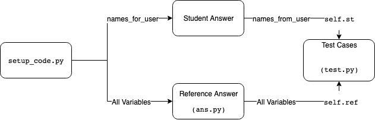

# Python Autograder

This file documents the default Python autograder included in the `prairielearn/grader-python` Docker image. For general information on how to set up an external grader, visit the [external grading](../externalGrading.md) page.

## Setting up

### `info.json`

The question should be first set up to enable [external grading](../externalGrading.md), with `"gradingMethod": "External"` set in the `info.json` settings. To use the specific Python autograder detailed in this document, `"image"` should be set to `"prairielearn/grader-python"` and `"entrypoint"` should point to `"/python_autograder/run.sh"` in the `"externalGradingOptions"` dictionary.

A full `info.json` file should look something like:

```json
{
  "uuid": "...",
  "title": "...",
  "topic": "...",
  "tags": ["..."],
  "type": "v3",
  "singleVariant": true,
  "gradingMethod": "External",
  "externalGradingOptions": {
    "enabled": true,
    "image": "prairielearn/grader-python",
    "entrypoint": "/python_autograder/run.sh"
  }
}
```

### `server.py`

The server code in the `generate()` function must define the list of variables or functions that will be passed to the autograded student code as `names_for_user`, and also those that will be passed from the student code to the test code as `names_from_user`. Only variables or functions listed in `names_for_user` will be accessible by the user from the setup code; only names listed in `names_from_user` will be accessible by the test cases from the user code.

These are stored as a list of dictionary objects in the `data["params"]` dict. The above `names_for_user` and `names_from_user` lists are stored as separate keys in `params`. For example:

```python
def generate(data):
    data["params"]["names_for_user"] = [
        {"name": "x", "description": "Description of the variable", "type": "float"},
    ]
    data["params"]["names_from_user"] = [
        {"name": "x_sq", "description": "The square of $x$", "type": "float"},
    ]
```

Each variable dictionary has entries `name` (the Python variable name in the code), `description` (human readable), and `type` (human readable). These variable lists are used for two purposes: (1) showing students which variables are used, and (2) making variables available to the student code and autograder code.

### `question.html`

At a minimum, the question markup should contain a `pl-file-editor` element (or `pl-file-upload`) and a `pl-external-grader-results` to show the status of grading jobs. These are placed in the question panel and submission panel, respectively. It is also recommended to place a `pl-file-preview` element in the submission panel so that students may see their previous code submissions. An example question markup is given below:

```html
<pl-question-panel>
  <pl-file-editor file-name="user_code.py"></pl-file-editor>
</pl-question-panel>

<pl-submission-panel>
  <pl-external-grader-results></pl-external-grader-results>
  <pl-file-preview></pl-file-preview>
</pl-submission-panel>
```

By default, the grader will look for a gradable file named `user_code.py`, but this can be changed in the test suite.

Expected variables can also be displayed to the user with the `<pl-external-grader-variables>` element. By setting the `variables-name` attribute to either `names_for_user` or `names_from_user`, both sets of variables can be shown.

Full example:

```html
<pl-question-panel>
  <p>... Question prompt ...</p>

  <p>The setup code gives the following variables:</p>
  <p>
    <pl-external-grader-variables
      variables-category="names_for_user"
    ></pl-external-grader-variables>
  </p>

  <p>Your code snippet should define the following variables:</p>
  <pl-external-grader-variables variables-category="names_from_user"></pl-external-grader-variables>
  <pl-file-editor
    file_name="user_code.py"
    ace_mode="ace/mode/python"
    source-file-name="tests/initial_code.py"
  ></pl-file-editor>
</pl-question-panel>

<pl-submission-panel>
  <pl-external-grader-results></pl-external-grader-results>
</pl-submission-panel>
```

Note that the `<pl-external-grader-variables>` element is for purely decorative purposes only, `names_for_user` or `names_from_user` or both can be omitted without any negative results.

### `tests/setup_code.py`

This file is executed before any reference or student code is run. Any variables defined in `names_for_user` can be accessed from here in student code, while the reference answer may freely access variables without restriction. The code in this file is run only _once_ total for both student and reference code. If you need to run some code before each of student and reference code (for example, to set a random seed), you may define the function `def repeated_setup()`, which will be executed before each of them. `repeated_setup()` will always be run after the setup code itself is run.

The server parameters in `data` can be accessed with `data` in this file.

### `tests/test.py`

The test cases for each coding problem are defined as methods of a `test` class contained in the aptly named `test.py` file. The class will have one of the following signatures, depending if you require plots from the student:

```python
## No plot grading
class Test(PLTestCase):

## Plot grading enabled
class Test(PLTestCaseWithPlot):
```

These classes themselves extend `unittest.TestCase`, so any functionality from there is also available.

Each test case is a separate method in the class, the names of these functions must be prefixed with `test_`, but any name that follows is arbitrary. Test cases are run in sorted order by the `unittest` library, so one convention that can be used is to give tests numeric names to ensure their running order.

Adding a name and point value to the test case is done by means of python decorators:
`@points(val)` and `@name("name of the test case")`. These will control the name of the case and the points awarded in the "Test Results" dropdown menu that are shown when a student submits a solution. An example of a definition:

```python
@points(10)
@name("Cool test case")
def test_0(self):
```

Inside the test case implementation, the student answer variables and reference answer variables can be accessed as children of the tuples `self.st` and `self.ref`, respectively. There are various helper functions to check correctness of different types of variables, these are defined in `code_feedback.py`. These are taken from the RELATE grader, so this may be familiar to those with prior experience with RELATE.

At the end of the test case, set the correctness of the answer using `feedback.set_score()`. This function takes a floating point number between 0 and 1 (inclusive), with 0 being completely *in*correct and 1 being completely correct. By default, if no points are given the test case will be marked incorrect.

The overall structure of a test case should look something like:

```python
from code_feedback import Feedback

@points(10)
@name("name of the test case")
def test_0(self):
   if Feedback.check_scalar("name of the variable", self.ref.variable_name, self.st.variable_names):
       Feedback.set_score(1)
   else:
       Feedback.set_score(0)
```

Note that `Feedback.set_score()` is used to set the correctness of the test case between `0` and `1`, this is then multiplied by the number of points awarded by the test case. For example, if a test case is worth 10 points and `Feedback.set_score(0.5)` is run, the student will be awarded 5 points.

The server parameters in `data` can be accessed from within the test cases using `self.data`.

### Leading and Trailing Code

If the optional files `tests/leading_code.py` and/or `tests/trailing_code.py` exist, the autograder will automatically prepend and append the contents to the user's submission before grading. This can be useful if alternative input methods are used, e.g. for Parson's problem questions to provide python imports or other code that must be run.

#### Multiple Iterations

By setting the `total_iters` class variable, the test suite can be run for multiple iterations. To prevent a specific test case from being run multiple times, you can add the `@not_repeated` decorator to it.

#### Code Feedback

The code feedback library contains built-in functions for checking correctness of various datatypes. Here is a nonexhaustive list of them, for a more complete reference refer to the [autogenerated code docs](sphinx-docs.md) or the [source file on GitHub](https://github.com/PrairieLearn/PrairieLearn/blob/master/graders/python/python_autograder/code_feedback.py). Note that all functions will perform some sort of sanity checking on user input and will not fail if, for example, the student does not define an input variable.

- `check_numpy_array_features(name, ref, data)`
  Checks that a numpy array has the same shape and datatype as the reference solution. Does _not_ check values against the reference.
- `check_numpy_array_allclose(name, ref, data, rtol=1e-05, atol=1e-08)`
  Checks that a numpy array has the same shape and datatype as the reference solution, also checks values to see if they are close using specified `rtol` and `atol`.
- `check_list(name, ref, data, entry_type=None)`
  Checks that a list has the same length as the reference solution. If `entry_type` is not `None`, can optionally check if each element has that type. Does _not_ check values against the reference.
- `check_tuple(name, ref, data)`
  Checks that a tuple has the same length and values as the reference solution.
- `check_scalar(name, ref, data, rtol=1e-5, atol=1e-8)`
  Checks that a scalar value is close to the reference solution using specified `rtol` and `atol`.
- `call_user(f, *args, **kwargs)`
  Calls a user defined function with specific `args` and `kwargs`.
- `check_dataframe(name, ref, data, subset_columns=None)`
  Checks that a Pandas DataFrame has the same contents as the reference solution. Can optionally check for a subset of columns by giving a list of column names to `subset_columns`.

Most of these functions have a `accuracy_critical` and `report_failure` keyword argument. If `accuracy_critical` is set to `True` (default is `False`), the grading job will halt if this check fails (similar to an assert). If `report_failure` is true (default), feedback will be displayed to the student if this check fails. The `name` argument is used when displaying feedback.

## General tips and gotchas

Note that the first argument of the `Feedback.check_xx` functions is the name of the variable being checked, this will show up in the grader feedback if the student answers this problem incorrectly.

Be careful not to switch the ordering of the student and reference arguments. The student answer is subject to more strict type checking, and there have been instances in the past where the grader has been broken by poorly formatted student answers.

## Banning/Disallowing library functions

One can hook into library functions in the setup code to disallow students from accessing certain functions. This example is taken from the [demo/autograder/python/numpy] question.

By setting the library functions equal to `Feedback.not_allowed`:

```python
numpy.linalg.inv = Feedback.not_allowed
numpy.linalg.pinv = Feedback.not_allowed
```

the `inv` and `pinv` functions will be effectively banned from use. Any time the student tries to use the functions their code will raise an exception. This will survive library reimports.

## Overview



## Course-specific libraries

Some courses may use libraries that are common across multiple questions. For such questions, it is possible to save these libraries and classes in the course's `serverFilesCourse` directory. Any files in this directory are automatically added to the Python PATH, so they can be imported in any of the files above as needed. If this option is used, however, the question's `info.json` file should indicate that these files should be added to the grading container, as below:

```json
{
  "externalGradingOptions": {
    "enabled": true,
    "image": "prairielearn/grader-python",
    "serverFilesCourse": ["course_lib.py"],
    "entrypoint": "/python_autograder/run.sh"
  }
}
```

## Security

At the start of a grading job, the script `run.sh` is run with `root` privileges. This will initialise directories and copy grading files into the correct location, delete itself, and generate a secret filename for the grading results using `uuidgen` which is passed into the grading code via command-line argument. Then the actual grading script will then be run (`pltest.py`) as the user `ag`.

The grading Python scripts will load any sensitive files into memory (setup code, answer code, test cases) and remove them from disk before running any student code. Command line arguments in argv are wiped as well. Users therefore do not have access to question specific code, but only general grader logic which is publicly available.

After grading, results will be written to the secret filename generated above. If this file does not exist or the filename does not match then the grading job will fail and students will not receive points. This is mostly a failsafe in case the grader code were to crash, but in theory could also prevent crafty students from writing their own results file.

The grading job will now drop back to `root` in the `run.sh` script and will copy any output to the correct location, as expected by the external grading framework.

[demo/autograder/python/numpy]: https://github.com/PrairieLearn/PrairieLearn/tree/master/exampleCourse/questions/demo/autograder/python/numpy
