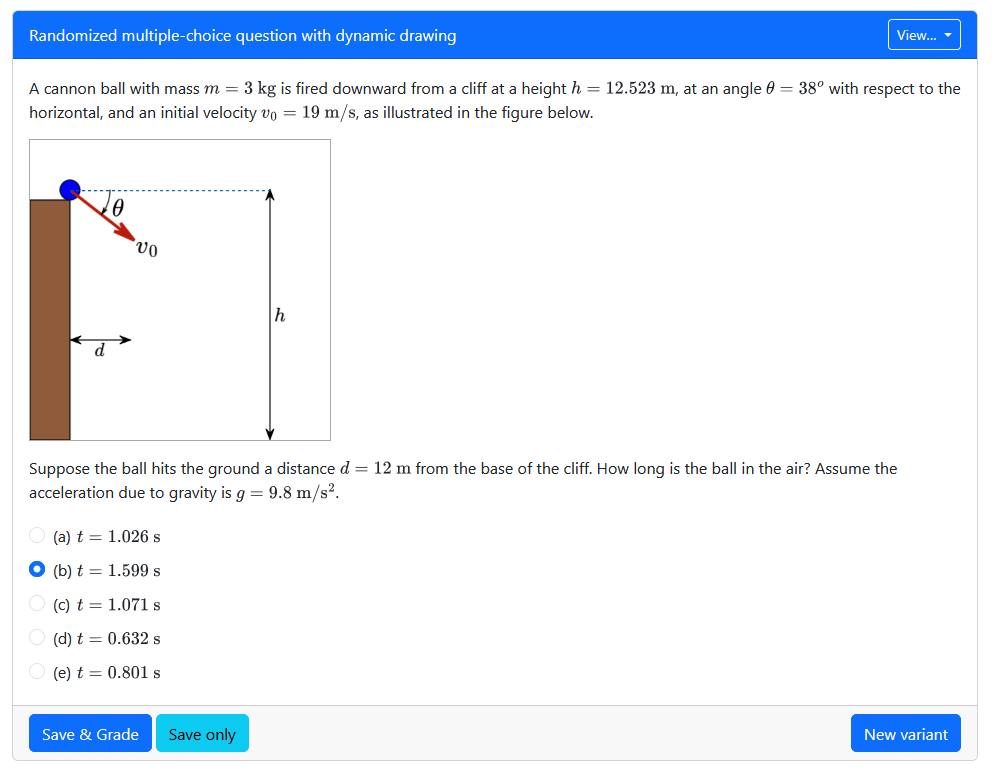

# Questions

Questions are the basic building blocks of PrairieLearn. They are the individual problems that students will solve, and they can be combined into assessments (homeworks and exams). Questions can be simple or complex, and they can be written in a variety of ways. This document describes how to create questions, including the directory structure, metadata, HTML templates, and server-side code.



## Question components

A question is made up of three main components:

1. **`info.json`**: Metadata about the question, including the question title, topic, and tags.
2. **`question.html`**: The HTML template that defines the question. This is where you write the question text and define the input elements. Reference the [question template documentation](template.md) for more details.
3. **`server.py`**: This is where you write the logic for generating random values, grading student responses, and any other server-side code. This file is optional, but it is necessary for any question that has non-trivial randomization or custom grading behavior. Reference the [server documentation](server.md) for more details.

## Creating a question

To create a new question through the PrairieLearn web interface:

1. Navigate to the **Questions** tab in your course.
2. Click the **Add question** button.
3. Enter a title and Question ID (QID) for your new question.
4. Choose a starting point:
   - **Empty question**: Creates a blank question with just the essential files (`question.html` and `server.py`).
   - **PrairieLearn template**: Start from one of PrairieLearn's pre-built question templates.
   - **Course template**: Start from a template defined in your course. See [Custom templates](#custom-templates) for details.
5. Click **Create question**.

!!! tip

    Avoid using term names (e.g. `Spring20/questionName`) or assessment names (e.g. `exam3/question12`) in your question ID, as these can make it harder to find and reuse questions across assessments and terms. One potential folder structure you could consider is `topic/subtopic/question`.

## Directory structure

Questions are all stored inside the `questions` directory (or any subfolder) for a course. Each question is a single directory that contains all the files for that question. The name of the full question directory relative to `questions` is the QID (the "question ID") for that question. For example, here are three different questions:

```text
questions
|
|-- fossilFuelsRadio          # first question, id is "fossilFuelsRadio"
|   |
|   +-- info.json             # metadata for the fossilFuelsRadio question
|   +-- server.py             # secret server-side code (optional)
|   `-- question.html         # HTML template for the question
|
|-- addVectors                # second question, id is "addVectors"
|   |
|   +-- info.json             # metadata for the addVectors question
|   +-- server.py
|   +-- question.html
|   +-- notes.docx            # more files, like notes on how the question works
|   +-- solution.docx         # these are secret (can't be seen by students)
|   |
|   +-- clientFilesQuestion/  # Files accessible to the client (web browser)
|   |   `-- fig1.png          # A client file (an image)
|   |
|   +-- tests/                # external grading files (see other doc)
|       `-- ...
|
`-- subfolder                 # a subfolder we can put questions in -- this itself can't be a question
    |
    `-- nestedQuestion        # third question, id is "subfolder/nestedQuestion"
        |
        +-- info.json         # metadata for the "subfolder/nestedQuestion" question
        `-- question.html
```

PrairieLearn assumes independent questions; nothing ties them together. However, each question could have multiple parts (inputs that are validated together).

!!! info

    An extensive library of example questions can be found under the [`exampleCourse/questions`](https://github.com/PrairieLearn/PrairieLearn/blob/master/exampleCourse/questions) directory of PrairieLearn. You can also view these questions by [running PrairieLearn locally](../installing.md/#running-instructions).

## Metadata (`info.json`)

The `info.json` file for each question defines properties of the question. For example:

```json title="info.json"
{
  "uuid": "cbf5cbf2-6458-4f13-a418-aa4d2b1093ff",
  "title": "Newton's third law",
  "topic": "Forces",
  "tags": ["secret", "Fa18"],
  "authors": [{ "name": "John Doe", "email": "doe@example.org", "orcid": "0000-0000-0000-0001" }],
  "type": "v3",
  "comment": "You can add comments to JSON files using this property."
}
```

| Property                 | Type    | Description                                                                                                                                                                                                                                                                                                        |
| ------------------------ | ------- | ------------------------------------------------------------------------------------------------------------------------------------------------------------------------------------------------------------------------------------------------------------------------------------------------------------------ |
| `uuid`                   | string  | [Unique identifier](../uuid.md). (Required; no default)                                                                                                                                                                                                                                                            |
| `type`                   | enum    | Type of the test. Must be `"v3"` for new-style questions. (Required; no default)                                                                                                                                                                                                                                   |
| `title`                  | string  | The title of the question (e.g., `"Addition of vectors in Cartesian coordinates"`). (Required; no default)                                                                                                                                                                                                         |
| `topic`                  | string  | The category of question (e.g., `"Vectors"`, `"Energy"`). Like the chapter in a textbook. (Required; no default)                                                                                                                                                                                                   |
| `tags`                   | array   | Optional extra tags associated with the question (e.g., `["secret", "concept"]`). (Optional; default: no tags)                                                                                                                                                                                                     |
| `authors`                | array   | Authors of the question. Each author entry can have a `name`, and must contain at least one of the following attributes: `email`, `orcid` ([ORCID identifier](https://orcid.org)), or `originCourse` (course sharing name; see [Question Sharing](#question-sharing) for details). (Optional; default: no authors) |
| `gradingMethod`          | enum    | The grading method used for auto-grading this question. Valid values: `Internal`, `External`, or `Manual` (for manual-only questions). (Optional; default: `Internal`)                                                                                                                                             |
| `singleVariant`          | boolean | Whether the question is not randomized and only generates a single variant. (Optional; default: `false`)                                                                                                                                                                                                           |
| `showCorrectAnswer`      | boolean | Whether the question should display the answer panel. (Optional; default: `true`)                                                                                                                                                                                                                                  |
| `partialCredit`          | boolean | Whether the question will give partial points for fractional scores. (Optional; default: `true`)                                                                                                                                                                                                                   |
| `externalGradingOptions` | object  | Options for externally graded questions. See the [external grading docs](../externalGrading.md). (Optional; default: none)                                                                                                                                                                                         |
| `dependencies`           | object  | External JavaScript or CSS dependencies to load. See below. (Optional; default: `{}`)                                                                                                                                                                                                                              |
| `sharePublicly`          | boolean | Whether the question should be available for anyone to preview or use in their course                                                                                                                                                                                                                              |
| `shareSourcePublicly`    | boolean | Whether the source code of the question should be available                                                                                                                                                                                                                                                        |
| `sharingSets`            | array   | Sharing sets which the question belongs to                                                                                                                                                                                                                                                                         |

!!! note "Local development note"

    Any time you edit a question `info.json` file on a local copy of PrairieLearn, you need to click “Load from disk” to reload the changes. Most edits to HTML or Python files will be picked up by reloading the page. However, if you made changes to question generation or element arguments, you might also need to generate a new variant.

### Question Sharing

Any question that is marked with `"shareSourcePublicly": true` will be considered and displayed as being published for free use under the [CC-BY-NC](https://www.creativecommons.org/licenses/by-nc/4.0/) license. Any question that is marked with `"sharePublicly": true` will be considered and displayed as being published for free use under the [CC-BY-NC-ND](https://creativecommons.org/licenses/by-nc-nd/4.0/) license. Questions may be privately shared to individual courses using sharing sets, as explained in the [sharing documentation](../contentSharing.md). Sharing sets that a question belongs to are specified as a list of strings. These must match sharing sets that are declared in the [course configuration](../course/index.md#adding-sharing-sets).

```json title="info.json"
{
  "sharingSets": ["python-exercises"]
}
```

### Question Authorship

Future versions of PrairieLearn may provide the ability to track the usage of shared questions. To ensure that questions remain associated with their original author(s) and course, we recommend including `authors` information in the `info.json` file. The `orcid` attribute in particular allows authors to be uniquely identified, even after changing their affiliation or email address. The `originCourse` attribute can be used to associate questions with courses by providing their [sharing name](../contentSharing.md#sharing-names). This allows a wider number of course staff to be credited with contributing to a question, and might allow them to track question usage in a future version of PrairieLearn.

### Question Dependencies

Your question can load client-side assets such as scripts or stylesheets from different sources. A full list of dependencies will be compiled based on the question's needs and any dependencies needed by page elements, then they will be deduplicated and loaded onto the page.

These dependencies are specified in the `info.json` file, and can be configured as follows:

```json title="info.json"
{
  "dependencies": {
    "nodeModulesScripts": ["three/build/three.min.js"],
    "clientFilesQuestionScripts": ["my-question-script.js"],
    "clientFilesQuestionStyles": ["my-question-style.css"],
    "clientFilesCourseStyles": ["courseStylesheet1.css", "courseStylesheet2.css"]
  }
}
```

The different types of dependency properties available are summarized in this table:

| Property                     | Description                                                                                       |
| ---------------------------- | ------------------------------------------------------------------------------------------------- |
| `nodeModulesStyles`          | The styles required by this question, relative to `[PrairieLearn directory]/node_modules`.        |
| `nodeModulesScripts`         | The scripts required by this question, relative to `[PrairieLearn directory]/node_modules`.       |
| `clientFilesQuestionStyles`  | The scripts required by this question relative to the question's `clientFilesQuestion` directory. |
| `clientFilesQuestionScripts` | The scripts required by this question relative to the question's `clientFilesQuestion` directory. |
| `clientFilesCourseStyles`    | The styles required by this question relative to `[course directory]/clientFilesCourse`.          |
| `clientFilesCourseScripts`   | The scripts required by this question relative to `[course directory]/clientFilesCourse`.         |

Additional details about how to access these fields from `server.py` can be found in the [`server.py` documentation](server.md#accessing-files-on-disk).

### Non-randomized questions

While it is recommended that all questions contain random parameters, sometimes it is impractical to do this. For questions that don't have a meaningful amount of randomization in them, the `info.json` file should set `"singleVariant": true`. This has the following effects:

- On `Homework`-type assessments, each student will only ever be given one variant of the question, which they can repeatedly attempt without limit. The correct answer will never be shown to students.
- On `Exam`-type assessments, all questions are effectively single-variant, so the `singleVariant` option has no effect.

### Partial credit

By default, all questions award partial credit. For example, if there are two numeric answers in a question and only one of them is correct, the student will be awarded 50% of the available points.

To disable partial credit for a question, set `"partialCredit": false` in the `info.json` file for the question. This will mean that the question will either give 0% or 100%, and it will only give 100% if every element on the page is fully correct. Some [question elements](../elements/index.md) also provide more fine-grained control over partial credit.

In general, it is _strongly_ recommended to leave partial credit enabled for all questions.

!!! info

    See the [reference for `infoQuestion.json`](../schemas/infoQuestion.md) for an exhaustive list of all the properties available, and their schemas.

## HTML (`question.html`)

The `question.html` is a template used to render the question to the student. A complete `question.html` example looks like:

```html title="question.html"
<pl-question-panel>
  <p>
    A particle of mass $m = {{params.m}}\rm\ kg$ is observed to have acceleration $a =
    {{params.a}}\rm\ m/s^2$.
  </p>
  <p>What is the total force $F$ currently acting on the particle?</p>
</pl-question-panel>

<p>
  <pl-number-input
    answers-name="F"
    comparison="sigfig"
    digits="2"
    label="$F =$"
    suffix="$\rm m/s^2$"
  ></pl-number-input>
</p>
```

The `question.html` is regular HTML, with a few special features:

1. Any text in double-curly-braces (like `{{params.m}}`) is substituted with variable values using [Mustache](https://mustache.github.io/mustache.5.html). These parameters are typically defined by a [question's `server.py`](#custom-generation-and-grading-serverpy).
2. Special HTML elements (like [`<pl-number-input>`](../elements/pl-number-input.md)) enable input and formatted output. A student's submission is composed of the answers they provide to the question elements. See the [list of PrairieLearn elements](../elements/index.md).

   :warning: **All submission elements must have unique `answers-name` attributes.** This is necessary for questions to be graded properly.

3. A special `<markdown>` tag allows you to write Markdown inline in questions.
4. LaTeX equations are available within HTML by using `$x^2$` for inline equations, and `$$x^2$$` or `\[x^2\]` for display equations.
5. Special layout elements like `<pl-question-panel>` and `<pl-answer-panel>` can be used to show content to students in different contexts.

!!! info

    More details about these features and information about `question.html` is in the [question template documentation](template.md).

## Custom generation and grading (`server.py`)

The `server.py` file for each question creates randomized question variants by generating random parameters and the corresponding correct answers. A minimal `server.py` might set random parameters and calculate correct answers based on those parameters, while using the built-in grading ability of the PrairieLearn elements to grade the student's submission. More complex questions may use `server.py` to provide custom parsing and grading functionality, or randomized images and files.

```python title="server.py"
import random

def generate(data):
    # Generate random parameters
    data["params"]["m"] = random.randint(1, 10)
    data["params"]["a"] = random.randint(1, 10)

    # Compute the correct answer
    data["correct_answers"]["F"] = data["params"]["m"] * data["params"]["a"]
```

!!! info

    More information about `server.py`, custom grading, and more can be found in the [server.py documentation](server.md).

## Grading student answers

Elements like [`pl-multiple-choice`](../elements/pl-multiple-choice.md) or [`pl-checkbox`](../elements/pl-checkbox.md), which aren't freeform answers, are automatically graded based on the element parameters. For other elements, like [`pl-number-input`](../elements/pl-number-input.md) and [`pl-string-input`](../elements/pl-string-input.md), which have students input an answer of their choosing, there are four different methods of auto-grading the student answer:

1. Set the correct answer using the correct-answer attributes for each element in `question.html`. This will use the built-in grading methods for each element. This option is typically used for answers with a hard-coded value (i.e. if `"singleVariant": true` in `info.json`), and is not expected to be used in most randomized questions.

2. Set `data["correct_answers"][VAR_NAME]` in `server.py`. This is for questions where you can pre-compute a single correct answer based on the (randomized) parameters.

3. Write a [custom grading function](./server.md#step-5-grade) in `server.py` that checks `data["submitted_answers"][VAR_NAME]` and sets scores. This supports a variety of alternative grading options, including having multiple correct answers, testing properties of the submitted answer for correctness, compute correct answers of some elements based on the value of other elements, etc.

4. Write an [external grader](../externalGrading.md), though this is typically applied to more complex questions like coding.

If a question uses more than one method for grading, options 3 and 4 override options 1 and 2. If you grade a question using a custom grading function (option 3) or an external grader (option 4), you are still strongly encouraged to provide a possible correct answer so that students can see it in the answer panel. More details about providing feedback on student answers can be found in the `"answer"` panel section of the [question template documentation](template.md#answer-panel).

## Accessibility

See the [question accessibility documentation](accessibility.md) for more information about how to ensure your questions are accessible to all students, including those using screen readers or other assistive technologies.

## Custom templates

Creating a question with a QID starting with `template/` will create a question that will be presented as a template option when [creating a question](#creating-a-question). This should allow instructors to create course-specific patterns, conventions, or grading processes that can then be adopted by new questions.
