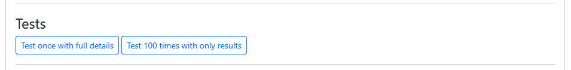

# `server.py`

The `server.py` file for each question creates randomized question variants by generating random parameters and the corresponding correct answers.

The following sections build a simple example of a question that asks the student to double a number. The question will look like this:

<!-- prettier-ignore -->
```html title="question.html"
<pl-question-panel>
  If $x = {{params.x}}$, what is $y$ if $y$ is double $x$?
</pl-question-panel>
<pl-integer-input answers-name="y" label="$y =$"></pl-integer-input>
<pl-submission-panel>
  {{feedback.y}}
</pl-submission-panel>
```

!!! tip

    Jump to the [complete `question.html` and `server.py` example](#complete-example).

More details about the `{{params.x}}` and `{{feedback.y}}` Mustache syntax can be found in the [question template documentation](./template.md#mustache-templates).

## Step 1: `generate`

First, the `generate` function is called to generate the question variant. It should update `data["params"]` with any necessary parameters for the question, and `data["correct_answers"]` with the correct answers.

```python title="server.py"
import random

def generate(data):
    # Generate random parameters for the question and store them in the data["params"] dict:
    data["params"]["x"] = random.randint(5, 10)

    # Also compute the correct answer (if there is one) and store in the data["correct_answers"] dict:
    data["correct_answers"]["y"] = 2 * data["params"]["x"]
```

These values can be used in the `question.html` file with Mustache syntax. For example, you can use `data["params"]["x"]` with `{{params.x}}`.

The snippet below uses the [`<pl-question-panel>`](../elements.md#pl-question-panel-element) element so that it is only shown within the context of the [question panel](./template.md#question-panel).

<!-- prettier-ignore -->
```html title="question.html"
<pl-question-panel>
  If $x = {{params.x}}$, what is $y$ if $y$ is double $x$?
</pl-question-panel>
```

### Randomization

Question variants are randomized based on the variant seed (`data["variant_seed"]`), and all random generators (`random`, `np.random`, etc.) are seeded with this value.

??? tip "Generating fake data"

    If you need to generate fake data, you can use the [`faker`](https://faker.readthedocs.io/en/master/) library. This is useful for generating random names, addresses, and other data that looks real but is not.

    ```python title="server.py"
    from faker import Faker
    fake = Faker()

    fake.name()
    # 'Lucy Cechtelar'
    ```

### Parameter generation

For generated floating point answers, it's important to use consistent rounding when displaying numbers to students _and_ when computing the correct answer. Displaying rounded numbers to students but using the unrounded version for grading can lead to unexpected results.

=== "Good"

    ```python title="server.py"
    def generate(data):
        # Rounds numbers at the beginning
        a = np.round(33.33337, 2)
        b = np.round(33.33333, 2)
        data["params"]["a_for_student"] = f'{a:.2f}'
        data["params"]["b_for_student"] = f'{b:.2f}'
        data["correct_answers"]["c"] = a - b
    ```

=== "Bad"

    ```python title="server.py"
    def generate(data):
        a = 33.33337
        b = 33.33333
        data["params"]["a_for_student"] = f'{a:.2f}'
        data["params"]["b_for_student"] = f'{a:.2f}'
        # Correct answer is computed with full precision,
        # but the parameters displayed to students are rounded.
        data["correct_answers"]["c"] = a - b
    ```

## Step 2: `prepare`

Next, the `prepare` function is called after all elements (e.g. `<pl-integer-input>`) have run `prepare()`. This may be done to do any sort of final post-processing, but is not commonly used.

## Step 3: `render`

Next, the `render(data, html)` function is called to render the question. You can use this function to override how the question is rendered. The render function expects two parameters, `data` and `html`, and should return a string of HTML. The HTML after the mustache template has been rendered is available through the `html` parameter. This is rarely used except for very advanced questions, and we won't need it for this example.

## Step 4: `parse`

When a student submits their answer, the `parse` function is called to parse the submitted answers after the individual elements have parsed them. This function can be used to display more-specific format errors than the input elements or to parse the input differently. When our parse function runs, `<pl-integer-input>` will have already parsed the submitted value as an integer, and display an error to the student if it was invalid. For this example, we will allow the student to only submit positive integers, so we will check for that and set a format error with `data["format_errors"]` if it is negative.

The values typically read or modified by a `parse` function are:

- `data["raw_submitted_answers"][NAME]` - the exact raw answer submitted by the student.
- `data["submitted_answers"][NAME]` - the answer parsed by elements (e.g. strings converted to numbers).
- `data["format_errors"][NAME]` - the format error message for a named answer.

If there are format errors, then the submission is "invalid" and is not graded. To provide feedback but keep the submission "valid", `data["feedback"][NAME]` can be used instead.

```python title="server.py"
def parse(data):
    # Reject negative numbers for "y" if we don't already have a format error
    if "y" not in data["format_errors"] and int(data["submitted_answers"]["y"]) < 0:
        data["format_errors"]["y"] = "Negative numbers are not allowed"
```

We could have also modified the submitted answers directly, if we need to process the inputs further. For example, if we wanted to accept negative answers as equivalent to their absolute value, we could do this instead:

```python title="server.py"
def parse(data):
    # Ensure that "y" is positive
    data["submitted_answers"]["y"] = abs(int(data["submitted_answers"]["y"]))
```

!!! info

    In general, each function of the question generation process runs *after* all elements in the question. For example, the `parse()` function in `server.py` runs after all elements have run their `parse()` functions. This is important to remember when using the `data` dictionary, as it will contain the results *after* the elements have finished processing.

Although questions with custom grading may not rely on the full grading functionality from individual elements, it is _highly_ recommended that built-in elements are used for student input, as these elements include helpful parsing and feedback by default. Parsed student answers are present in the `data["submitted_answers"]` dictionary.

!!! note

    Data stored under the `"submitted_answers"` key in the data dictionary may be of varying type. Specifically, the `pl-integer-input`
    element sometimes stores very large integers as strings instead of the Python `int` type used in most cases. The best practice for custom grader
    code in this case is to always cast the data to the desired type, for example `int(data["submitted_answers"][name])`. See the
    [PrairieLearn elements documentation](../elements.md) for more detailed discussion related to specific elements.

The `parse()` function can also be used to create custom files to be sent to an external grader. This can be done with the `pl.add_submitted_file()` function, as in the example below:

```python title="server.py"
import prairielearn as pl

def parse(data):
    code = f"x = {data["submitted_answers"]["expression"]}"
    pl.add_submitted_file(data, "user_code.py", raw_contents=code)
```

## Step 5: `grade`

Finally, the `grade(data)` function is called to grade the question. The grade function is responsible for:

- Setting the score and feedback for each named answer in `data["partial_scores"]`.
- Setting the total score for the question in `data["score"]`.
- Setting the overall feedback for the question in `data["feedback"]`.

This function only runs if `parse()` did not produce format errors, so we can assume all data is valid. All elements will have already graded their answers (if any) before this point.

The values typically read or modified by a `grade` function are:

- `data["partial_scores"][NAME]["score"]` - the individual scores for the named answers (0 to 1).
- `data["partial_scores"][NAME]["feedback"]` - the feedback for each named answer from the element that graded it.
- `data["score"]` - the total score for the question (0 to 1).
- `data["feedback"][NAME]` - the overall question feedback for each named answer.

It is recommended that you give additional feedback to the student as they make progress towards the solution, and reward this progress with partial credit.

If this function is not defined, the question will be graded automatically based on the correct answers set in `data["correct_answers"]`. Each answer the student provides will also be given feedback from the element that graded it. If the `grade` function _is_ defined, the data you receive has already been graded by the elements. You should ensure you only award partial credit if the answer isn't correct, otherwise you might give partial credit for a correct answer. In the snipped below, we update `data["score"]` using the [`set_weighted_score_data`][prairielearn.question_utils.set_weighted_score_data] utility.

You can set `data["format_errors"][NAME]` to mark the submission as invalid. This will cause the question to not use up one of the student's attempts on assessments. However, you are encouraged to do as many checks for invalid data as possible in `parse` instead of `grade`; the `parse` function is called when the student hits "Save only", in manually or externally graded questions, and in assessments without real-time grading.

```python title="server.py"
import math
import prairielearn as pl

def grade(data):
    # Give half points for incorrect answers larger than "x", only if not already correct.
    # Use math.isclose to avoid possible floating point errors.
    y_is_correct = math.isclose(data["partial_scores"]["y"]["score"], 1.0)
    if not y_is_correct and int(data["submitted_answers"]["y"]) > data["params"]["x"]:
        data["partial_scores"]["y"]["score"] = 0.5
        pl.set_weighted_score_data(data)
        data["feedback"]["y"] = "Your value for $y$ is larger than $x$, but incorrect."
```

### Providing feedback

To set custom feedback, the grading function should set the corresponding entry in the `data["feedback"]` dictionary. These feedback entries are passed in when rendering the `question.html`, which can be accessed by using the mustache prefix `{{feedback.}}`. See the [above example](#complete-example) or [this demo question](https://github.com/PrairieLearn/PrairieLearn/tree/master/exampleCourse/questions/demo/custom/gradeFunction) for examples of this.

Some elements provide feedback through `data["partial_scores"][NAME]["feedback"]`, which you can override in the grading function. This field is often a string, though some elements such as `<pl-drawing>` and `<pl-checkbox>` use different types. The feedback provided here will be attached to the student's answer for that element, which can make it easier for students to interpret the feedback they received in longer questions. Since not all elements provide feedback this way, and some use different data structures to represent the feedback they give, we recommend using `data["feedback"][NAME]` to provide question-specific feedback instead.

!!! tip "Answer-specific feedback"

    If you want to provide feedback on a specific answer that doesn't use/support `data["partial_scores"][NAME]["feedback"]`,
    you could render the feedback directly after the element in `question.html`:

    <!-- prettier-ignore -->
    ```html title="question.html"
    <pl-string-input ...></pl-string-input>
    {{#feedback.value1}}<div>Feedback: {{.}}</div>{{/feedback.value1}}
    ```

Overall question feedback in `data["feedback"][NAME]` needs to be rendered explicity in the `question.html` template using `{{feedback.NAME}}`. Feedback given in `data["partial_scores"][NAME]["feedback"]`, if supported by the element, will be rendered automatically by the elements, assuming the element is visible.

### Grading floating-point answers

For grading functions involving floating point numbers, **avoid exact comparisons with `==`**. Floating point comparisons with `==` might unexpectedly fail since calculations in Python can introduce floating-point error. Instead, use the [`math.isclose`](https://docs.python.org/3/library/math.html#math.isclose) function, as it performs comparisons within given tolerance. The `prairielearn` Python library also offers several functions to perform more specialized comparisons:

- [`is_correct_scalar_ra`][prairielearn.grading_utils.is_correct_scalar_ra] compares floats using relative and absolute tolerances.
- [`is_correct_scalar_sf`][prairielearn.grading_utils.is_correct_scalar_sf] compares floats up to a specified number of significant figures.
- [`is_correct_scalar_dd`][prairielearn.grading_utils.is_correct_scalar_dd] compares floats up to a specified number of digits.

### Recalculating scores

Any custom grading function for the whole question should set `data["score"]` as a value between 0.0 and 1.0, which will be the final score for the given question. If a custom grading function is only grading a specific part of a question, the grading function should set the corresponding dictionary entry in `data["partial_scores"]` and then recompute the final `data["score"]` value for the whole question. The `prairielearn` Python library provides the following score recomputation functions:

- [`set_weighted_score_data`][prairielearn.question_utils.set_weighted_score_data] sets `data["score"]` to be the weighted average of entries in `data["partial_scores"]`.
- [`set_all_or_nothing_score_data`][prairielearn.question_utils.set_all_or_nothing_score_data] sets `data["score"]` to 1.0 if all entries in `data["partial_scores"]` are 1.0, 0.0 otherwise.

This can be used like so:

```python title="server.py"
import prairielearn as pl

def grade(data):
    # update partial_scores as necessary
    data["partial_scores"]["y"]["score"] = 0.5

    # compute total question score
    pl.set_weighted_score_data(data)
```

More detailed information can be found in the [grading utilities documentation](../python-reference/prairielearn/grading_utils.md).

If you prefer not to show score badges for individual parts, you can unset the dictionary entries in `data["partial_scores"]` once `data["score"]` has been computed.

??? example "Code snippet"

    ```python title="server.py"
    import prairielearn as pl

    def grade(data):
        # update partial_scores as necessary
        data["partial_scores"]["y"]["score"] = 0.5

        # compute total question score
        pl.set_weighted_score_data(data)

        # unset partial scores
        data["partial_scores"]["y"]["score"] = None
    ```

## Question lifecycle

The diagram below shows the lifecycle of a question, including the server functions called, the different panels that are rendered, and points of interaction with the student.

{layout="dagre" scale="0.6" pad="0" }

## Complete example

The finished, complete `question.html` and `server.py` example looks like:

<!-- prettier-ignore -->
```html title="question.html"
<pl-question-panel>
  If $x = {{params.x}}$, what is $y$ if $y$ is double $x$?
</pl-question-panel>
<pl-integer-input answers-name="y" label="$y =$"></pl-integer-input>
<pl-submission-panel>
  {{feedback.y}}
</pl-submission-panel>
```

```python title="server.py"
import random
import math
import prairielearn as pl

def generate(data):
    # Generate random parameters for the question and store them in the data["params"] dict:
    data["params"]["x"] = random.randint(5, 10)

    # Also compute the correct answer (if there is one) and store in the data["correct_answers"] dict:
    data["correct_answers"]["y"] = 2 * data["params"]["x"]

def parse(data):
    # Reject negative numbers for "y" if we don't already have a format error
    if "y" not in data["format_errors"] and int(data["submitted_answers"]["y"]) < 0:
        data["format_errors"]["y"] = "Negative numbers are not allowed"

def grade(data):
    # Give half points for incorrect answers larger than "x", only if not already correct.
    # Use math.isclose to avoid possible floating point errors.
    y_is_correct = math.isclose(data["partial_scores"]["y"]["score"], 1.0)
    if not y_is_correct and int(data["submitted_answers"]["y"]) > data["params"]["x"]:
        data["partial_scores"]["y"]["score"] = 0.5
        pl.set_weighted_score_data(data)
        data["feedback"]["y"] = "Your value for $y$ is larger than $x$, but incorrect."
```

## `server.py` functions

This table summarizes the functions that can be defined in `server.py`.

| Function     | Updates `data`?    | Modifiable `data` keys                                                                                   | Description                                                                                                                                                                                                                                                                   |
| ------------ | ------------------ | -------------------------------------------------------------------------------------------------------- | ----------------------------------------------------------------------------------------------------------------------------------------------------------------------------------------------------------------------------------------------------------------------------- |
| `generate()` | :white_check_mark: | `correct_answers`, `params`                                                                              | Generate the parameter and true answers for a new random question variant. Set `data["params"][name]` and `data["correct_answers"][name]` for any variables as needed. Modify the `data` dictionary in-place.                                                                 |
| `prepare()`  | :white_check_mark: | `answers_names`, `correct_answers`, `params`                                                             | Final question preparation after element code has run. Can modify data as necessary. Modify the `data` dictionary in-place.                                                                                                                                                   |
| `render()`   | :x:                | N/A. Returns `html` as a string                                                                          | Render the HTML for one panel and return it as a string.                                                                                                                                                                                                                      |
| `parse()`    | :white_check_mark: | `correct_answers`, `format_errors`, `feedback`, `submitted_answers`                                      | Parse the `data["submitted_answers"][var]` data entered by the student, modifying this variable. Modify the `data` dictionary in-place.                                                                                                                                       |
| `grade()`    | :white_check_mark: | `correct_answers`, `feedback`, `format_errors`, `params`, `partial_scores`, `score`, `submitted_answers` | Grade `data["submitted_answers"][var]` to determine a score. Store the score and any feedback in `data["partial_scores"][var]["score"]` and `data["partial_scores"][var]["feedback"]`. Modify the `data` dictionary in-place.                                                 |
| `file()`     | :x:                | N/A. Returns an `object` (string, bytes-like, file-like)                                                 | Generate a file object dynamically in lieu of a physical file. Trigger via `type="dynamic"` in the question element (e.g., `pl-figure`, `pl-file-download`). Access the requested filename via `data['filename']`. If `file()` returns nothing, an empty string will be used. |
| `test()`     | :white_check_mark: | `partial_scores`, `format_errors`, `score`, `raw_submitted_answers`, `feedback`, `gradable`              | Test the question, and ensure it can grade a variety of student inputs.                                                                                                                                                                                                       |

As shown in the table, all functions (except for `render`) accept a single argument, `data` (a dictionary), and modify it in place. The `render` function accepts two arguments: the `data` dictionary and the `html` content computed from the template and elements.

### `data` dictionary

| Attribute               | Type    | Description                                                                                                                          |
| ----------------------- | ------- | ------------------------------------------------------------------------------------------------------------------------------------ |
| `params`                | `dict`  | Parameters for the question variant. These are set in the `generate()` function and can be used in the `question.html` file.         |
| `correct_answers`       | `dict`  | Correct answers for the question variant. Each item maps from a named answer to a value.                                             |
| `submitted_answers`     | `dict`  | Student answers submitted for the question after parsing.                                                                            |
| `raw_submitted_answers` | `dict`  | Raw student answers submitted for the question.                                                                                      |
| `format_errors`         | `dict`  | Dictionary of format errors for each answer. Each item maps from a named answer to a error message.                                  |
| `partial_scores`        | `dict`  | Dictionary of partial scores for each answer. Each entry is a dictionary with the keys `score` (float) and `weight` (int, optional). |
| `score`                 | `float` | The total score for the question variant.                                                                                            |
| `feedback`              | `dict`  | Dictionary of [feedback](#providing-feedback) for each answer. Each item maps from a named answer to a feedback message.             |
| `variant_seed`          | `int`   | The [random seed](#randomization) for this question variant.                                                                         |
| `options`               | `dict`  | Any options associated with the question, e.g. for [accessing files](#accessing-files-on-disk)                                       |
| `filename`              | `str`   | The name of the [dynamic file requested](#generating-dynamic-files-with-file) in the `file()` function.                              |
| `test_type`             | `str`   | The type of test being run in the [`test()` function](#testing-questions-with-test).                                                 |

The key `data` fields and their types are described above. You can view a full list of all fields in the [`QuestionData` reference](../python-reference/prairielearn/question_utils.md#prairielearn.question_utils.QuestionData).

## Question data storage

All persistent data related to a question variant is stored under different entries in the `data` dictionary. This dictionary is stored in JSON format by PrairieLearn, and as a result, **everything in `data` must be JSON serializable**. Some types in Python are natively JSON serializable, such as strings, lists, and dicts, while others are not, such as complex numbers, numpy ndarrays, and pandas DataFrames.

The `prairielearn` Python library provides the utility functions [`to_json`][prairielearn.conversion_utils.to_json] and [`from_json`][prairielearn.conversion_utils.from_json] (part of [`conversion_utils.py`](https://github.com/PrairieLearn/PrairieLearn/blob/master/apps/prairielearn/python/prairielearn/conversion_utils.py)), which can serialize and deserialize various objects for storage as part of question data. Please refer to the documentation for those functions for additional information. Here is a simple example of how to use them to store and retrieve a numpy array:

```python title="server.py"
import numpy as np
import prairielearn as pl

def generate(data):
    data["params"]["numpy_array"] = pl.to_json(np.array([1.2, 3.5, 5.1]))

def grade(data):
    pl.from_json(data["params"]["numpy_array"])
```

The [`pl.to_json`][prairielearn.conversion_utils.to_json] function supports keyword-only options for different types of encodings (e.g. `pl.to_json(var, df_encoding_version=2)`). These options have been added to allow for new encoding behavior while still retaining backwards compatibility with existing usage.

- `df_encoding_version` controls the encoding of Pandas DataFrames. Encoding a DataFrame `df` by setting `pl.to_json(df, df_encoding_version=2)` allows for missing and date time values whereas `pl.to_json(df, df_encoding_version=1)` (default) does not. However, `df_encoding_version=1` has support for complex numbers, while `df_encoding_version=2` does not.

- `np_encoding_version` controls the encoding of Numpy values. When using `np_encoding_version=1`, then only `np.float64` and `np.complex128` can be serialized by `pl.to_json`, and their types will be erased after deserialization (will become native Python `float` and `complex` respectively). It is recommended to set `np_encoding_version=2`, which supports serialization for all numpy scalars and does not result in type erasure on deserialization.

## Accessing files on disk

From within `server.py` functions, directories can be accessed as:

```python
# on-disk location of the current question directory
data["options"]["question_path"]

# on-disk location of clientFilesQuestion/
data["options"]["client_files_question_path"]

# URL location of clientFilesQuestion/ (only in render() function)
data["options"]["client_files_question_url"]

# URL location of dynamically-generated question files (only in render() function)
data["options"]["client_files_question_dynamic_url"]

# on-disk location of clientFilesCourse/
data["options"]["client_files_course_path"]

# URL location of clientFilesCourse/ (only in render() function)
data["options"]["client_files_course_url"]

# on-disk location of serverFilesCourse/
data["options"]["server_files_course_path"]
```

## Generating dynamic files with `file()`

You can dynamically generate file objects in `server.py`. These files never appear physically on the disk. They are generated in `file()` and returned as strings, bytes-like objects, or file-like objects. `file()` has access to the same `data` object as the one created by the `generate()` function, including `data["params"]` and `data["correct_answers"]`. A complete `question.html` and `server.py` example using a dynamically generated `fig.png` looks like:

```html title="question.html"
<p>Here is a dynamically-rendered figure showing a line of slope $a = {{params.a}}$:</p>
<pl-figure file-name="fig.png" type="dynamic"></pl-figure>
```

```python title="server.py"
import random
import io
import matplotlib.pyplot as plt

def generate(data):
    data["params"]["a"] = random.choice([0.25, 0.5, 1, 2, 4])

def file(data):
    # check for the appropriate filename
    if data["filename"] == "fig.png":
        # plot a line with slope "a"
        plt.plot([0, data["params"]["a"]], [0, 1])
        # make a bytes object (a buffer)
        buf = io.BytesIO()
        # save the figure data into the buffer
        plt.savefig(buf, format="png")
        return buf
```

Requests for files to this URL will be routed to the `file()` function in `server.py` since the `type` of `pl-figure` is set to `"dynamic"`. The filename requested is stored in `data["filename"]`, and the file contents should be returned from the `file()` function.

We recommend using the [`pl-figure`](../elements.md#pl-figure-element) and [`pl-file-download`](../elements.md#pl-file-download-element) elements to display or download files. Specifically, you should use `pl-file-download` for files that should be downloaded or shown in a separate tab (e.g. PDFs, source code, etc.), and `pl-figure` for images that should be displayed.

??? info "Advanced dynamic file usage"

    The URL for the dynamically generated files is set to `{{options.client_files_question_dynamic_url}}` in the HTML, which is a special URL that PrairieLearn uses to route requests to the `file()` function. You could instead write `question.html` like so:

    ```html title="question.html"
    <p>Here is a dynamically-rendered figure showing a line of slope $a = {{params.a}}$:</p>
    
    ```

## Testing questions with `test()`

The question testing functionality is available under the "Settings" tab for a question.



The `test()` function is called to test the question. This function can be used to ensure that your question is working correctly. The `raw_submitted_answers` generated by the `test()` function will be used in place of the student's submission, and the remaining fields will be compared to the result of parsing and grading. If your code crashes, or if any of the fields are different, the test will report an issue.

!!! warning "Important"

    Most questions do not need to implement the `test()` function in `server.py`. You only need to implement it if:

    1. You don't set `correct_answers` in the `generate` or `prepare` stage of your question. In this scenario, the elements you use don't know how to generate the correct set of inputs, and the responsibility shifts to the `test()` function in `server.py`.
    2. You are using elements that haven't implemented the `test()` function. All first-party elements have this function implemented, so this is only a concern if you use a custom course element.

The `test()` function receives the output of `prepare()`, along with a `test_type` parameter. The `test_type` is either `correct`, `incorrect`, or `invalid`. Your function should generate `raw_submitted_answers` based on the inputs (e.g. `data["correct_answers"]`) and `test_type`. It should also update `score` and `feedback`.

{ pad="0" scale="1"}
