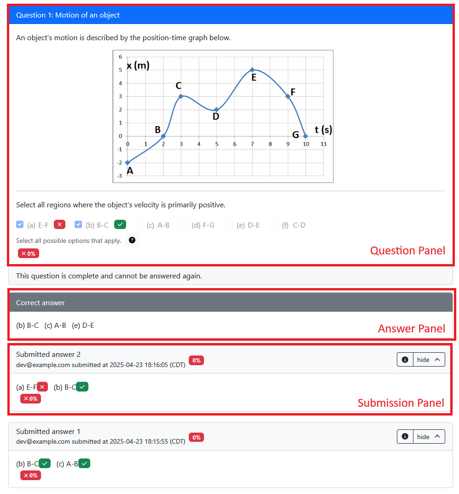

# `question.html`

## Template file

All `question.html` files are processed with the [Mustache template engine](https://mustache.github.io/mustache.5.html), which allows for basic dynamic rendering of HTML. In addition, it supports:

- [**Rendering panels**](#rendering-panels-from-questionhtml): These panels control what is shown when a student is viewing the question, viewing their submission, or viewing the correct answer.

- [**Markdown**](#markdown-in-questions): HTML and custom elements are great for flexibility and expressiveness. However, they're not great for working with large amounts of text, formatting text, and so on. [Markdown](https://github.com/adam-p/markdown-here/wiki/Markdown-Cheatsheet) is a lightweight plaintext markup syntax that's ideal for authoring simple but rich text.

- [**LaTeX**](#using-latex-in-questions-math-mode): PrairieLearn supports LaTeX equations in questions.

## Rendering panels from `question.html`

When a question is displayed to a student, there are three "panels" that will be shown at different stages: the `"question"` panel, the `"submission"` panel, and the `"answer"` panel. These display the question prompt, the solution provided by the student, and the correct answer.



The `"question"` panel is displayed when the question is first shown to the student. A `"submission"` panel is displayed each time the student saves an answer; there may be multiple submission panels if the student submits multiple answers to the same variant. The `"answer"` panel is displayed based on question/assessment configuration; by default, it is shown when the student either submits the correct answer or runs out of attempts. You can see the [lifecycle diagram](server.md#question-lifecycle) for more details on how these panels are displayed.

All three panels are displayed based on the same `question.html` template, but elements will render differently in each panel. For example, the `<pl-number-input>` element displays an input box in the "question" panel, the submitted answer in the "submissions" panel, and the correct answer in the "answer" panel.

### `"question"` panel

Text in `question.html` can be set to only display in the "question" panel by wrapping it in the [`<pl-question-panel>` element](../elements/pl-question-panel.md). This is useful for the question prompt, which doesn't need to be repeated in the "submission" and "answer" panels. For example:

=== "Good"

    ```html
    <pl-question-panel>
      <p>What is y, if y is 1 + 3?</p>
    </pl-question-panel>
    <pl-number-input answers-name="y" label="$y =$"></pl-number-input>
    ```

=== "Bad"

    ```html
    <p>What is y, if y is 1 + 3?</p>
    <pl-number-input answers-name="y" label="$y =$"></pl-number-input>
    ```

    The question will be repeated in the "submission" and "answer" panels, which is unnecessary and can be confusing for students.

### `"submission"` panel

By default, feedback given by elements (`data["partial_scores"][NAME]["feedback"]`) is rendered when an element renders in the "submission" panel. You can use the [`pl-submission-panel`](../elements/pl-submission-panel.md) to show additional text only in the "submission" panel. For example:

=== "Good"

    ```html
    <pl-submission-panel>
      <p>
        Feedback: {{feedback.y}}
      </p>
    </pl-submission-panel>
    ```

=== "Bad"

    ```html
    <p>Feedback: {{feedback.y}}</p>
    ```

    This will show the feedback in the "question" and "answer" panels as well, which is unnecessary and can be confusing for students. Since `feedback.y` won't be defined until the student submits an answer, it will show as an empty string in the "question" panel, just showing `"Feedback: "`.

More details about providing feedback can be found on the [`server.py` page](server.md#providing-feedback).

### `"answer"` panel

By default, the correct answers are shown in the "answer" panel. This can be disabled by setting `showCorrectAnswer: false` in the question's `info.json`. The FAQ item ["How can I hide the correct answer when students see their grading results?"](../faq.md#how-can-i-hide-the-correct-answer-when-students-see-their-grading-results) describes some other techniques for hiding the correct answer.

If you grade a question using a [custom grading function](./server.md#step-5-grade), an [external grader](../externalGrading.md), or using [manual grading](../manualGrading/index.md), you are encouraged to display a correct answer so that students can see it in the answer panel. If there are multiple correct answers, you should add a note within the [`pl-answer-panel`](../elements/pl-answer-panel.md) element that any correct answer would be accepted, and the displayed answer is only an example. You can also show additional text in the answer panel as well, e.g. extended explanations for the correct answers.

## Mustache templates

Any text in double-curly-braces (like `{{params.m}}`) is substituted with variable values using [Mustache](https://mustache.github.io/mustache.5.html). These parameters are typically defined by a [question's `server.py`](server.md). For example, if `params["m"]` is defined in `server.py`, you can use it in `question.html` like this:

```html title="question.html"
<p>If m is {{params.m}}, what is {{params.m}} * 3?</p>
```

This will be rendered as:

```html
<p>If m is 5, what is 5 * 3?</p>
```

### Data available to Mustache templates

When the student first views a question variant, `parse` and `grade` have not run yet, so values set in `data` by those functions won't be available to the template. Each `server.py` function has restrictions on how the `data` object can be modified, which are documented in the [`server.py` function table](./server.md#serverpy-functions). For example, in the `generate` phase, you can only modify `data["params"]` and `data["correct_answers"]`.

See the [question lifecycle diagram](./server.md#question-lifecycle) for detailed information on when the `server.py` functions are called. Note that any modifications to the `data` object in later phases like `parse` or `grade` will be persisted and used for any subsequent renderings of the question. For example, if the `grade` function alters `data["params"]` after a student submission, the updated `data["params"]` will be used when the question is rendered again.

### Advanced rendering

You can use the following syntax to conditionally render a piece of HTML:

```html title="question.html"
{{#params.show}}
<p>This will only show up if params.show is true</p>
{{/params.show}}
```

You can use this syntax to render over an array of strings (the `.` represents the current item in the array):

```html title="question.html"
{{#params.items}}
<p>{{.}}</p>
{{/params.items}}
```

!!! info "HTML rendering"

    By default, Mustache escapes special characters when using double braces (`{{params.x}}`). This ensures that any content that may contain characters used by HTML (such as quotes or `<` characters) is displayed or interpreted in its original context.

    You can use triple-braces (e.g. `{{{params.html}}}`) to substitute raw HTML without escaping. This should only be used for content that is defined by the instructor. If you want to render student-provided HTML, you can use the [`<pl-xss-safe>` element](../elements/pl-xss-safe.md).

### Hiding staff comments in `question.html`

HTML or JavaScript comments in your `question.html` source are visible to students in the rendered page source. To leave small maintenance notes to staff in your `question.html` source, you should use [Mustache comments](https://mustache.github.io/mustache.5.html#Comments) (`{{! ... }}`) that will be removed during the rendering process. Never put sensitive information, such as solutions, in a HTML/JS comment.

Example:

```html
<!-- This HTML comment will not be visible to students in the web page, 
 but *will be included* in the rendered page source, so students may be able to
 see it by reading the HTML source. -->
{{! This Mustache comment will NOT be included in the rendered page source. }}
```

## Markdown in questions

You can use the special `<markdown>` tag to automatically convert its contents to HTML. Here's an example `question.html` that utilizes this element:

<!-- prettier-ignore -->
```html title="question.html"
<markdown>
# Hello, world!

This is some **Markdown** text.
</markdown>
```

That question would be rendered like this:

```html
<h1>Hello, world!</h1>
<p>This is some <strong>Markdown</strong> text.</p>
```

!!! warning

    Markdown recognizes indentation as a code block, so text inside these tags should **not** be indented with the corresponding HTML content.

    === "Good"

        ```html
        <div>
          <markdown>
        # Hello, world!
          </markdown>
        </div>
        ```
    === "Bad"

        ```html
        <div>
          <markdown>
            # Hello, world!
          </markdown>
        </div>
        ```

### Markdown code blocks

Fenced code blocks (those using triple-backticks ` ``` `) are rendered as [`<pl-code>` elements](../elements/pl-code.md), which will then be rendered as usual by PrairieLearn. These blocks support specifying language and highlighted lines, which are then passed to the resulting `<pl-code>` element. Consider the following Markdown:

<!-- prettier-ignore -->
````html title="question.html"
<markdown>
```cpp{1-2,4}
int i = 1;
int j = 2;
int k = 3;
int m = 4;
```
</markdown>
````

This will be rendered to the following `<pl-code>` element (which itself will eventually be rendered to standard HTML):

<!-- prettier-ignore -->
```html
<pl-code language="cpp" highlight-lines="1-2,4">
int i = 1;
int j = 2;
int k = 3;
int m = 4;
</pl-code>
```

??? note "Escaping literal `<markdown>` tags"

    PrairieLearn defines a special escape syntax to allow a literal `<markdown>` or `</markdown>` tag in your question. If you have `<markdown#>` or `</markdown#>` in a Markdown block, they will be rendered as `<markdown>` and `</markdown>` respectively (but will not be used to find regions of text to process as Markdown).

## Using LaTeX in questions (math mode)

PrairieLearn supports LaTeX equations in questions. You can view a full list of [supported MathJax commands](https://docs.mathjax.org/en/latest/input/tex/macros/index.html).

Inline equations can be written using `$x^2$` or `\(x^2\)`, and display equations can be written using `$$x^2$$` or `\[x^2\]`. For example:

<!-- prettier-ignore -->
```html title="question.html"
<p>Here is some inline math: $x^2$. Here is some display math: $$x^2$$</p>
<p>What is the total force $F$ currently acting on the particle?</p>

<markdown>
# LaTeX works in Markdown too!

$$\phi = \frac{1+\sqrt{5}}{2}$$
</markdown>
```

### Using a dollar sign ($) without triggering math mode

Dollar signs by default denote either **inline** (`$ x $`) or **display mode** (`$$ x $$`) environments.

To escape either math environment, consider using PrairieLearn's `<markdown>` tag and inline code syntax.

<!-- prettier-ignore -->
```html
<markdown>
What happens if we use a `$` to reference the spreadsheet cell location `$A$1`?
</markdown>
```

In scenarios where it does not make sense to use the code environment, consider disabling math entirely by
adding the `mathjax_ignore` class to an HTML element.

```html
<div class="mathjax_ignore">
  Mary has $5 to spend. If each apple costs $2 dollars and a banana costs $1 dollar, then how many
  pieces of fruit can Mary get?
</div>

<div>$x = 1$ and I have <span class="mathjax_ignore">$</span>5 dollars.</div>
```
