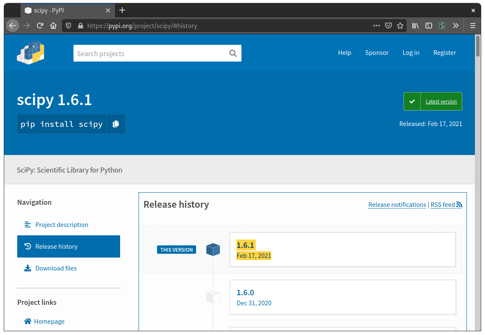
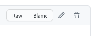

# Question runtime environment

Since PrairieLearn executes your question code in an environment that is not fully user-controlled, it can be useful to have an understanding of exactly how PrairieLearn executes your code. This page discusses the environment where your code is executed in, including which third-party libraries are available and how to install your own.

## General information

All `server.py` files for questions are executed in a Docker container created from the `prairielearn/prairielearn` image. This image includes the Python version that is bundled with the [latest version of Miniconda](https://docs.conda.io/en/latest/miniconda.html), as well as the packages in [`requirements.txt`](https://github.com/PrairieLearn/PrairieLearn/blob/master/requirements.txt). The only packages guaranteed to be installed are those listed in the requirements file.

To run a command line version of this Python environment, you may start it with the following command:

```sh
docker run -it --rm prairielearn/prairielearn /bin/bash
```

## Installing libraries in your course

The quickest way to add custom libraries is to install them directly to your course. This will assume that you are comfortable using Git and Docker. If you are not familiar, it is recommended to follow the [Installing PL for local development](../installing.md) guide.

1. Check out a copy of your course locally with Git, and make sure the main branch is up-to-date.
2. Locate the package that you would like to install. You can find a list of all the available Python libraries at the [Python Package Index](https://pypi.org).
3. Install the package to your course's `serverFileCourse` directory with the following command. Make sure to replace `<path-to-course>` and `<library>` with the absolute path to the course on your local computer and the library you wish to install, respectively.

   ```sh
   docker run -it --rm -v <path-to-course>:/course prairielearn/prairielearn pip3 install --target /course/serverFilesCourse <library>
   ```

4. Using Git, commit and push the new files that are now in your `serverFilesCourse` directory.

After these steps, you should be able to `import` the library as normal in your `server.py` files.

!!! note

    The local installation may generate compiled files that are commonly ignored in `.gitignore`. For example, packages that use native code will typically contain `*.so` files. These files are required for the usage of the installed package, so make sure these files are committed within Git if you encounter issues. Ignored files can be viewed with `git status --ignored`.

## Adding libraries to PrairieLearn

If a library is very large or requires specific dependencies, it may be infeasible to install it directly into your course. In that case, you can open a pull request to add it to PrairieLearn's built-in dependencies. This should be used as a last resort and is subject to maintainer approval. Note that this process will take more time, as your change will have to be reviewed, merged, and deployed. So, only use this in cases where installing directly in your course did not work.

### Locate the library and version on PyPI

PrairieLearn downloads all of its Python packages from the [Python Package Index](https://pypi.org); your first step should be to locate the package and version you want. You can find the versions under "Release history" on the left. Most of the time the latest version should be chosen unless there is a specific need for an older release.


Example for SciPy. The newest release as of writing this guide is `1.6.1`.

### Add the library to `requirements.txt`

A list of of the Python libraries that PrairieLearn uses is stored in a file called `requirements.txt`. The easiest way to propose a change to this file is to use the web interface (if you are familiar with Git and pull requests you may do that, but this will not be included for simplicity's sake).

First, browse to the file `requirements.txt` in the [PL GitHub Repo](https://github.com/prairielearn/prairielearn). An edit button should be visible on the top right of the file preview:



Click the edit button to open a file editor. Add the new library and version on a new line in the format `library==version`, taking care to maintain alphabetical order in the file:

```diff
...
scikit-learn==1.3.0
+scipy==1.11.1
sphinx-markdown-builder==0.6.0
...
```

When you're satisfied with your edits, click the "Commit changes..." button, enter a descriptive commit message, and click "Propose changes" to create the pull request.

### Wait for review

If you've reached this point, then you're all finished! One of the PrairieLearn maintainers will look over your pull request shortly.
