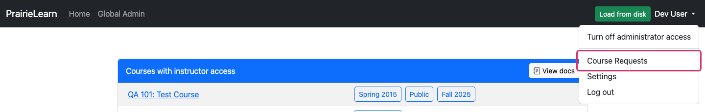
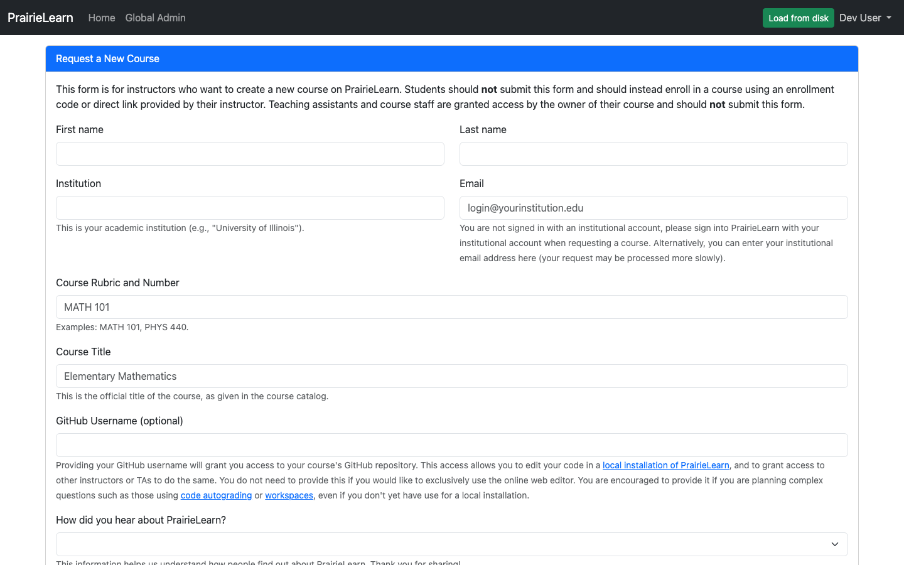

# Request your course space

To start using PrairieLearn as an instructor, you first need a course space. Open the user menu in the top right of any PrairieLearn page and click **Course Requests**.

That takes you to the course request form. Fill it in with your institution, course name, and a brief description; the PrairieLearn team will review and follow up by email.

While you wait, this is also a good time to join the PrairieLearn Slack: [:fontawesome-brands-slack: https://prairielearn.com/slack](https://prairielearn.com/slack). The Slack is a great place to ask questions and get help from the PrairieLearn community.

When your request is approved, you'll be granted **Owner** access to a fresh course in PrairieLearn and a dedicated GitHub repository for its content. From there, jump to [Get started](../getStarted.md).
