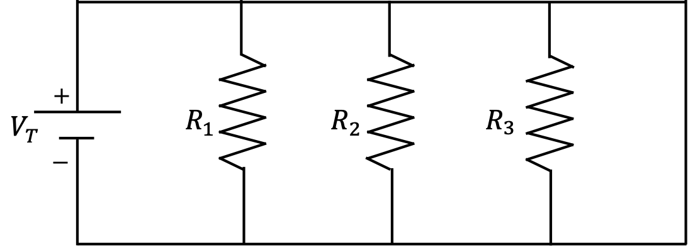
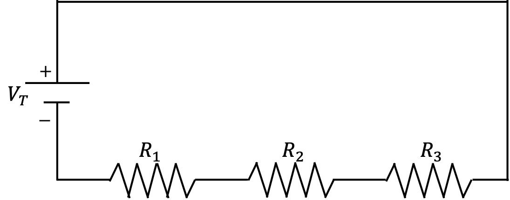

# Lesson 1: Creating simple questions

- [Lesson 1 Recording](https://mediaspace.illinois.edu/media/t/1_8v9b8gqe/170964131)

Choose one of the examples below, and convert the question from the "paper-pencil" format to PrairieLearn.

## Example 1:

Find the area for a region bounded by

$y = 4 - x^2$

that is in the first quadrant.

**Solution:**

$A = \int_0^2 (4-x^2) dx = \frac{16}{3}$

**Take one step further:**

- Instead of implementing the solution for $y = 4 - x^2$, consider the function $y = a - x^b$, where $a$ and $b$ are randomized parameters (or parameters picked out at random from a given list).

**PrairieLearn implementation:**

- [workshop/Lesson1_example1_v1](https://prairielearn.engr.illinois.edu/pl/course/108/question/8211618/preview)

- [workshop/Lesson1_example1_v2](https://prairielearn.engr.illinois.edu/pl/course/108/question/8211620/preview)

## Example 2:

For a given metal, $Q_v = 2 \rm \,ev$ is the energy required for vacancy formation. When the temperature is $T_1 = 800^o\rm C$, the vacancy concentration is 1 for every 10000 atoms.

Detemine the temperature $T_2$ needed to achieve a concentration of 1 vacancy for every 1000 atoms.

**Solution:**

The temperature dependence of vacancy concentration $N_v$ is given by:

$$N_v = N \, \exp(-Q_v/(k T))$$

where $N$ is the concentration of atomic sites, $k$ is the Boltzmann constant and $T$ is the absolute temperature. Hence we can write:

$$\ln(N) = \ln(N*{v1}) + \frac{Q_v}{k T_1} = \ln(N*{v2}) + \frac{Q_v}{k T_2}$$

where $T_1 = (800 + 273) \rm K$, $N_{v1} = 1/10000$ and $N_{v2} = 1/1000$. Solving for $T_2$ we get:

$$\frac{1}{T_2} = \frac{1}{T_1} - \frac{k}{Q_v} \ln\left(\frac{N_{v2}}{N_{v1}} \right)$$

**Take one step further:**

- Randomize the parameters
- Think about some typical issues that appear with questions like this: will you provide the constant to convert from Celsius to Kelvin? What about the Boltzmann constant? If not, take into account rounding when deciding on the tolerance criteria for the question.

**PrairieLearn implementation:**

- [workshop/Lesson1_example2](https://prairielearn.engr.illinois.edu/pl/course/108/question/8211621/preview)

## Example 3:

Determine the equivalent resistance of the circuit below:

**Solution:**

For this solution, we will use $V_T = 125V$, $R_1 = 20\Omega$, $R_2 = 100\Omega$ and $R_3 = 50\Omega$.

$\frac{1}{R_T} = \frac{1}{R_1} + \frac{1}{R_2} + \frac{1}{R_3} = \frac{8}{100}\Omega$

$R_T = 12.5 \Omega$

**Take one step further:**

- randomize the input parameters
- ask for the current from the power supply (instead of the equivalent resistance)
  $I_T = V_T/R_T = 10 A$
- select the figure from two options: the parallel circuit above, or the series circuit below.

$R_T = R_1 + R_2 + R_3 = 170 \Omega$

$I_T = V_T/R_T = 0.735 A$

**PrairieLearn implementation:**

- [workshop/Lesson1_example3_v1](https://prairielearn.engr.illinois.edu/pl/course/108/question/8211622/preview)

- [workshop/Lesson1_example3_v2](https://prairielearn.engr.illinois.edu/pl/course/108/question/8211624/preview)

- [workshop/Lesson1_example3_v3](https://prairielearn.engr.illinois.edu/pl/course/108/question/8211623/preview)

## Homework 1

Create one or two questions using some of these basic elements:

`pl-multiple-choice` [documentation](https://prairielearn.readthedocs.io/en/latest/elements/#pl-multiple-choice-element) and [example](https://prairielearn.engr.illinois.edu/pl/course/108/question/6312319/preview)

`pl-checkbox` [documentation](https://prairielearn.readthedocs.io/en/latest/elements/#pl-checkbox-element) and [example](https://prairielearn.engr.illinois.edu/pl/course/108/question/1420145/preview)

`pl-dropdown` [documentation](https://prairielearn.readthedocs.io/en/latest/elements/#pl-dropdown-element) and [example](https://prairielearn.engr.illinois.edu/pl/course/108/question/7911603/preview)

`pl-integer-input` [documentation](https://prairielearn.readthedocs.io/en/latest/elements/#pl-integer-input-element) and [example](https://prairielearn.engr.illinois.edu/pl/course/108/question/3637014/preview)

`pl-number-input` [documentation](https://prairielearn.readthedocs.io/en/latest/elements/#pl-number-input-element) and [example](https://prairielearn.engr.illinois.edu/pl/course/108/question/3131525/preview)

`pl-figure` [documentation](https://prairielearn.readthedocs.io/en/latest/elements/#pl-figure-element) and [example](https://prairielearn.engr.illinois.edu/pl/course/108/question/611923/preview)
