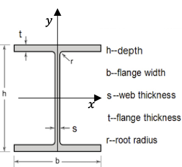
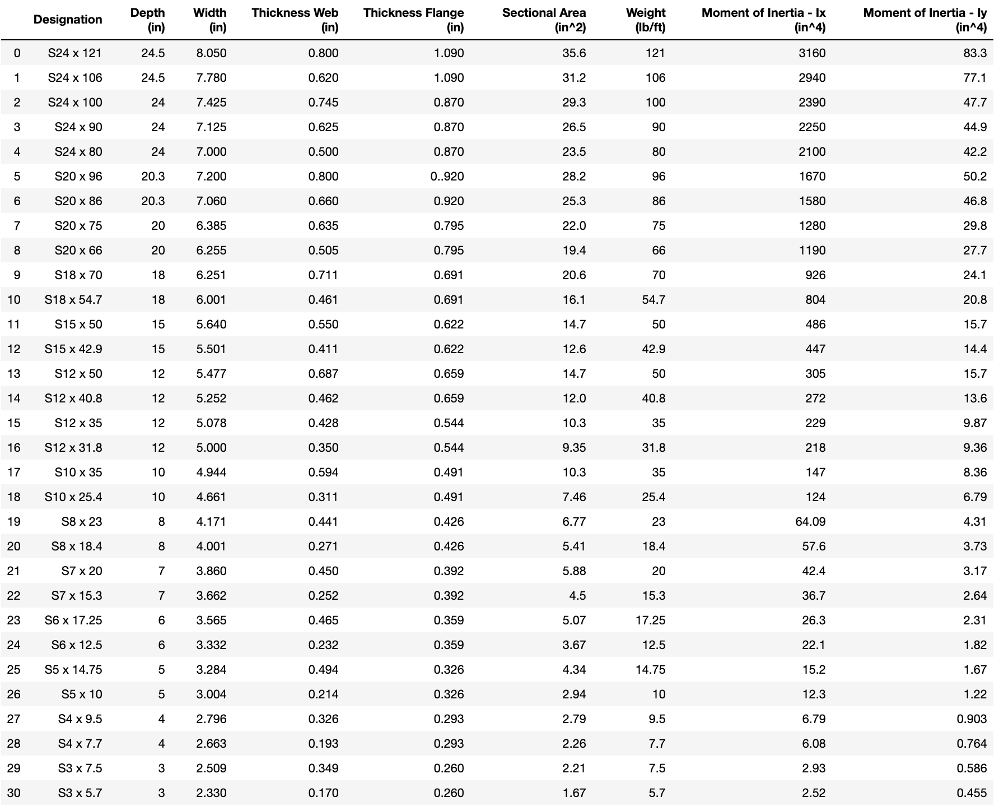
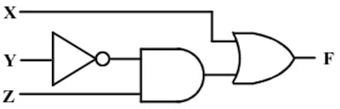

# Lesson 3: Looking at more specialized elements

- [Lesson 3 Recording](https://mediaspace.illinois.edu/media/t/1_l4dh8cwm/170964131)

Convert these questions from the "paper-pencil" format to PrairieLearn.

## Example 1:

Given a matrix $A$ and a vector $b$, compute the matrix-vector multiplication $y = Ab$

**Consider:**

- $A$ and $b$ are randomized
- How do you want to provide (display) the matrices? Take a look at `pl-variable-output`, `pl-matrix-latex` and `pl-python-variable`.
- How do you want students to submit their answers? Take a look at `pl-matrix-component-input` and `pl-matrix-input`.

**PrairieLearn implementation:**

- [workshop/Lesson3_example1_v1](https://prairielearn.engr.illinois.edu/pl/course/108/question/8211625/preview)

- [workshop/Lesson3_example1_v2](https://prairielearn.engr.illinois.edu/pl/course/108/question/8211627/preview)

- [workshop/Lesson3_example1_v3](https://prairielearn.engr.illinois.edu/pl/course/108/question/8211626/preview)

## Example 2:

Consider the Standard I-beam cross-section:

The table below has the geometric properties for different specifications for a steel beam:

For the **S20 x 66** beam, what is the maximum normal stress $\sigma_x$ assuming that the maximum moment is equal to $M_{max} = 5 \times 10^5 \rm\ lb \cdot in$.

**Solution:**

For the **S20 x 66** beam, we use $I_x = 1190 \rm\ in^4$ and $c = h/2 = 10 \rm\ in$. Hence the maximum normal stress is:

$$\sigma_x = \frac{M_{max} \,c}{I_x} = 0.042 \times 10^5 \rm\ lb/in^2 = 4.2 \rm\ ksi$$

**Take one step further:**

- provide random choice for the beam designations
- think about the different ways you can present the table information

You can download the figure files and the table:

<a href="../figs/cross-section.png" target="_blank">Download cross-section figure</a>

<a href="../figs/properties.png" target="_blank">Download table figure</a>

<a href="../figs/properties.csv" target="_blank">Download table with properties</a>

**PrairieLearn implementation:**

- [workshop/Lesson3_example2_v1](https://prairielearn.engr.illinois.edu/pl/course/108/question/8211628/preview)

- [workshop/Lesson3_example2_v2](https://prairielearn.engr.illinois.edu/pl/course/108/question/8211629/preview)

- [workshop/Lesson3_example2_v3](https://prairielearn.engr.illinois.edu/pl/course/108/question/8211630/preview)

## Example 3:

Convert an integer number $x$ from decimal representation (base 10) to binary representation (base 2).

**Think about:**

You can use `pl-multiple-choice` for this question. If you want to have the student input the answer, you can utilize `pl-string-input`.

**PrairieLearn implementation:**

- [workshop/Lesson3_example3](https://prairielearn.engr.illinois.edu/pl/course/108/question/8211631/preview)

## Example 4:

For given values of X, Y and Z, determine F.

**Think about:**

You can use `pl-overlay` to add the input boxes on top of the image.

<a href="../figs/logic-diagram.png" target="_blank">Download image</a>

**PrairieLearn implementation:**

- [workshop/Lesson3_example4_v1](https://prairielearn.engr.illinois.edu/pl/course/108/question/8211632/preview)

- [workshop/Lesson3_example4_v2](https://prairielearn.engr.illinois.edu/pl/course/108/question/8211633/preview)

## Homework 3

Create new questions using some of the elements discussed today:

`pl-matrix-component-input` [documentation](https://prairielearn.readthedocs.io/en/latest/elements/#pl-matrix-component-input-element) and [example](https://prairielearn.engr.illinois.edu/pl/course/108/question/1793641/preview)

`pl-matrix-input` [documentation](https://prairielearn.readthedocs.io/en/latest/elements/#pl-matrix-input-element) and [example](https://prairielearn.engr.illinois.edu/pl/course/108/question/611932/preview)

`pl-matrix-latex` [documentation](https://prairielearn.readthedocs.io/en/latest/elements/#pl-matrix-latex-element) and [example](https://prairielearn.engr.illinois.edu/pl/course/108/question/1793638/preview)

`pl-variable-output` [documentation](https://prairielearn.readthedocs.io/en/latest/elements/#pl-variable-output-element) and [example](https://prairielearn.engr.illinois.edu/pl/course/108/question/3637022/preview)

`pl-python-variable` [documentation](https://prairielearn.readthedocs.io/en/latest/elements/#pl-python-variable-element) and [example](https://prairielearn.readthedocs.io/en/latest/elements/#pl-python-variable-element)

`pl-string-input` [documentation](https://prairielearn.readthedocs.io/en/latest/elements/#pl-string-input-element) and [example](https://prairielearn.engr.illinois.edu/pl/course/108/question/1793642/preview)

`pl-overlay` [documentation](https://prairielearn.readthedocs.io/en/latest/elements/#pl-overlay-element) and [example](https://prairielearn.engr.illinois.edu/pl/course/108/question/7911589/preview)
