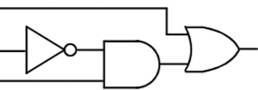

# Lesson 4: Customizing the grading method

- [Lesson 4 Recording](https://mediaspace.illinois.edu/media/t/1_ssplpphc/170964131)

## Customize your grade function using `server.py`

### Example 1

Ask students to provide a matrix $A$ such that $A^2$ is the zero matrix.

Since there is more than one solution that satisfies this problem, you will need to customize the grade function.

**PrairieLearn implementation:**

- [workshop/Lesson4_example1](https://us.prairielearn.com/pl/course/108/question/8211634/preview)

### Example 2

Modify the example from Lesson 3 below:

Now ask students to enter three input values and one output that makes this logic diagram correct. Since there are several solutions that are correct, you will need to customize the grade function.

**PrairieLearn implementation:**

- [workshop/Lesson4_example2](https://us.prairielearn.com/pl/course/108/question/8211635/preview)

### Example 3

This is an example of a question that expects data collected from an experiment.

The purpose of this experiment is to determine the convective heat transfer coefficients for natural convection over pin fins. Seven thermocouples are embedded along the length of the fin.
One thermocouple is placed at the base of the fin, which is the reference position $x_0 = 0$. We denote the temperature
at the base as $T_b = T(x_0)$. The other thermocouples are placed at positions $x_1$, $x_2$, ... with
corresponding temperatures $T_1$, $T_2$, etc. The pin fin has diameter $D$, length $L$ and is made of stainless steel with thermal conductivity $k = 20 \rm W/mK$.

Students will be asked to enter measurements for temperature and the position of the thermocouples. Make sure you think about the tolerances you expect for these variables.

Students will calculate the convective heat transfer based on the data described above. The correct answer should be determined based on their data, and not reference values defined by the instructors.

**PrairieLearn implementation:**

- [workshop/Lesson4_example3](https://us.prairielearn.com/pl/course/108/question/8211637/preview)

## Auto grader

Take a look at the documentation for the [python auto grader](https://prairielearn.readthedocs.io/en/latest/python-grader/) first.

### Example 4

Write a question that provides students with a matrix $A$, and asks them to compute the following:

1. another matrix $B = \beta \, A$, where $\beta \in [2,9]$.

2. a function that takes two matrices $M_1$ and $M_2$ as arguments, and returns:
   - a matrix $C$ given by the element-wise multiplication of $M_1$ and $M_2$ (and hence $M_1$ and $M_2$ should have the same dimensions)
   - the summation of all the entries of $C$

**PrairieLearn implementation:**

- [workshop/Lesson4_example4](https://us.prairielearn.com/pl/course/108/question/8211636/preview)

## Homework 4

Continue creating more questions using the PL elements that best fit your needs. The topics discussed today can be helpful when creating more advanced questions, but not everyone will need this type of customized grading.
