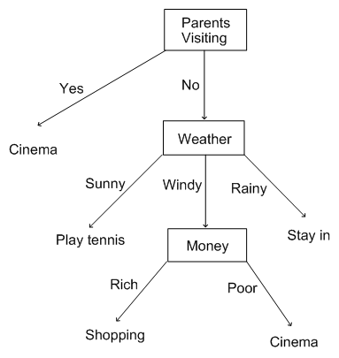
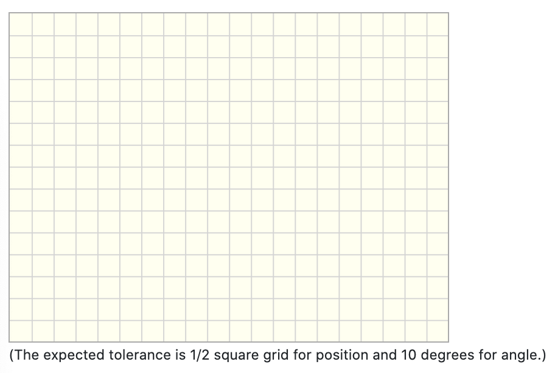

# Lesson 5: Using graphical/drawing elements

## pl-graph

#### Example 1:

Create a question with a decision tree. Think about ways to create dynamic versions of the question. You can use `pl-figure` to load images, but here we want to explore the use of `pl-graph` ([check the documentation](https://prairielearn.readthedocs.io/en/latest/elements/#pl-graph-element)).

[Image from http://www.sfu.ca/iat813/lectures/lecture6.html]

#### Example 2:

Write a question that provides the outgoing links from a set of websites and use the PageRank algorithm to determine the most popular website.

[Image from https://en.wikipedia.org/wiki/PageRank]

Your question should provide the Google Matrix in the form of a graph like the cartoon above. Use `pl-graph` to display the Google Matrix.

## pl-drawing

#### Example 3:

Write a question that uses the drawing canvas to collect input from student. Take a look at the `pl-drawing` [documentation](https://prairielearn.readthedocs.io/en/latest/pl-drawing/) before you start writing questions.

 In this example, ask students to add a vector providing the position and direction.
 
 

#### Example 4:

Add a shape to the drawing canvas, and ask students to mark the centroid using a point (`pl-point`). You can use the pre-defined shapes `pl-circle`, `pl-triangle`, `pl-rectanle` or create a polygon using `pl-polygon`.

## Video

- [Lesson 5 Recording]()