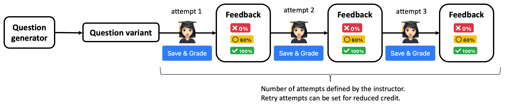
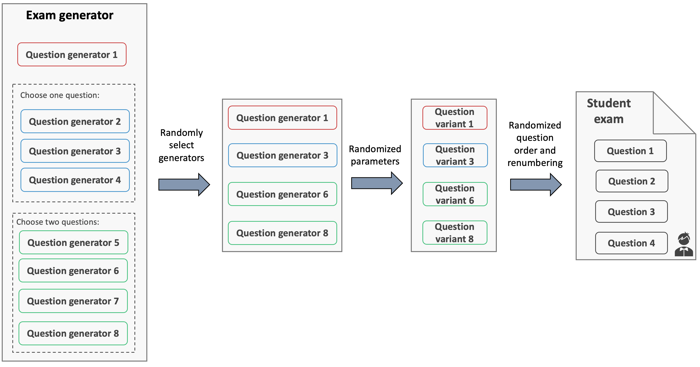
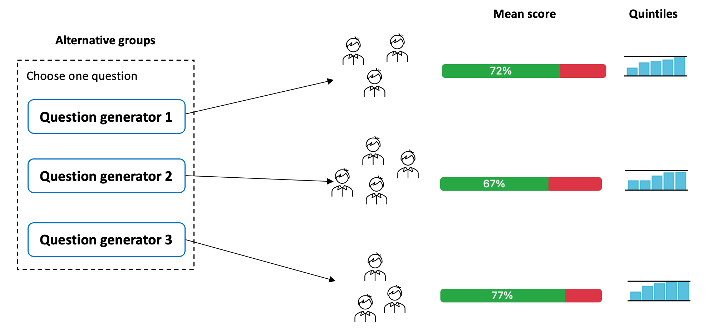

## Auto-graded randomized exams

Studies have shown that learning and retention of knowledge is enhanced through retrieval practice that incorporates feedback and increased use of formative assessments.
Here we describe how we use PrairieLearn to create quizzes where students get immediate feedback, shortening the feedback cycle between student learning and assessment performance. This shorter cycle enables the use of frequent and second-chance testing, especially in large courses, which has been shown to lead to significant improvements in learning outcomes and better final exam performance.

We will use the assessment [E1: Auto-graded randomized exams](https://www.prairielearn.org/pl/course_instance/128605/assessment/2310709) to highlight some of the PrairieLearn features to deliver auto-graded and randomized exams.

### Instant feedback with retry attempts

Using the default `Exam` configuration in PrairieLearn, students will receive a fixed question variant for each question generator. This feature matches a traditional paper-and-pencil experience, where the student receives one exam with fixed parameters.

By default, PrairieLearn will auto-grade each question in real-time, and provide students with the feedback about correctness. Depending on how instructors define the question points, students can try to fix incorrect answers for the same parameters, and submit other attempts for reduced credit, mimicking the concept of partial credit.

This short feedback cycle allows students to reach out to instructors right after the test, enabling them to promptly review and clarify any missed contepts, and consequently make adjustments for upcoming assessments.

**Question 1** asks students to compute a variable $c$ given two parameters $a$ and $b$. The formula to compute $c$ is randomized (selected from a set of 4 different formulas) and the parameters $a$ and $b$ are randomized as well. Students have two attempts to complete this question: the first attempt for full credit and the second attempt for partial credit (1/3 points).

**Question 2** asks students to enter the matrix corresponding to a displayed graph, which is generated in real-time based on randomized parameters. Students have two attempts to complete the question. They can also receive partial credit for each attempt, since each entry of the matrix is graded separately.

**Question 3** is highly randomized, in essence mixing 4 different questions into one, since the circuit diagram changes (parallel and series), and the question prompt changes (compute current or resistance).
Since the solution involves multiple computation steps, students get 5 attempts to complete the question for reduced credit.

### Creating exams from question pools

Exams that are delivered asynchronously or in online unproctored environments create an opportunity for _collaborative cheating_, where a student can gain advantage by receiving information about the exam from another student. Generating random exams from pools of problems has been shown to mitigate collaborative cheating. In PrairieLearn, question generators can be selected from what we call **alternative groups or pools**. For example, an alternative group with 4 question generators can select 2 of them at random to create a version of the exam. In the figure below, an exam with 4 questions is created from a set of 8 question generators.

In addition, question generators will create different question variants based on randomized parameters. These question variants will finally build a student exam, where questions appear in random order. Our studies indicate that pools of 3-4 question generators are effective to mitigate cheating.

### Using information from previous exams to generate randomized exams with reduced difficulty variance

A concern with randomized exams is how one can ensure students receive problems of roughly similar difficulty. Problems can be binned into pools by topic coverage and difficulty, but it can be challenging to generate problems of identical difficulty. When creating question generators for the first time, a instructor can use previous experiences to decide which ones should be combined in an alternative group. PrairieLearn will collect data from these questions, which later can be used by instructors to improve fairness of these randomized exams.

**Question 4** is randomly selected out of a pool of 3 question generators, each one of them asking students to compute a different matrix and/or vector operation, including matrix multiplication and outer product. Each question generator also utilizes randomized parameters. One of the advantages of keeping similar question variants within separate question generators is the easy access to statistics, providing information regarding question and exam fairness. The disadvantage is the cumbersome bookkeeping of question generators, since one may have to coordinate changes to many files when updates are needed.
