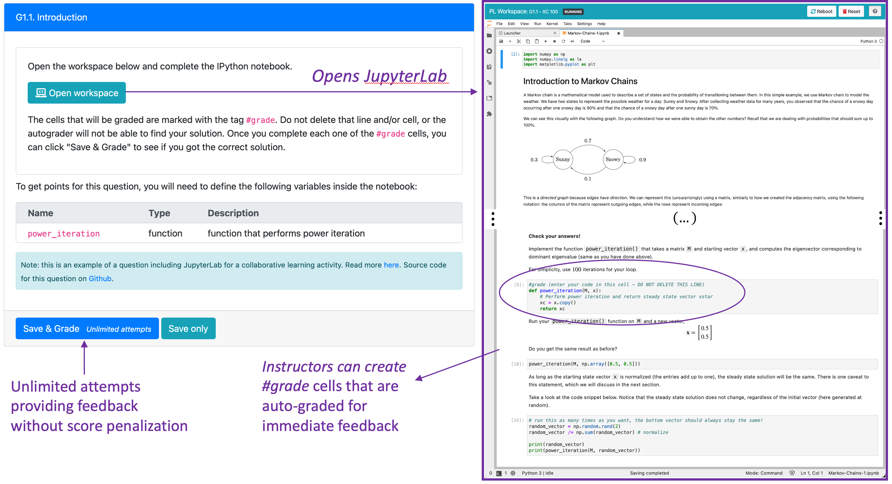

## Group Activities

Research shows that collaborative learning can increase student persistence, improve learning outcomes, and foster better classroom cultures. Using PrairieLearn, instructors can provide group activities where students work collaborativelly in the same assessment, which is shared among all the group members.

### Group formation

PrairieLearn provides the option for instructors to pre-arrange teams, or for students to create their own teams. For pre-assigned groups, instructors can select one of the following options:

- upload a CSV file with the group information
- let PrairieLearn assign students to groups at random, given a mininum and maximum group sizes

Instructors can also let students self-assign to groups. This can be especially helpful when giving group activities during lecture, where groups can be created "on-the-fly" depending on the proximity of students. Instructors can also provide the minium and maximum group sizes under this configuration.

For self-assignment, a student will create a group providing a group name. This student will receive a "join code" that can be used by others that want to join the group. Once the group reaches the minimum size, students are able to start the assessment. Every member of the group will have access to the same question variants, and consequently will also share the same grade.

### Facilitating collaboration among teams

The simple creation of students' teams will rarely guarantee that students will work collaboratively. However, successful and productive collaborations can be greatly improved by careful design of the task, assignment of team roles and the use of available technologies to both promote collaborations among students and support the instructors implementing these activities.

Assessments that are based on higher level skills such as _Analyze_, _Evaluate_ and _Create_ from the [Bloom's Taxonomy](https://en.wikipedia.org/wiki/Bloom's_taxonomy) produce more opportunities for students' interactions, where they can learn from each other. Low level skills which require students to remember simple concepts, or apply simple calculations will emphasize the existence of domineering leaders and free loaders. When designing group tasks, we focus on questions that produce discussions and decision-making.

Another strategy to enhance collaborative learning is to provide activities that can be self-managed by the team, such that instructors act only as facilitators instead of source of information. In the course demo, we provide an example that uses JupyterLab notebooks for the [group assessment](https://www.prairielearn.org/pl/course_instance/128605/assessment/2310480). These notebooks can include text, images, and equations for content presentation, and also ask students to perform computations (in this example, using a Python 3 Kernel).

We can use PrairieLearn external grader to check content for correctness. This will help students self-manage their progress. Instructors can define `#grade` cells inside the JupyterLab notebook, which will be auto-graded for instant feedback (see image below).

Students in the same group will share the same JupyterLab, and the same submission history and scores. Currently the JupyterLab syncs upon saving (real-time synchronization is a work-in-progress).

A lack of clarity and experience in assuming team roles can lead students to default into domineering team leaders or passive free-loaders. Evidence-based practices such as Process Oriented Guided Inquiry Learning ([POGIL](https://pogil.org)) have shown that providing students with structured roles can help them participate more equitably during collaborative learning. We are currently implementing POGIL roles in PrairieLearn.
