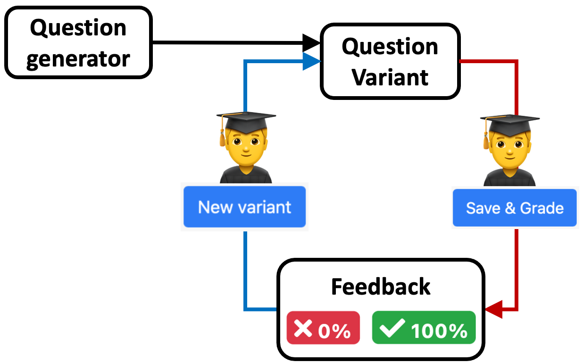
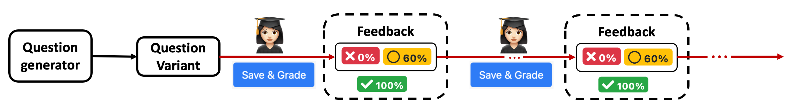

## Mastery-based homework assessments

Educational research and learning theory show that small numbers of single-practice problems may not be the most effective learning strategy for students. Mastery learning theory shows that different students require different amounts of practice to achieve proficiency in a given skill, and that all students require repeated practice. In addition, different learning skills require different learning approaches.

In the following text, we will illustrate how PrairieLearn can be used to create different learning experiences for students, and how they can be adjusted based on individual learning goals. We often use these homework as formative assessments, where students receive immediate feedback and have the opportunity to use the feedback to enhance their learning.

PrairieLearn supports the development of **question generators**, defined by a set of html and python code that generate different **question variants** based on randomized parameters. A homework is defined by a collection of question generators.

### Drilling for mastery: unlimited variants with single attempt

In this configuration, the question generator creates unlimited question variants, each one with a single attempt. Once students submit an answer to a question, they receive immediate feedback, indicating if the question was correct, partially correct, or incorrect. The feedback may also include more detailed explanation. No matter if a submission is correct or not, students have the ability to generate another question variant with a single attempt. Moreover, students are not penalized when submitting an incorrect attempt.

Instructors can define the number of times a student needs to correctly answer a question variant to earn full credit. Since question variants present a different version of the question, this repetition provides students with the needed practice to achieve mastery. Even after students reach full credit for a given question, they can continue to work on other question variants for additional practice. We see students coming back to homework assessments when reviewing for exams.

Question generators based on skill levels such as _Remember_, _Understand_ and _Apply_ from the [Bloom's Taxonomy](https://en.wikipedia.org/wiki/Bloom's_taxonomy) often involve a solution process that requires information retrival to answer conceptual questions or computation of simple expressions. These skills are the most appropriate for questions using the unlimited variants with single retry option.
The [demo homework assessment](https://www.prairielearn.org/pl/course_instance/128605/assessment/2310476) includes some examples using this configuration:

**Question 1** asks students to demonstrate basic thinking and remembering skills, by selecting the numbers that are prime (or odd, or even, etc). Students need to successully complete at least 3 question variants in order to receive full credit.

**Question 2** asks students to demonstrate their understanding of binary and decimal numbers, by converting a decimal number to its binary representation. Students need to successully complete at least 2 question variants in order to receive full credit.

**Question 3** asks students to apply knowledge of derivatives to compute first order derivatives of polynomial equations. They need to successully complete at least 3 question variants in order to receive full credit.

### Repeated variant: unlimited variants with prescribed number of retry attempts

More sophisticated skill levels can require multiple steps during the solution process, or combine knowledge of different topics. When creating more complex questions, instructors may want to provide students with additional attempts per question variant. This avoids unnecessary frustration of starting fresh on a new question variant when a small mistake is made during the solution process. Using this configuration, students can create a new question variant if they answer the question correctly or if they use all the retry attempts.

Similarly to the above configuration, instructors can define the number of times a student needs to correctly answer a question variant to earn full credit. The [demo homework assessment](https://www.prairielearn.org/pl/course_instance/128605/assessment/2310476) includes some examples using this configuration:

**Question 4** asks students to illustrate a vector with given position and orientation. Each question variant has two attempts, allowing students to retry the same question before generaring a new variant. In this example, students may have the correct understanding of the question, but potentially count the position incorrectly, or miss the correct orientation (clockwise or counter-clockwise). The second attempt gives students the opportunity to adjust their thinking, without having to start from the beginning. They need to successully complete at least 2 question variants in order to receive full credit.

**Question 5** asks students to compute a quantity (stress) based on information obtained from a table that is randomized for each question variant. The computation of the stress involves several steps: finding the correct information from the table, identifying the correct equation and performing mathematical operations using the appropriate units. Since students can make small mistakes during the solution process, but still have the overall correct understanding of the problem, we provide 3 retry attempts for each question variant. Students need to successully complete at least 2 question variants in order to receive full credit.

### Fixed variant: unlimited retry attempts for a single question variant

There are some situations where we want students to receive a single question variant
and have unlimited attempts to complete the question successfully. This is desirable when the question involves a lot of computation, or includes specialized coding.

**Question 6** from [demo homework assessment](https://www.prairielearn.org/pl/course_instance/128605/assessment/2310476) asks students to apply knowledge from a given topic to contruct the solution of a "real-world" problem. Students have unlimited attempts to submit the correct solution for full credit.
