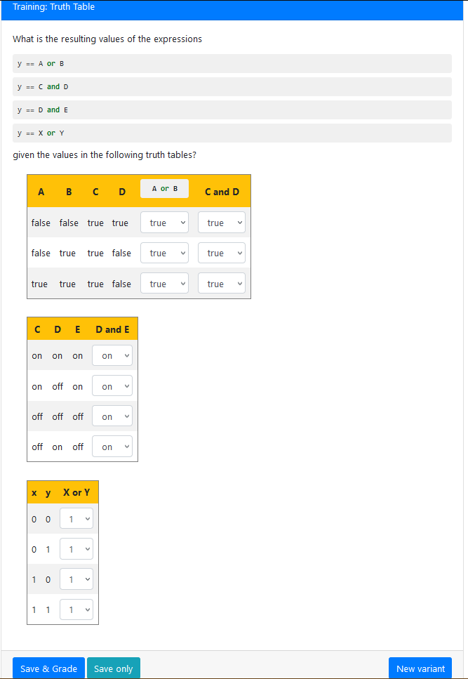

# Training: Truth Table

> Provides training for the truth table element.

## Notes
By default the table will automatically generate all possible combinations
that the variables can hold. This means that there will be 2^n rows in the
table by default.

## Author

Grant Leech
