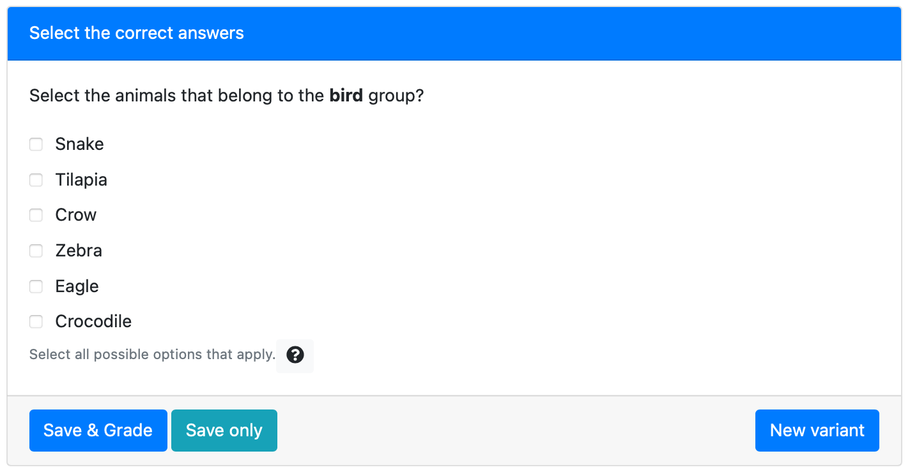
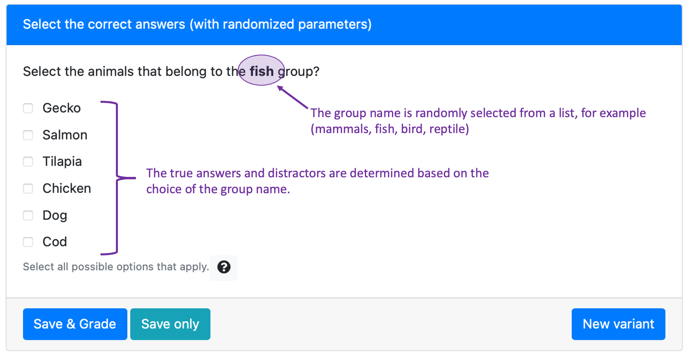

### Simple example

This simple checkbox example only requires writing a `question.html` file. This implementation only creates one unique version of the question, with the same set of parameters and answers. The only level of randomization comes from the order in which the answers are displayed.

```html src=simple/question.html

```

### Complex example

We can add variation to this example by adding randomization to the group parameter.

The modified `question.html` file that supports the randomization is:

```html src=complex/question.html

```

To generate the parameters, we can use the following Python code in `server.py`:

```python src=complex/server.py

```

Here's one instance of this fully randomized question:


