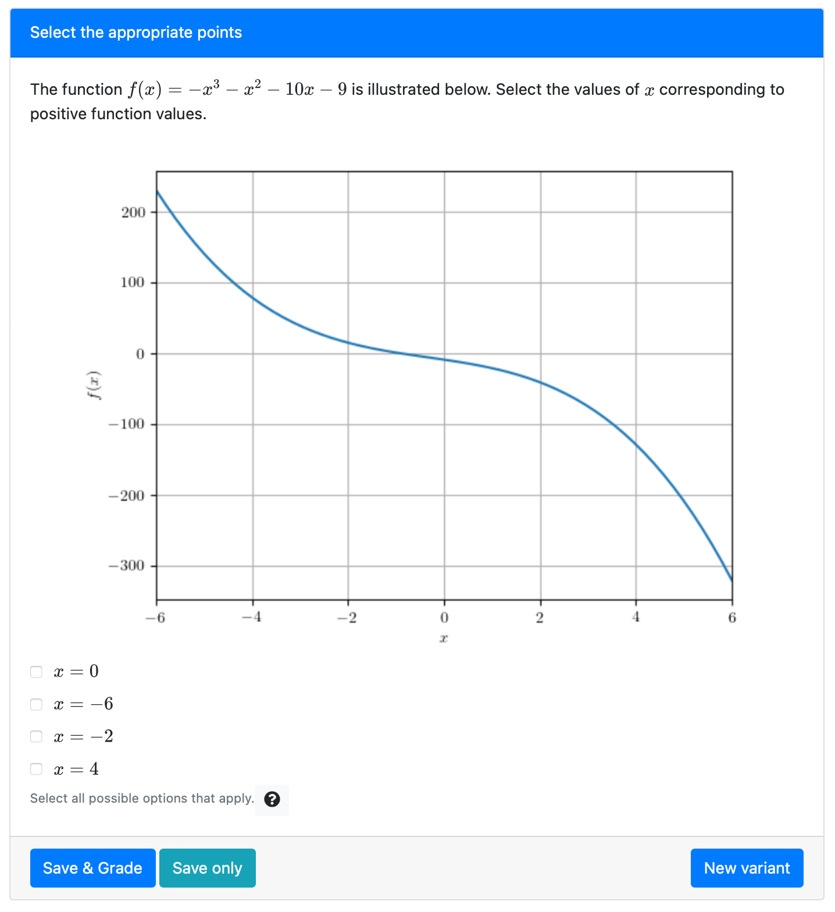

### Simple example

This is an example showing how we can add an image to a question



where we only need to write the `question.html` file:

```html src=simple/question.html

```

The plot is added from a static image `static_image.png` using the element `pl-figure`. We use `pl-checkbox` to add the possible answers that can be selected by the user, including the correct answers and distractors.

### Complex example

The same example can be generated using different levels of randomization, including:

- Randomized function $f(x)$
- Selected correct answers can be positive or negative numbers

The modified `question.html` file that supports the randomization is:

```html src=complex/question.html

```

To generate the parameters, we can use the following Python code in `server.py`:

```python src=complex/server.py

```

The above script randomizes and computes several aspects of the question:

1. Randomized function $f(x)$:

The coefficients $a, b, c$ are selected from a list of possible coefficients to ensure the function
will satisfy some pre-determined requirements. We use the Python library [Sympy](https://www.sympy.org/en/index.html) to create the symbolic expression for
$f(x) = a x^3 + b x^2 + c x - 9$ and store this expression as the variable `f` in the `data['params']` dictionary.

2. Randomized expected sign for correct answers

The correct answers can correspond to either _negative_ or _positive_ function values. This option is stored as variable `option` in the `data["params"]` dictionary.

3. Dynamic plot for the randomized function

In `pl-figure` with `type="dynamic"` the contents of the image file are returned by the function `file()` located in `server.py` (since the plot depends on the choice of the function coefficients). In this example, the code in `file()` generates the "fake" image `figure.png`

4. Checkbox answers matching the randomized parameters

The correct answers depend on the variables `f` and `option`. The boolean values for each answer (e.g. $x = -6$) are stored as parameters in the `data` dictionary (e.g `params.x0`) in the `server.py` file. We use the attribute `number-answers=4` so that only 4 out of the 7 possible answers are displayed.

Here's one instance of this fully randomized question:


