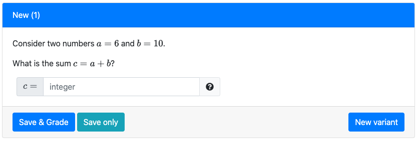

# Creating a question

### 1) Adding the first question

* Navigate to your newly created course instance, and select `Questions` at the top of the page.  Your questions page should be similar to the example below:


* click the button `Add question`.  A new question will be generated with the title `New (1)`.

* We begin in the `Settings` tab, similar to when we created a course instance.  Before we change the name of the question, let's view its content; click the `Preview` tab.

* You will see the the following:



This is a straightforward question asking students to sum two numbers.  If you click `New variant`, you should see the same question, but the values of `a` and `b` are different; indeed, they are randomly generated.  Now that we have an idea of what the question is about, we can change some of its information.

* Navigate back to the settings tab and click the button `Change QID` to change the question ID name.  Typically, question authors choose QID that provide some big-picture idea of the question topic.  For this simple question, we'll just use `sum_two_numbers`.  

* next, click the `Edit` button next to `info.json`.

* change the question `title`. We'll change it to

```json
"title": "Compute the sum of two numbers",
```

* change the question `topic`.  This will be very helpful once you have a large number of questions; you can use a filter to find questions under a specific topic.  Right now it is listed under `Algebra`, which we'll leave as is.


* change the question `tags`.  Use [tags](course.md/#tags) to add more levels to your filter. We recommend adding the user-ID of the question author (e.g., school email name) and the semester when the question was created.  We'll change it to the following:

```json
"tags": [
    "your_userid",
    "fa21",
    "calculate",
    "arithmetic"
],
```

In addition to the netid and semester, we added the type of question `calculate` (instead of multiple choice, for example), and a sub-topic `arithmetic`.  This can be helpful when organizing questions into assessments.

* you should not change the `"type": "v3"` field, which is the most current version of PrairieLearn questions.

* click `Save and sync`.  Going back to the `Preview` tab, you will see that the title of the question has changed.

#### Files Tab

* Next, navigate to the `Files` tab to review the files that generate the question.  We've already seen and edited the `info.json` file.

* click on the third selection `server.py`.  This provides backend support for the question; it is written in the Python programming language.  We'll examine the lines of the code:

First we import two *libraries* random and copy.  Libraries supply a set of pre-defined functions, which must be imported before using them.  We don't end up actually using the copy library here, only random.
```python
import random, copy
```
We define a *function* called `generate` that takes an input called `data`.
```python
def generate(data):
```

Lines that begin with `#` are comments: they are messages for the user describing what happens in the code.  The first thing that happens is that two integers, `a` and `b` are generated using the `randint` function in the `random` library.  Each integer satisfies $5 \leq a,b \leq 10$.
```python
a = random.randint(5, 10)
b = random.randint(5, 10)
```
Feel free to change the range of either number; for example, `b = random.randint(10, 20)` would change the range of the second integer to $10\leq b\leq 20$.

Next, we place these two integers into the structure called `data`.  Specifically, it is a Python [dictionary](https://docs.python.org/3/library/stdtypes.html#typesmapping).  For more info about the `data` dictionary, see [element functions](course.md/#element-functions).  The generated numbers are **parameters** of the question so we place them in `data['params']`.  They are further specifed by their variables names, `a` and `b`.
```python
data['params']['a'] = a
data['params']['b'] = b
```

We define the correct answer to the question:
```python
c = a + b
```

Finally, we place the integer `c` into the structure `data`.  We place it in the `'correct_answers'` grouping, and give it the name `'c'`.
```python
data['correct_answers']['c'] = c
```

* Now, return to the Files menu and click on the file `question.html`.  This formats the structure of the question page.

The `pl-question-panel` defines the question as presented to the student.  In the second line, we see:
```html
<p> Consider two numbers $a = {{params.a}}$ and $b = {{params.b}}$.</p>
```

`{{params.a}}` and `{{params.b}}` references the two parameters created randomly in the `server.py` file.  The `$` signs denote "math mode", which formats how they appear in the text.  `<p>` and `</p>` denote the beginning and end of a paragraph.

The `pl-number-input` defines how the answer should be input by the student:
```html
<pl-integer-input answers-name="c" label="$c=$"></pl-integer-input>
```
For assessment of student answers, the question uses a `pl-integer-input` input field element since we are expecting an integer answer.  For a complete list of elements, see [elements](course.md/#elements).  There are only two attributes being used.  `answers-name` refers to the name of the true answer.  It could be given any name we choose, but `"c"` is a good choice because it matches the definition in the `server.py` file.  The attribute `label` determines what the student will see next to the submission box; use the `$` characters to format it in math mode.

### 2) Adding a geometry question

Once again, navigate to the `Questions` tab and select `Add question`.  The same question asking for the sum of two numbers is generated.  This time, we'll completely change the content of the question and create a geometry question.

* Go to the `Files` tab and edit the `question.html` file.

* Replace the question with the following multiple-choice question:

```html
<pl-question-panel>
  <p> What is the area of a rectangle that has sides 4 and 5?</p>
</pl-question-panel>

<pl-multiple-choice answers-name="area">
  <pl-answer correct="true">20</pl-answer>
  <pl-answer correct="false">10</pl-answer>
  <pl-answer correct="false">9</pl-answer>
  <pl-answer correct="false">18</pl-answer>
  <pl-answer correct="false">40</pl-answer>
</pl-multiple-choice>
```
Nothing in the `pl-question-panel` is particularly new.  Notice that we are defining the sides of the rectangle without appealing to the `server.py` file.  In fact, the file is not needed for the question as written, and you could just delete `server.py` for this question.  We'll leave it for now, because we will use it when we create another version of this question.

Instead of an integer input, we define a `pl-multiple-choice` element.  The name of the answer is denoted by `"area"`.  We also define five `pl-answer` elements.  Each has an attribute, `correct`, and a corresponding numberical value.  We set `correct="true"` for 20, and all others are marked false.

* Click `Save and sync`.  

* You can return to the `Preview` tab to see the changes to the question.  Notice that by clicking `New variant`, the order of the possible choices will be changed, but the same five values will appear.

* Go to the `Settings` tab and changed the `QID`.  You can set the QID to `find_rectangle_area`, or another brief but descriptive name.

* Now, edit the `info.json` file.  We'll change the `title`, `topic`, and `tags`:
```json
"title": "Find the area of a rectangle",
"topic": "Geometry",
"tags": [
    "userid",
    "fa21",
    "MC",
    "geometric-properties"
],
```

We now use the tags `MC` for multiple-choice, and the sub-topic tag `geometric-properties`.

* click `Save and sync` to finish.

### 3) Creating a new question from an existing one inside your course

We'll now create a new question using an existing one inside the course.  We will adapt the previous geometry question to add randomization to the question.

* From the `Questions` tab, select the question you create with QID `find_rectangle_area`.

* Go to the `Settings` tab, and click the button `Make a copy of this question`. Click `Submit` to make a copy of the question inside your own course.

Notice that the `title` and `QID`, which are "Find the area of a rectangle (copy 1)" and `find_rectangle_area_copy1`, respectively.  We are in the `Settings` tab of the new question, **not** the previous one.  Any edits you make won't affect the previous question.

* click the button `Change QID` to change the question ID name. In this example, we will use `find_rectangle_area_rand`, in anticipation of adding randomization to the question.

* click the `Edit` button next to `info.json`.

* change the question `title`. In this case, you can just remove `(copy 1)` from the title, come up with another one, or leave it as is.

You can change `topic` and `tags` as needed.  Since the question will be very similar to the last one, leaving them as is should be fine.  You may want to add an additional tag, `"rand"`.  When you have written many questions for your course, it can be useful to have a tag indicating which questions have randomization.

* click `Save and sync`.

**Change the content of the question**

We will add randomization to the previous question, using the file [server.py](question.md#question-serverpy)

* go to the `Files` tab.

* click the `Edit` button next to `server.py`.  We will define question variables in this file and add randomization.  Replace the text in `server.py` with the following:

```python
import random
def generate(data):
  # define the sides of the rectangle as random integers
  a = random.randint(2,5)
  b = random.randint(11,19)
  # store the sides in the dictionary "params"
  data["params"]["a"] = a
  data["params"]["b"] = b
  # define some typical distractors
  data["params"]["distractor1"] = (a*b)/2
  data["params"]["distractor2"] = 2*(a*b)
  data["params"]["distractor3"] = 2*(a+b)    
  data["params"]["distractor4"] = (a+b)
  # define the correct answer
  data["params"]["truearea"] = a*b
```
Like the first question, two integers are generated randomly and stored in the `data` dictionary.  We also define four "distractors" i.e., incorrect answers.  We provide incorrectly scaled versions of the area, as well as scaled versions of the perimeter.  Finally, we define the correct answer, which is stored using the key `"truearea"`.  


* click `Save and sync`.

* go to the `Files` tab.

* click the `Edit` button next to `question.html`.  We'll update the question to use the variables created in the `server.py` file.  Change the file to the following:

```html
<pl-question-panel>
<p> What is the area of a rectangle that has sides {{params.a}} and {{params.b}}?</p>
</pl-question-panel>

<pl-multiple-choice answers-name="area">
<pl-answer correct="true">{{params.truearea}}</pl-answer>
<pl-answer correct="false">{{params.distractor1}}</pl-answer>
<pl-answer correct="false">{{params.distractor2}}</pl-answer>
<pl-answer correct="false">{{params.distractor3}}</pl-answer>
<pl-answer correct="false">{{params.distractor4}}</pl-answer>
</pl-multiple-choice>
```

Rather than explicitly typing the values of the correct and incorrect answers, we use the variables stored in the `data` dictionary.

* click `Save and sync`.

* go to the `Preview` tab to see your question. Try it out! Check a different variant and see how the variables change.

### 4) Creating a symbolic question
Not all questions must have numerical answers; there is also support for symbolic inputs such as algebra expressions.  Our fourth question will demonstrate this feature.

* Navigate to the `Questions` tab and select `Add question`.

* Once the question is created, click on the `Files` tab, and open `server.py` for editing.  Input the following:
```python
import numpy
import sympy

def generate(data):

    # Create a variable
    x = sympy.symbols('x')

    # degree of polynomial
    degree = 3

    # Randomize the coefficients (make sure the leading coefficient is non-zero)
    coeffs = numpy.random.random_integers(-9,9,size = degree+1)
    if coeffs[0]==0:
        coeffs[0]=1

    # Create the polynomial
    f = coeffs[0]*x**3 + coeffs[1]*x**2 + coeffs[2]*x + coeffs[3]

    # Compute derivative with respect to x
    df = 3*coeffs[0]*x**2 + 2*coeffs[1]*x + coeffs[2]

    # Modify data and return
    data["params"]["x"] = sympy.latex(x)
    data["params"]["f"] = sympy.latex(f)
    data["correct_answers"]["df"] = str(df)
```
We are using two new libraries, `numpy` and `sympy`.

### 5) Copying a question from the example course

You should also have access to the example course `XC 101`. From the top menu, next to the PrairieLearn homepage button, you can select other courses that you were allowed access to (depicted in red in the figure below). Select `XC 101`. If you cannot see the example course, contact us on Slack (`#pl-help`) and we will make sure you gain access.

You will find a variety of questions in the example course. This is probably your best starting point when creating questions for the first time. Let's see how you can copy one of the example questions to your own course:

* from the `Questions` tab, click on the question `Template pl-integer-input: randomized input parameters` (QID: `template/integerInput`).

* click on the `Settings` tab.

* click the button `Make a copy of this question`. Select your course "MATH 101" and click `Submit`.

* That is it! Go to the `Questions` tab and you will see the question was added to your course. You can modify the question following the steps from the section above.
