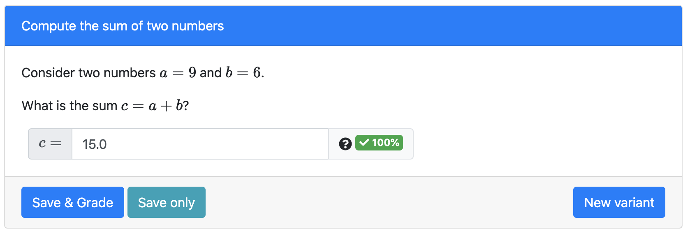

# Create content in the browser

Now that your course space request has been granted, log in to [prairielearn.org](https://www.prairielearn.org/).  In addition to the example `XC 101: Example Course`, you will see your new course, `MATH 101: Elementary Mathematics`.

Click this link; which will take you to your course home page.  This is a view of your course home page (or a similar variation, depending on when your course was originally created):


This tutorial will show you how to create:

* [a course instance](#creating-a-course-instance)

* [a question](#creating-questions-from-scratch)

* [an assessment](#creating-a-new-assessment)


## Creating a course instance

A course instance corresponds to a single offering of a course, such as "Fall 2020", or possibly "Fall 2020, Section M".   We will create a course instance for Math 101 to take place in the Fall of 2021.  Follow the steps below to create a new course instance:

* You should automatically be directed to the `Course Instances` tab.  If not, navigate to this tab.

* Click the button `+ Add course instance`.  A new instance will be generated, with the placeholder name "New (1)".  You will be automatically directed to the instance's `Settings` tab.

* Click the button `Change CIID` to change the course instance ID name. Typically we recommend using a short version of the course instance name; for our course in Fall 2021, we choose the name `Fa21`.  After changing the CIID, click `Change` to save.

* Next, we will change the configuration of the course through the `infoCourseInstance.json` file.  Select the `Edit` button next to the json file name.

#### infoCourseInstance.json

The file will open in an editing window in your browser.  You will see the following items:

* `uuid` - This is the course's "universally unique identifier", which was generated automatically.  This does not need to be changed.

* 'longName` - This is the full name of your course instance, as it will appear on your list of course instances.  Replace the name "New (1)" with the name of the instance.  In this case, we will type:

```json
"longName": "Fall 2021",
```

Make sure a comma separates the name from the next item `userRoles`

* `userRoles` - This lists the users associated with the course instance.  The roles will be initialized as:

```json
"userRoles": {
    "your_email@illinois.edu": "Instructor"
},
```

By default, you are an instructor for the course instance.  You can add other instructors and teaching assistants, but we'll leave this unchanged for now.

* 'allowAccess` - The dates in which your course will be available.  (See other  [access options](courseInstance.md#course-instance-allowaccess).)  For this example, we will assume our semester runs from August 16, 2021 until December 17, 2021.  Thus, we will enter:


```json
"allowAccess": [
    {
        "startDate": "2021-08-16T00:00:01",
        "endDate": "2021-12-17T23:59:59"
    }
]
```

So this course instance will become available at 12:01 AM on August 16, and will close at 11:59 PM on December 17.  Notice that a pair of square brackets and a pair of curly braces are used.

* To save your changes, click `Save and sync`.

* Navigating back to your course by clicking on `Math 101`, you will now see the `Fall 2021` under the Course instances tab.


## Creating a question

### 1) Adding the first question

* Navigate to your newly created course instance, and select `Questions` at the top of the page.  Your questions page should be similar to the example below:


* click the button `Add question`.  A new question will be generated with the title `New (1)`.

* We begin in the `Settings` tab, similar to when we created a course instance.  Before we change the name of the question, let's view its content; click the `Preview` tab.

* You will see the the following:


This is a straightforward question asking students to sum two numbers.  If you click `New variant`, you should see the same question, but the values of `a` and `b` are different; indeed, they are randomly generated.  Now that we have an idea of what the question is about, we can change some of its information.

* Navigate back to the settings tab and click the button `Change QID` to change the question ID name.  Typically, question authors choose QID that provide some big-picture idea of the question topic.  For this simple question, we'll just use `sum_two_numbers`.  

* next, click the `Edit` button next to `info.json`.

* change the question `title`. We'll change it to

```json
"title": "Compute the sum of two numbers",
```

* change the question `topic`.  This will be very helpful once you have a large number of questions; you can use a filter to find questions under a specific topic.  Right now it is listed under `Algebra`, which we'll leave as is.


* change the question `tags`.  Use [tags](course.md/#tags) to add more levels to your filter. We recommend adding the netid of the question author and the semester when the question was created.  We'll change it to the following:

```json
"tags": [
    "netid",
    "fa21",
    "calculate",
    "arithmetic"
],
```

In addition to the netid and semester, we added the type of question `calculate` (instead of multiple choice, for example), and a sub-topic `arithmetic`.  This can be helpful when organizing questions into assessments.

* you should not change the `"type": "v3"` field, which is the most current version of PrairieLearn questions.

* click `Save and sync`.  Going back to the `Preview` tab, you will see that the title of the question has changed.

#### Files Tab

* Next, navigate to the `Files` tab to review the files that generate the question.  We've already seen and edited the `info.json` file.

* click on the third selection `server.py`.  This provides backend support for the question; it is written in the Python programming language.  We'll examine the lines of the code:

First we import two *libraries* random and copy.  Libraries supply a set of pre-defined functions, which must be imported before using them.  We don't end up actually using the copy library here, only random.
```python
import random, copy
```
We define a *function* called `generate` that takes an input called `data`.
```python
def generate(data):
```

Lines that begin with `#` are comments: they are messages for the user describing what happens in the code.  The first thing that happens is that two integers, `a` and `b` are generated using the `randint` function in the `random` library.  Each integer satisfies $5 \leq a,b \leq 10$.
```python
a = random.randint(5, 10)
b = random.randint(5, 10)
```
Feel free to change the range of either number; for example, `b = random.randint(10, 20)` would change the range of the second integer to $10\leq b\leq 20$.

Next, we place these two integers into the structure called `data`.  They are **parameters** of the question so we place them in `data['params']`.  They are further specifed by their variables names, `a` and `b`.
```python
data['params']['a'] = a
data['params']['b'] = b
```

We define the correct answer to the question:
```python
c = a + b
```

Finally, we place the integer `c` into the structure `data`.  We place it in the `'correct_answers'` grouping, and give it the name `'c'`.
```python
data['correct_answers']['c'] = c
```

* Now, return to the Files menu and click on the file `question.html`.  This formats the structure of the question page.

The `pl-question-panel` defines the question as presented to the student.  In the second line, we see:
```html
<p> Consider two numbers $a = {{params.a}}$ and $b = {{params.b}}$.</p>
```

`{{params.a}}` and `{{params.b}}` references the two parameters created randomly in the `server.py` file.  The `$` signs denote "math mode", which formats how they appear in the text.  `<p>` and `</p>` denote the beginning and end of a paragraph.

The `pl-number-input` defines how the answer should be input by the student:
```html
<pl-number-input answers-name="c" comparison="sigfig" digits="3" label="$c=$"></pl-number-input>
```
We'll look at each part of the line:
  
&nbsp;&nbsp;&nbsp;&nbsp;&nbsp;&nbsp;- `answers-name` references the correct answer that was computed in `server.py`,  
&nbsp;&nbsp;&nbsp;&nbsp;&nbsp;&nbsp;  which we saved under the name `'c'`.

&nbsp;&nbsp;&nbsp;&nbsp;&nbsp;&nbsp;- `comparison` describes how the student's answer is compared to the the actual  
&nbsp;&nbsp;&nbsp;&nbsp;&nbsp;&nbsp;  answer.  For this question, we compare *significant figures*.

&nbsp;&nbsp;&nbsp;&nbsp;&nbsp;&nbsp;- `digits` denotes the number of digits in the student answer that must match the  
&nbsp;&nbsp;&nbsp;&nbsp;&nbsp;&nbsp; correct answer.

&nbsp;&nbsp;&nbsp;&nbsp;&nbsp;&nbsp;- `label` is what the student sees in front of the answer box.  Note that we format  
&nbsp;&nbsp;&nbsp;&nbsp;&nbsp;&nbsp;  it in math mode.

There is one change we'll make to this question, namely the `comparison` between the student's answer and the true answer.  Let's see how the current setting of `comparison` affects the grade of a student question.  In the `Preview` tab, you can input an answer and click `Save & Grade` to test the question.  Here are some examples with the current setting:





The first four answers match 3 digits of the correct answer, namely $15.0$.  The last one only matches the first two digits of the correct answer, so is marked incorrect.  However, we might not want the answers $15.01$ and $15.0111111111111$ to be marked correct.

Navigate back to the `Files` tab, and re-open `question.html`.  Change the last line to the following:
```html
<pl-number-input answers-name="c" comparison="relabs" atol="0" rtol="0" label="$c=$"></pl-number-input>
```

We changed `comparison` to `relabs`, which uses the relative and absolute error between the student's answer and the true answer to determine if a question is correct.  Since this is basic integer arithmetic, we will set `atol` (absolute tolerance) and `rtol` (relative tolerance) to zero.  A student will only be given credit for the exact answer.  Notice that we have removed `digits`, which is not needed for the `relabs` comparison variant.

Click `Save and sync` to save your changes.  If you repeat the experiment above in the `Preview` tab, only the first two answers will be marked correct.

### 2) Adding a geometry question

* change the question `topic`.  This will be very helpful when using the filter to find questions under a specific topic. For example:

```json
"topic": "Geometric properties"
```

```json
"title": "Find the area"
```

* change the question `tags`. Use [tags](course.md/#tags) to add more levels to your filter. We recommend adding the netid of the question author and the semester when the question was created. For our example, we use:

```json
"tags": [
    "mfsilva",
    "fa20",
    "MC",
    "calculate"
],
```
* click the button `Change QID` to change the question ID name. Typically, question authors choose QID that provide some big-picture idea of the question topic. For example, `find_rectangle_area`.

* you should not change the `"type": "v3"` field, which is the most current version of PrairieLearn questions.

* click `Save and sync`.

**Change the content of the question**

To provide a simple example, here we first create a question without any randomization, by modifying the file [question.html](question.md#question-questionhtml).

* go to the `Files` tab.

* click the `Edit` button next to `question.html`.

* Modify the content of the file.  You may want to start by copying this simple example:

```html
<pl-question-panel>
  <p> What is the area of a rectangle that has sides 4 and 5?</p>
</pl-question-panel>

<pl-multiple-choice answers-name="area">
  <pl-answer correct="true">20</pl-answer>
  <pl-answer correct="false">10</pl-answer>
  <pl-answer correct="false">9</pl-answer>
  <pl-answer correct="false">18</pl-answer>
  <pl-answer correct="false">40</pl-answer>
</pl-multiple-choice>
```

* click `Save and sync`

* go to the `Preview` tab to see your question. Try it out!

* if you go back to the question tab, you should see your new question.


Note that this question does not use any server side code, and for that reason, the file `server.py` is not needed. Indeed, you could just delete `server.py` for this question. (we will not remove the file for the purpose of the following steps of this tutorial).

### 2) Creating a new question from an existing one inside your course

* from the `Questions` tab, select the question you want to copy. As an example, we will use the question with QID `find_rectangle_area`.

* go to the `Settings` tab.

* click the button `Make a copy of this question`. Click `Submit` to make a copy of the question inside your own course.

* click the button `Change QID` to change the question ID name. In this example, we will use `find_rectangle_area_rand`.

* click the `Edit` button next to `info.json`.

* change the question `title`. In this case, you can just remove `(copy 1)` from the title, come up with another one, or leave it as is.

* you can change `topic` and `tags` as needed.

* click `Save and sync`.

**Change the content of the question**

We will add randomization to the previous question, using the file [server.py](question.md#question-serverpy)

* go to the `Files` tab.

* click the `Edit` button next to `server.py`. Here is where you can define the question variables, and add randomization. We will talk about some other examples in later sections. Here is a how we can modify the original area example:

```python
import random
def generate(data):
  # define the sides of the rectangle as random integers
  a = random.randint(2,5)
  b = random.randint(11,19)
  # store the sides in the dictionary "params"
  data["params"]["a"] = a
  data["params"]["b"] = b
  # define some typical distractors
  data["params"]["distractor1"] = (a*b)/2
  data["params"]["distractor2"] = 2*(a*b)
  data["params"]["distractor3"] = 2*(a+b)    
  data["params"]["distractor4"] = (a+b)
  # define the correct answer
  data["params"]["truearea"] = a*b
```

* click `Save and sync`.

* go to the `Files` tab.

* click the `Edit` button next to `question.html`.

```html
<pl-question-panel>
<p> What is the area of a rectangle that has sides {{params.a}} and {{params.b}}?</p>
</pl-question-panel>

<pl-multiple-choice answers-name="area">
<pl-answer correct="true">{{params.truearea}}</pl-answer>
<pl-answer correct="false">{{params.distractor1}}</pl-answer>
<pl-answer correct="false">{{params.distractor2}}</pl-answer>
<pl-answer correct="false">{{params.distractor3}}</pl-answer>
<pl-answer correct="false">{{params.distractor4}}</pl-answer>
</pl-multiple-choice>
```

* click `Save and sync`.

* go to the `Preview` tab to see your question. Try it out! Check a different variant and see how the variables change.

### 3) Copying a question from the example course

You should also have access to the example course `XC 101`. From the top menu, next to the PrairieLearn homepage button, you can select other courses that you were allowed access to (depicted in red in the figure below). Select `XC 101`. If you cannot see the example course, contact us on Slack (`#pl-help`) and we will make sure you gain access.


You will find a variety of questions in the example course. This is probably your best starting point when creating questions for the first time. Let's see how you can copy one of the example questions to your own course:

* from the `Questions` tab, click on the question `Template pl-integer-input: randomized input parameters` (QID: `template/integerInput`).

* click on the `Settings` tab.

* click the button `Make a copy of this question`. Select your course and click `Submit`.

* That is it! Go to the `Questions` tab and you will see the question was added to your course. You can modify the question following the steps from the section above.

## Creating an assessment

Before you create an assessment, make sure you are in the desired course instance. For example, we want to create a homework assessment in the "Fall 2020" course instance, as indicated below.


* click the button `Add assessment`.

* click the button `Change AID` to change the assessment ID name. In general, we use names such as `Homework1` or `Exam5`.

* click the `Edit` button next to `infoAssessment.json`.

* select the [assessment type](assessment.md#assessment-types) to be either `Homework` or `Exam`. For this example, we will use `Homework`.

* change the `title`. For example:
```json
"title": "Geometric properties and applications",
```

* you can change the assessment `set`, which is used for better organization of the course instance. PrairieLearn has some standardized sets (eg. Homework, Quiz, Exam), and you can also [create your own](course.md#assessment-sets).

* change the number of the assessment (within its set). This number will be used to sort the assessments in the `Assessment` page.

* in `allowAccess` you should set the dates in which you want the assessment to be available. Read the documentation about [Access controls](https://prairielearn.readthedocs.io/en/latest/accessControl/) to learn about the different configurations available. In this example, we will use:

```json
"allowAccess": [
    {
        "startDate": "2020-09-01T20:00:00",
        "endDate": "2020-09-06T20:00:00",
        "credit": 100
    }
]
```

* in `zones` you should enter the questions to be included in that assessment. We will add the two questions that we just created:

```json
"zones": [
    {
        "questions": [
            {"id": "find_rectangle_area_rand", "points": 1, "maxPoints": 5},
            {"id": "integerInput", "points": 1, "maxPoints": 5}
        ]
    }
]
```

* click `Save and sync`.


**Learn more:**

- [Quick reference guide about question structure and PrairieLearn elements](https://coatless.github.io/pl-cheatsheets/pdfs/prairielearn-authoring-cheatsheet.pdf)

- [Different ways to setup an assessment](assessment.md)

- [Detailed list of PrairieLearn elements](elements.md)
