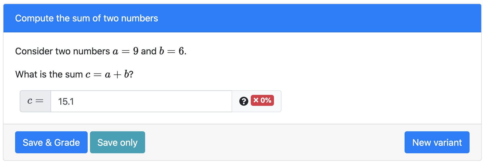

# Possible pitfalls for users


### Using the correct answer inputs

Consider the question from tutorial.  Suppose we have the following input:

```html
<pl-number-input answers-name="c" comparison="sigfig" digits="3" label="$c=$"></pl-number-input>
```

We'll look at each part of the line:
  
&nbsp;&nbsp;&nbsp;&nbsp;&nbsp;&nbsp;- `answers-name` references the correct answer that was computed in `server.py`,  
&nbsp;&nbsp;&nbsp;&nbsp;&nbsp;&nbsp;  which we saved under the name `'c'`.

&nbsp;&nbsp;&nbsp;&nbsp;&nbsp;&nbsp;- `comparison` describes how the student's answer is compared to the the actual  
&nbsp;&nbsp;&nbsp;&nbsp;&nbsp;&nbsp;  answer.  For this question, we compare *significant figures*.

&nbsp;&nbsp;&nbsp;&nbsp;&nbsp;&nbsp;- `digits` denotes the number of digits in the student answer that must match the  
&nbsp;&nbsp;&nbsp;&nbsp;&nbsp;&nbsp; correct answer.

&nbsp;&nbsp;&nbsp;&nbsp;&nbsp;&nbsp;- `label` is what the student sees in front of the answer box.  Note that we format  
&nbsp;&nbsp;&nbsp;&nbsp;&nbsp;&nbsp;  it in math mode.

We will see that using `pl-number-input` is the wrong approach for this question.  Let's see how the current setting of `comparison` affects the grade of a student question.  In the `Preview` tab, you can input an answer and click `Save & Grade` to test the question.  Here are some examples with the current setting:




The first four answers match 3 digits of the correct answer, namely $15.0$.  The last one only matches the first two digits of the correct answer, so is marked incorrect.  However, we do not want the answers $15.01$ and $15.0111111111111$ to be marked correct.  The question originally appeared with

```html
<pl-integer-input answers-name="c" label="$c=$"></pl-integer-input>
```

which leads to the expected behavior for student answers.
