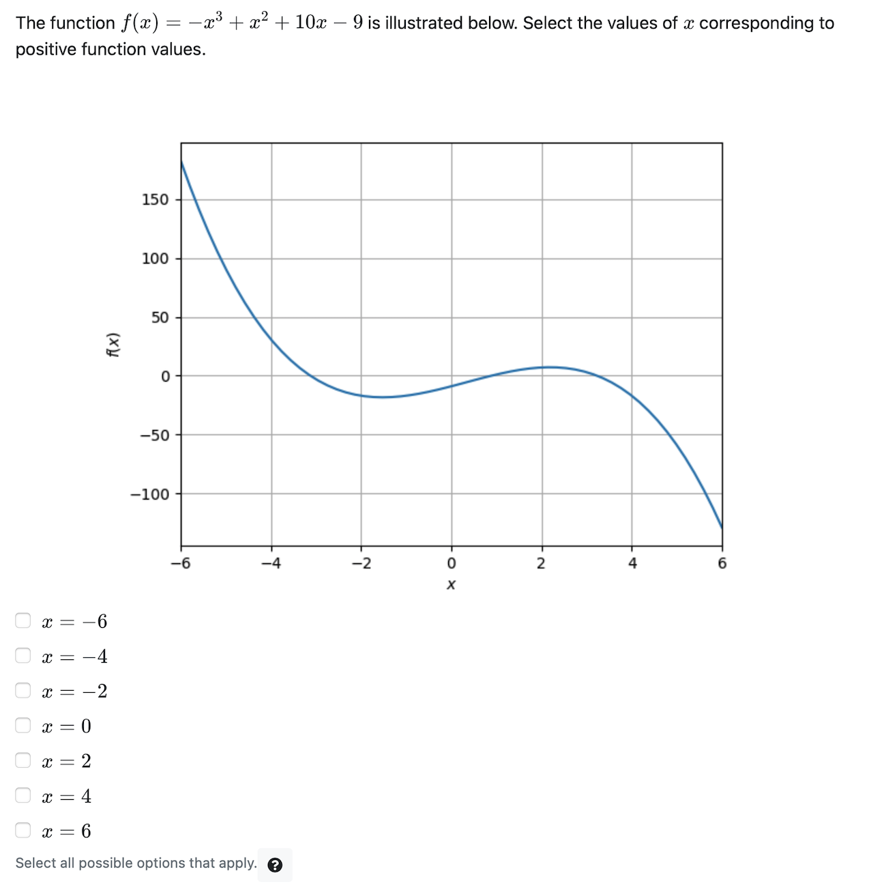
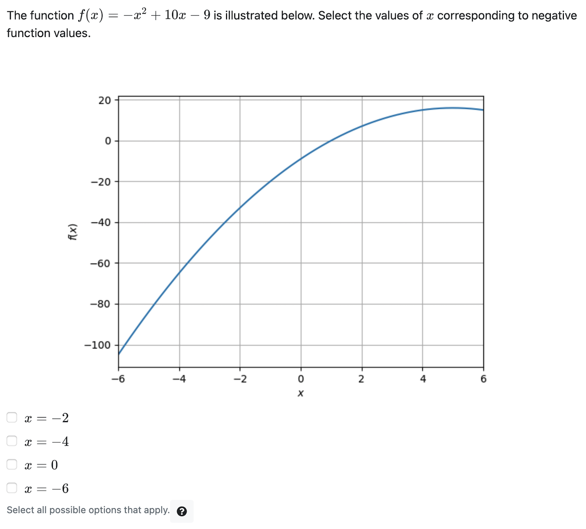

# Question type: Checkbox


The example below uses checkboxes to collect a user's submission.

## Example: select the locations where the function is positive



### Simple implementation without randomization

In this simple implementation, we only need to write the HTML file `question.html`. The plot is added from a static image `static_image.png` using the element `pl-figure`.

```html
<pl-question-panel>
<p> The function $f(x) = -x^3 + x^2 + 10x - 9$ is illustrated below.  
Select the values of $x$ corresponding to positive function values.</p>

<pl-figure file-name=static_image.png directory='clientFilesQuestion'></pl-figure>
</pl-question-panel>
```

We use `pl-checkbox` to add the possible answers that can be selected by the user, including the correct answers and distractors:

```html
<pl-checkbox answers-name="select" hide-letter-keys="true" fixed-order="true" >
    <pl-answer correct="true">  $x = -6$ </pl-answer>
    <pl-answer correct="true">  $x = -4$ </pl-answer>
    <pl-answer correct="false"> $x = -2$ </pl-answer>
    <pl-answer correct="false"> $x = 0$ </pl-answer>
    <pl-answer correct="true">  $x = 2$ </pl-answer>
    <pl-answer correct="false"> $x = 4$ </pl-answer>
    <pl-answer correct="false"> $x = 6$ </pl-answer>
</pl-checkbox>
```

We use the attribute `fixed-order="true"` to keep the locations in ascending orders.

### Implementation with randomized parameters

Here we provide the same example, but now incorporating randomized parameters:



**question.html**

Here is the complete `question.html` file that generates the randomized version of this question:

```html
<pl-question-panel>
<p> The function $f(x) = {{params.f}}$ is illustrated below.
Select the values of $x$ corresponding to {{params.option}} function values.</p>
<pl-figure file-name=figure.png type="dynamic"></pl-figure>
</pl-question-panel>

<pl-checkbox answers-name="select" hide-letter-keys="true" number-answers=4>
    <pl-answer correct={{params.x0}}> $x = -6$ </pl-answer>
    <pl-answer correct={{params.x1}}> $x = -4$ </pl-answer>
    <pl-answer correct={{params.x2}}> $x = -2$ </pl-answer>
    <pl-answer correct={{params.x3}}> $x = 0$ </pl-answer>
    <pl-answer correct={{params.x4}}> $x = 2$ </pl-answer>
    <pl-answer correct={{params.x5}}> $x = 4$ </pl-answer>
    <pl-answer correct={{params.x6}}> $x = 6$ </pl-answer>
</pl-checkbox>
```

**1) Randomized function $f(x)$**

The function $f(x)$ is generated using random coefficients in `server.py`. The latex expression is stored as the variable `f` in the  `data["params"]` dictionary:

```html
The function $f(x) = {{params.f}}$ is illustrated below.
```

**2) Randomized expected sign for correct answers**

The correct answers can correspond to either *negative* or *positive* function values. This option is stored as variable `option` in the `data["params"]` dictionary:

```html
Select the values of $x$ corresponding to {{params.option}} function values.
```

**3) Create dynamic plot for the randomized function**

Once the function $f(x)$ is generated in `server.py`, the corresponding plot is also created and saved as `figure.png`.

```html
<pl-figure file-name=figure.png type="dynamic"></pl-figure>
```

**4) Checkbox answers matching the randomized parameters**

The correct answers (for the example above, the values of $x$ such that $f(x)<0$) depend on the variables `f` and `option`. The boolean values for each answer (e.g. $x = -6$) are stored as parameters in the `data` dictionary (e.g `params.x0`).


```html
<pl-checkbox answers-name="select" hide-letter-keys="true" number-answers=4>
    <pl-answer correct={{params.x0}}> $x = -6$ </pl-answer>
    <pl-answer correct={{params.x1}}> $x = -4$ </pl-answer>
    <pl-answer correct={{params.x2}}> $x = -2$ </pl-answer>
    <pl-answer correct={{params.x3}}> $x = 0$ </pl-answer>
    <pl-answer correct={{params.x4}}> $x = 2$ </pl-answer>
    <pl-answer correct={{params.x5}}> $x = 4$ </pl-answer>
    <pl-answer correct={{params.x6}}> $x = 6$ </pl-answer>
</pl-checkbox>
```

**server.py - the `generate` function**

```python
def generate(data):

    # generating the coefficients for the function
    a = random.choice([-1,0,1])
    b = random.choice([-1,1])
    c = random.choice([10,-10])

    data['params']['a'] = a
    data['params']['b'] = b
    data['params']['c'] = c

    # Generate the function for display
    x = sym.symbols('x')
    data['params']['f'] = sym.latex(a*x**3 + b*x**2 + c*x - 9)

    # Generate x and y values for the checkbox options
    xp = np.array([-6,-4,-2,0,2,4,6])
    yp = func(xp,a,b,c)

    # Generate question parameter
    option = np.random.choice(["positive", "negative"])
    data['params']['option'] = option

    # Determine the true and false options
    ysol = yp>0 if option=="positive" else yp<0
    solutions = ["true" if b else "false" for b in ysol]

    # Storing the correct answers in the data dictionary
    for i,s in enumerate(solutions):
        varName = "x" + str(i)
        data['params'][varName] = s
```


```python
a = random.choice([-1,0,1])
b = random.choice([-1,1])
c = random.choice([10,-10])

data['params']['a'] = a
data['params']['b'] = b
data['params']['c'] = c
```
